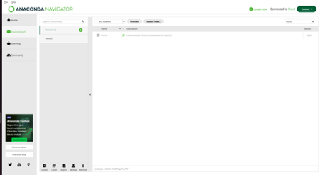

## Install Anaconda

Anaconda is a popular distribution of Python and R for data science and machine learning. Here's a step-by-step guide on how to install it on your system.

### On Windows

1. Download the Anaconda Installer:

   - Visit the official [Anaconda website](https://www.anaconda.com).

   - Download the appropriate installer for your Windows system (Python 3.x version is recommended for most data science tasks).

2. Run the Installer:

   - Double-click the downloaded installer file to start the installation process.

   - Follow the on-screen instructions.

   - Important: Make sure to check the box for "Add Anaconda to your PATH environment variable" during the installation. This will allow you to use Anaconda commands directly from your terminal.

3. Verify the Installation:

   - Open the Anaconda Navigator: This is a graphical user interface for managing Anaconda packages and environments.

### On Mac

1. Download the Anaconda Installer:

   - Visit the official [Anaconda website](https://www.anaconda.com).

   - Download the installer for macOS.

2. Run the Installer:

   - Double-click the downloaded installer file.

   - Follow the on-screen instructions.

     _Important: Make sure to check the box for "Add Anaconda to your PATH environment variable" during the installation. This will allow you to use Anaconda commands directly from your terminal._

3. Verify the Installation:

   - Open the Terminal (the Terminal app is located in the Applications/Utilities folder.

     Type the following command in the terminal: `conda --version`

### On Linux Ubuntu

1. Download the Anaconda Installer:

   - Visit the official [Anaconda website](https://www.anaconda.com).

   - Download the Linux installer (usually a .sh file).

2. Open the Terminal:

   - Press Ctrl+Alt+T to open a terminal window.

3. Run the Installer:

   - Navigate to the download directory in your terminal: `cd Downloads`

   - Run the installer with root privileges: `sudo bash Anaconda3-2023.05-Linux-x86_64.sh`

     _Replace Anaconda3-2023.05-Linux-x86_64.sh with the actual filename of the downloaded installer._

   - Follow the on-screen instructions. You'll be asked to read the license agreement and choose the installation type.

     _Important: Make sure to add Anaconda to your PATH during the installation process. This will allow you to use Anaconda commands directly from your terminal._

4. Verify the Installation:

   - Open a new terminal window and type: `conda --version`

5. Run a Anaconda session

   - Press Ctrl+Alt+T to open a terminal window and type: `anaconda-navigator`

## Create Environment

While Anaconda comes with a base environment, it's often recommended to create separate environments for different projects to avoid package conflicts.

- Click Environment tab on the left side of Anaconda environment and click Create button from the buttons at the bottom of the page

  

- Write a name for the new environment and choose the version of Python.

  

### Install pacakges

- Select the environment from the list of environments available

  

- From the list besides Chanel button select Not installed to show all the available packages but not installed

  

- Check on the checkbox next to the package to install it.
