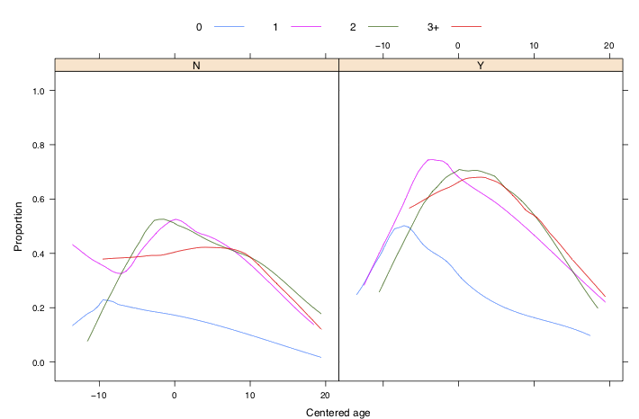
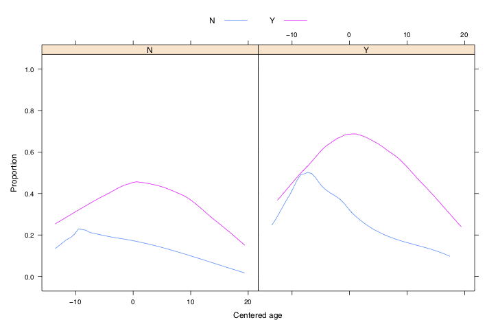

```{r setup, include=FALSE}
knitr::opts_chunk$set(comment=NA, warning = FALSE, message = FALSE)
library(ggplot2)
library(GGally)
library(gridExtra)
library(lme4)
library(gee)
library(faraway)
library(kableExtra)


# transparent theme
Rmkd_theme <- theme_light()+
        theme(panel.background = element_rect(fill = "transparent", colour = NA),
              plot.background = element_rect(fill = "transparent", colour = NA),
              panel.border = element_rect(fill = NA, colour = "black", size = 1),
              legend.background = element_rect(fill = "transparent", colour = NA))
theme_set(Rmkd_theme)

g_legend <- function(a.gplot){
  tmp <- ggplot_gtable(ggplot_build(a.gplot))
  leg <- which(sapply(tmp$grobs, function(x) x$name) == "guide-box")
  legend <- tmp$grobs[[leg]]
  return(legend)}

```
# Introduction

Last week we considered models for correlated continuous responses, such as observations from the same subjects taken over time. Linear mixed models assume a normal distribution for the response and a linear relationship with the predictors, while the random effects allow for variables from the same subject or unit to be correlated. This week we will extend this approach to non-normal responses by introducing a class of models called **generalised linear mixed models (or GLMMs)** which combine the generalised linear model (GLM) approach, commonly used for responses from the exponential family of distributions, and the linear mixed model approach. We will also consider **generalised estimating equations (GEEs)** which provide an alternative approach to modelling correlated observations.

# generalised linear mixed models

The linear model can be expressed in vector-matrix form as $$\mathbf{y}=\mathbf{X}\boldsymbol{\beta} +\mathbf{e}$$ or, in terms of the  mean of $\mathbf{y}$ as $$E(\mathbf{y})=\mathbf{X}\boldsymbol{\beta}.$$ A linear mixed model is given by $$\mathbf{y}=\mathbf{X}\boldsymbol{\beta} +\mathbf{Z}\mathbf{u}+\mathbf{e}$$ with $\mathbf{u} \sim N(\mathbf{0}, \mathbf{G})$ or, in terms of the conditional mean of $\mathbf{y}$ given the random effect $\mathbf{u}$, as $$E(\mathbf{y}|\mathbf{u})=\mathbf{X}\boldsymbol{\beta} +\mathbf{Z}\mathbf{u}.$$

Similarly, a generalised linear model with link function $g()$ is given by $$g(E(\mathbf{y}))=\mathbf{X}\boldsymbol{\beta}$$ and a **generalised linear mixed model (GLMM)** is given by $$g(E(\mathbf{y}|\mathbf{u}))=\mathbf{X}\boldsymbol{\beta} +\mathbf{Z}\mathbf{u},$$ with the distribution of $\mathbf{y}$ assumed to be a member of the exponential family and $\mathbf{u} \sim N(\mathbf{0}, \mathbf{G}).$ In other words, we add a normal error to allow for correlation between observations from the same grouping variable (subject/unit).

##[example] GLMM for a binary response
Let $Y_{ij}$ be a binary response, taking values 0 or 1. Here $i$ labels subjects, $i=1,\dots,I$ and $j$ labels observations, $j=1,\dots,n_i$. Given the random effect $u_i$, the $Y_{ij}$ are independent Bernoulli random variables with $$\mathrm{Var}(Y_{ij}|u_i) = E(Y_{ij}|u_i) [ 1- E(Y_{ij}|u_i)].$$
The conditional mean of $Y_{ij}$ depends on fixed and random effects via the linear predictor $$\mathbf{x}^\intercal_{ij} \boldsymbol{\beta} + \mathbf{z}^\intercal_{ij}\mathbf{u}_i = \mathbf{x}^\intercal_{ij} \boldsymbol{\beta} +u_i$$
where $z_{ij}=1$ for $i=1,\dots,I$ and $j=1,\dots,n_i$.
 Then, using the logit link, $$\log\left(\frac{P(Y_{ij}=1|u_i)}{P(Y_{ij}=0|u_i)}\right)= \mathbf{x}^\intercal_{ij} \boldsymbol{\beta} +u_i.$$
The single random effect $u_i$ is assumed to have a normal distribution with mean zero and some variance. This model is a simple logistic regression with randomly varying intercepts.
##[/example]

\pagebreak
We will illustrate the use of GLMMs for correlated discrete responses through the following example.


##[video,videoid="9xB-4Ba1KPA", duration="11m28s"] generalised linear mixed models -- Contraception example

##[example] Contraception use 
The `Contraception` dataset from `library(mlmRev)` contains data on 1934 women from 60 districts recorded as part of the 1988 Bangladesh Fertility Survey. The first few rows of the data are shown below:

```{r}
library(mlmRev)
head(Contraception)
```

The binary variable of interest, `use`, takes values `Y` for contraception or `N` for no contraception. The number of children is given in variable `livch` as 0, 1, 2, or 3+. The age of a woman is centered: `age` is the number of years above or below the average age. Variable `urban` takes values `urban` or `rural`. The following figure shows the (smoothed) proportion of women using contraception for urban (right panel) and rural (left panel) areas as a function of the woman's (centered) age by the number of children a woman has.

<!-- ```{r echo=FALSE,  fig.align='center', out.width='100%'} -->
<!--  -->
<!-- ``` -->


```{r echo=TRUE,  fig.align='center', out.width='100%'}
library(lattice)
lattice.options(default.theme = function() standard.theme())
print(xyplot(ifelse(use == "Y", 1, 0) ~ age|urban, Contraception,
             groups = livch, type = c("g", "smooth"),
             auto.key = list(space = "top", points = FALSE,
                             lines = TRUE, columns = 4),
             ylab = "Proportion", xlab = "Centered age"))
```


There are several interesting features in this figure. The quadratic trend with age suggests that contraceptive use peaks at a certain age and then decreases. The proportion of women using contraceptives is higher in urban than in rural areas and higher for women with children than for women with no children. In particular, the number of children does not seem to make a difference, so we introduce a new binary variable, `ch` for whether a woman has children or not.

```{r, warning=FALSE}
Contraception <- within(Contraception, 
                        ch <- factor(livch != 0, labels = c("N", "Y")))
head(Contraception)
```

The next figure shows the same plots as above, but with the binary `ch` variable used instead of the categorical variable `livch`.

<!-- ```{r echo=FALSE,  fig.align='center', out.width='100%'} -->
<!--  -->
<!-- ``` -->
```{r echo=TRUE,  fig.align='center', out.width='100%'}
print(xyplot(ifelse(use == "Y", 1, 0) ~ age|urban, Contraception,
             groups = ch, type = c("g", "smooth"),
             auto.key = list(space = "top", points = FALSE,
                             lines = TRUE, columns = 2),
             ylab = "Proportion", xlab = "Centered age"))
```

The patterns are similar to those seen earlier, but now it also becomes clear that contraceptive use peaks at a different age for women with children than for women without children. This suggests that an interaction term between `age` and `ch` might be appropriate in any model considered.

Based on what we've seen in the exploratory plots we could fit a GLM with a binary response for `use`, the logit link and explanatory variables for `urban`, `age` `ch`, as well as interaction between `age` and `ch` and a quadratic term in `age`.

```{r}
glm1 <- glm(use ~ 1 + urban + age*ch + I(age^2), data=Contraception, 
            family=binomial)
summary(glm1)
```
This model does not take into account the possibility that women from the same district may have correlated observations. One way to take that potential correlation into account is to fit a GLMM with `district` included as a random effect. This can be done using `glmer()` from `library(lme4)` as shown below. Note that when fitting the model with `glmer()` we get a warning about convergence of the algorithm. This is not something to worry about. 

```{r, warning=FALSE}
library(lme4)
glmm1 <- glmer(use ~ 1 + urban + age*ch + I(age^2) + (1|district), 
               data=Contraception, family=binomial)
summary(glmm1, corr=FALSE)
```

The difference between the two models is that the GLMM has a random intercept for each district while in the GLM there is a single intercept for all districts. The random intercept is assumed to be normally distributed with mean zero variance estimated by 0.223 (district random effect variance from the output).

The interpretation of the fixed effect coefficients is the same as in a logistic regression model. For instance, the positive coefficient for `urban` indicates that women in urban areas are more likely to use contraception than women in rural areas. We can interpret $\exp(\beta)$ as the odds multiplier as in Week 3:  

The odds of urban women using contraception are `exp(0.7140073)`=`r round(exp(0.7140073),2)` times the odds for rural women. The coefficients for age and children are not as straightforward to interpret because of the interaction term, but we can see from the positive coefficient of `ch` that women who already have children are more likely to use contraception than women who don't have children. 

##[/example]

# Generalised estimating equations

The second approach we will consider for correlated non-normal responses, is **generalised estimating equations (GEEs)**. GEEs were developed to accommodate correlated observations within subjects. An estimating equation is the equation we solve to calculate the parameter estimates. The extra term *generalised* distinguishes GEE as the estimating equations that accommodate the correlation structure of the repeated measurements.

GEE models are useful in analysing data that arises from a **longitudinal** (same subjects/units measured over time) or **clustered** design. They are are marginal models where the marginal expectation (average response for observations sharing the same covariates) is modelled as a function of the explanatory variables. The parameters in marginal models can be interpreted as the influence of the covariates on the population-averaged response. These models are appropriate when the scientific objectives are to characterise and contrast populations of subjects. GEE models are recommended when inference from the regression equation is mainly of interest and the correlation is regarded as a nuisance.

A useful feature of GEEs is that the parameter estimates along with the covariance matrix are consistently estimated (the standard errors are consistent estimates of the true standard errors) even if the correlation structure within subject is not known. Therefore, the variances along with the inferences regarding the parameter estimates are asymptotically correct. 

GEE regression models extend the generalised linear model (GLM). Recall that in GLMs the model relates the expected value of the response variable to the linear predictor through a link function:
 
$$g(E(Y_i))=\beta_0 +\beta_1x_{1i} +\dots+\beta_px_{pi}.$$
 
The variance of the response variable in a GLM is a specified function of its mean, and the distribution of the response variable comes from the exponential family of distributions.
 
GEE regression models extend GLMs by allowing:

1. the correlation of outcomes within an experimental unit to be estimated and taken into account when estimating the regression coefficients and their standard errors;

2. the calculation of robust standard errors of the regression coefficients.

In GEE regression models the variance-covariance matrix is a block-diagonal matrix in which the observations within each block (blocks here correspond to subjects/units) are assumed to be correlated and the observations outside of the blocks are assumed to be independent. In other words, the subjects are still assumed to be independent of each other and the measurements within each subject are assumed to be correlated.


##[supplement] Parameter estimation

GEE regression models use the method of quasi-likelihood estimation, which does not require the specification of the distribution of the response variable. This estimation method only requires specification of the relationships between the response mean and covariates and between the response mean and variance. This means that no log-likelihood is calculated for the GEE model.

Let $\mathbf{y}_i$ be a vector of random variables representing the responses on a given subject and let $E(\mathbf{y}_i)=\boldsymbol{\mu}_i$ which is then linked to the linear predictor $\mathbf{X} \boldsymbol{\beta}$ in some appropriate way. Let $\mathrm{Var}(\mathbf{y}_i)=\mathrm{Var}(\mathbf{y}_i; \boldsymbol{\beta}, \boldsymbol{\alpha})$ where $\boldsymbol{\alpha}$ represents parameters that model the correlation structure within subjects. The parameters $\boldsymbol{\beta}$ are estimated by setting the multivariate score function to zero and solving $$\sum_i \left( \frac{\partial \boldsymbol{\mu}_i}{\partial \boldsymbol{\beta}}\right)^\intercal \mathrm{Var}(\mathbf{y}_i)^{-1} (\mathbf{y}_i-\boldsymbol{\mu}_i)=0$$
 with a consistent estimate of $\boldsymbol{\alpha}$ substituted into $\mathrm{Var}(\mathbf{y})$. A similar set of equations can be derived with respect to $\boldsymbol{\alpha}$. These equations are the generalised estimating equations.

The algorithm that is used to obtain parameter estimates for a GEE model has the following steps:

1. Fit a generalised linear model assuming independence.

2. Compute the parameter estimates of the working correlation matrix based on the Pearson standardized residuals, the assumed structure of the correlation matrix, and the parameter estimates from the mean model.

3. Refit the regression model using an algorithm that incorporates the parameters from the working correlation matrix.

4. Keep alternating between steps 2 and 3 until model convergence is achieved.

##[/supplement] 

## Correlation structure

Some common choices for the working correlation structure are presented below.

1. **Independent**: This is the simplest correlation structure which assumes that all observations from the same subject/unit are independent. The blocks in the variance-covariance matrix take the form

\begin{align*}
 &\left[ \begin{array}{cccc}
         1 &  0 & 0 & 0\\  & 1&  0 & 0 \\  & & 1 & 0 \\ & & &  1
        \end{array} \right].
\end{align*}

This may be a good choice for a large number of subjects with few measurements per subject. The correlation influence is often small enough to have little impact on the regression coefficients, but the robust standard errors will give the correct inferences. This model gives consistent estimates of the parameters and standard errors when the mean model is correctly specified.

2. **1-dependent**: This correlation structure assumes that observations that are one time point apart are correlated, while observations more than one time point apart are uncorrelated. The blocks in the variance-covariance matrix take the form

\begin{align*}
 &\left[ \begin{array}{cccc}
         1 & \rho_1 & 0 & 0\\  & 1& \rho_1 & 0\\  & & 1 & \rho_1\\ & & &  1
        \end{array} \right].
\end{align*}


3. **2-dependent**: This is similar to the 1-dependent correlation structure, but now observations that are one or two time points apart are correlated, while observations that are more than one or two time points apart are uncorrelated. The blocks in the variance-covariance matrix take the form

\begin{align*}
 &\left[ \begin{array}{cccc}
         1 & \rho_1 & \rho_2& 0\\  & 1& \rho_1 & \rho_2\\  & & 1 & \rho_1\\ & & &  1
        \end{array} \right].
\end{align*}


4. **Exchangeable**: This assumes the same correlation for any two observations from the same subject/unit, regardless of the time distance between them. The variance-covariance matrix blocks take the form
\begin{align*}
 &\left[ \begin{array}{cccc}
         1 & \rho & \rho& \rho\\  & 1& \rho & \rho\\  & & 1 & \rho\\ & & &  1
        \end{array} \right].
\end{align*}
This type of structure might be more suitable when the repeated measurements are not made over time.

5. **AR(1)**: The autoregressive order 1 or AR(1) correlation structure assumes that observations closer to each other in terms of time distance are more highly correlated than observations further apart in time. The variance-covariance blocks for the AR(1) structure are of the form

\begin{align*}
 &\left[ \begin{array}{cccc}
         1 & \rho & \rho^2 & \rho^3\\  & 1& \rho & \rho^2\\  & & 1 & \rho\\ & & &  1
        \end{array} \right].
\end{align*}

The AR(1) structure is suitable for measurements repeated in time, but it is worth noting that the correlation decays very quickly with time distance.

6. **Unstructured**: This is the most general correlation structure with blocks of the form

\begin{align*}
 &\left[ \begin{array}{cccc}
         1 & \rho_{12} & \rho_{13} & \rho_{14}\\  & 1& \rho_{23} & \rho_{24}\\  & & 1 & \rho_{34}\\ & & &  1
        \end{array} \right].
\end{align*}

This type of structure can be challenging to estimate unless there are very few observation times. If there were many time points, it is better to impose some structure to the correlation matrix by selecting one of the other correlation structures. When there are missing values or a varying number of observations per subject, a non-positive definite matrix may occur, which would stop the parameter estimation process. 

## Choice of working correlation structure

The nature of the problem may suggest the choice of correlation structure. If the number of observations is small in a balanced and complete design, unstructured is recommended. If repeated measurements are obtained over time, AR(1) or $m$-dependent is recommended. If repeated measurements are not naturally ordered, exchangeable is recommended. If the number of clusters is large and the number of measurements is small, an independent structure may suffice.

## Misspecification of correlation structure

What if the assumed correlation structure is wrong?

If the estimation of the regression coefficients is the primary objective and there are a large number of clusters and a small number of time points, then the choice of a correlation structure is not that important. If the mean model is correctly specified, the GEE method for the parameter estimates was designed to guarantee consistency of the parameter estimates under minimal assumptions about the time dependence. The loss of efficiency from an incorrect choice of the working correlation structure is inconsequential when the number of subjects is large.

If the correlation among the measurements is of prime interest, and there are a small number of clusters with a large number of time points, then it is important to specify a suitable correlation structure. Both the model and the correlation structure must be approximately correct to obtain valid inferences. In this situation it is important to use the model-based standard errors rather than the robust standard errors. Choosing the correct correlation structure will also result in increased efficiency.

We will explore some of the correlation structures described above in an example.

##[video,videoid="JAANyplCrOs", duration="13m23s"] generalised estimating equations -- Epilepsy study example

###[example] Epilepsy study

In this example we look at data from a clinical trial of 59 epileptics. This data set is called `epilepsy` and it is available from `library(faraway)`. Patients were initially observed for 8 weeks and the number of seizures they had was recorded. This baseline period is denoted by `expind`=0 while the treatment period has `expind`=1. The patients were then randomized to treatment by the drug Progabide (31 patients, `treat`=1) or to the placebo group (28 patients, `treat`=0). They were observed for four 2-week periods (`timeadj`) and the number of seizures during each period was also recorded (`seizures`). For this trial, it was of interest to determine whether the treatment (Progabide) reduces the rate of seizures.

```{r}
library(faraway)
head(epilepsy)
```

<!-- ```{r, echo=FALSE} -->
<!-- knitr::kable( head(epilepsy), format="markdown", padding=2) -->
<!-- ``` -->

We start by looking at exploratory plots to see whether there is any difference between the treatment (dashed green lines) and the placebo group (solid orange lines) during the treatment period only. Note that we plot `sqrt(seizures)` on the y-axis because the range of the response variable on the original scale would be too large to notice any patterns. It seems that some patients actually experience an increase in the rate of seizures, and although this is the case across both groups, the placebo group is displaying more seizures. 

```{r, fig.width=6, fig.height=3.5, fig.align='center'}

tdata <- data.frame(epilepsy[epilepsy$expind==1,], week=rep(seq(2,8, by=2), 59))
ggplot(tdata, aes(x=week, y=sqrt(seizures), color=factor(treat), group=id)) + 
    geom_point(alpha=0.5) + geom_path(aes(linetype=factor(treat))) +
    scale_color_manual(values=c("#fd8d3c", "#41ab5d"), 
                      labels=c("Placebo","Treatment"), name="Treatment") +
    scale_linetype_manual(values=c(1,6),                      
                          labels=c("Placebo", "Treatment"), name="Treatment")
```

To make a better assessment of the treatment effect, we also need to take into account the baseline number of seizures. We can plot the average number of seizures per week before and during the experiment. Note that again the variables are plotted using a square root transformation due to the wide range of values in the data. The treatment effect does not seem to be very strong. We also notice an outlier with a high rate of seizures. We will later exclude this observation from the analysis.

```{r, fig.width=6, fig.height=3.5, fig.align='center'}
# mean seizures (per week) during experiment
y <- matrix( epilepsy$seizures, nrow=5)
exp <- sqrt( apply(y[-1,], 2, mean)/2)

# mean seizures (per week) during baseline period
bas <- sqrt(epilepsy$seizures[epilepsy$expind==0]/8)
d <- data.frame(exp, bas, t=epilepsy$treat[5*(1:59)]+2)

ggplot(d, aes(x=bas, y=exp, color=factor(t))) + geom_point(alpha=0.8) +
    scale_colour_manual(values=c("#fd8d3c", "#41ab5d"), 
                        labels=c("Placebo","Treatment"), name="Treatment") +
    xlab("sqrt(Baseline)") + ylab("sqrt(Experiment)") + 
    geom_abline(slope=1, intercept=0)
```
We can fit a GEE model to a subset of the data (excluding subject 49 with an unusually large number of seizures) using the `gee()` function from `library(gee)`. The syntax is similar to that of a GLM. For instance, for a count regression with the log link we specify `family=poisson`. For these data we also need to specify an offset due to the different lengths of the baseline and treatment periods (8 and 2 weeks respectively). 

In addition to all the arguments that are the same as in the `glm()` function, we have to specify the grouping variable, `id`, and the correlation structure using the `corstr` argument. Below we try a few different options for the correlation structure.

<!-- An AR(1) correlation structure is assumed because measurements taken close to each other are expected to be more highly correlated than measurements taken farther apart from each other. -->


```{r}
library(gee)
g1 <- gee(seizures ~ offset(log(timeadj))+expind+treat+I(expind*treat), id, 
        family=poisson, corstr="independence", data=epilepsy, subset=(id!=49))
summary(g1)

g2 <- gee(seizures ~ offset(log(timeadj))+expind+treat+I(expind*treat), id, 
        family=poisson, corstr="exchangeable", data=epilepsy, subset=(id!=49))
summary(g2)

g3 <- gee(seizures ~ offset(log(timeadj))+expind+treat+I(expind*treat), id, 
        family=poisson, corstr="AR-M", Mv=1, data=epilepsy, subset=(id!=49))
summary(g3)

g4 <- gee(seizures ~ offset(log(timeadj))+expind+treat+I(expind*treat), id, 
        family=poisson, corstr="unstructured", data=epilepsy, subset=(id!=49))
summary(g4)
```


The `Working Correlation` matrix in the output shows an estimate of the correlation for each subject according to the correlation structure specified. The rest of the output is similar to that of a GLM, except that here we have two standard errors, naive and robust. The naive estimate is the standard error under the assumption that the correlation matrix has been correctly specified and estimated. Using the robust estimate allows one to draw correct inferences from the data even if the correlation model was incorrectly specified.

Although no $p$-values are shown, the reported $z$-statistics can be treated as standard normal random variables and tests carried out in the usual fashion. So if $|z|>1.96$ we can conclude that the term is significant.

Here the term `I(expind*treat)` is not quite significant for the independent and exchangeable structure ($|z|<1.96$) and just about significant ($|z|>1.96$) for the AR(1) and unstructured option. We would interpret this as a marginally signficant treatment effect: no difference between the treatment and placebo group during the baseline observation period, and a significant difference during the experiment. And since the sign of the term `I(expind*treat)` is negative, this indicates a lower rate of seizures for the treatment group during the experiment.

<!-- The `working correlation` output tells us that adjacent measurements have a correlation of 0.62. -->
  
###[/example]

<!-- ###[task] -->
<!-- Analyse the seizures data using a GEE approach, this time including the age covariate. -->

<!-- (b)  Also investigate any trend during the experimental period. -->

<!-- (c) -->

<!-- Repeat the analysis using a GLMM instead of a GEE. -->

<!-- ####[answer] -->

<!-- We can add `age` to the model as shown below for the `unstructured` correlation structure. -->


<!-- ```{r} -->
<!-- g5 <- gee(seizures ~ offset(log(timeadj)) + age + expind + treat + I(expind*treat),  -->
<!--          id, family=poisson, corstr="unstructured", -->
<!--          data=epilepsy, subset=(id!=49)) -->
<!-- summary(g5) -->
<!-- ``` -->
<!-- The coefficient of age is negative, indicating that the treatment is less effective for older patients. -->


<!-- (b) We can also fit a GLMM with a random effect for subject: -->

<!-- ```{r} -->
<!-- library(lme4) -->
<!-- g6 <- glmer(seizures ~ offset(log(timeadj)) + age + expind + treat + I(expind*treat)+ (1|id),  -->
<!--           family=poisson, data=epilepsy, subset=(id!=49)) -->
<!-- summary(g6) -->
<!-- ``` -->
<!-- We get a warning that the algorithm failed to converge, so we increase the maximum number of iterations and try again: -->

<!-- ```{r}           -->
<!-- g6 <- glmer(seizures ~ offset(log(timeadj)) + age + expind + treat + I(expind*treat)+ (1|id),  -->
<!--           family=poisson, data=epilepsy, subset=(id!=49),  -->
<!--           control=glmerControl(optCtrl=list(maxfun=1000))) -->
<!-- summary(g6) -->
<!-- ``` -->
<!-- ####[/answer] -->
<!-- ###[/task]  -->

<!-- ###[task] -->
<!-- Analyse the contraception data using a GEE approach. -->

<!-- ####[answer] -->
<!-- One possible model is the one which includes all the predictors from Example 2, and an exchangeable correlation structure. -->

<!-- ```{r} -->
<!-- library(mlmRev) -->
<!-- library(gee) -->
<!-- gee1 <- gee(use ~ urban + age*ch + I(age^2), id=district, corstr="exchangeable", -->
<!--             data=Contraception, family=binomial) -->
<!-- ``` -->
<!-- ####[/answer] -->
<!-- ###[/task] -->

##[task] 
The `ohio` dataset from `library(faraway)` contains information on 536 children from Steubenville, Ohio, followed up as part of a study on the effects of air pollution. Children were in the study for four years, from age seven to ten. The response was whether they wheezed or not. The variables are:

* `resp`: an indicator of wheeze status (1=yes, 0=no)
* `id`: an identifier for the child
* `age`: 7 yrs=–2, 8 yrs=–1, 9 yrs=0, 10 yrs=1
* `smoke`: an indicator of maternal smoking at the first year of the study (1=smoker, 0=nonsmoker)

(a) Fit a GEE model to the data. Based on this model, is maternal smoking significantly associated with wheezing?

(b) Repeat the analysis using a GLMM.

###[answer]

First take a look at the data:

```{r}
library(faraway)
head(ohio)
```

<!-- ```{r, echo=FALSE} -->
<!-- knitr::kable( head(ohio), format="markdown", padding=2) -->
<!-- ``` -->

<!-- To get an idea of wheezing patterns across age, we plot a small subset of the data. -->
<!-- ```{r, fig.width=6, fig.height=4, fig.align='center'} -->

<!-- ggplot( subset(ohio, id %in% c(500:510)), aes( x=age, y=resp)) + -->
<!--     geom_path(aes(group=id, alpha=0.9, colour=id), -->
<!--               position=position_jitter( width=0.1, height = 0.01) ) + -->
<!--     guides(colour=FALSE, alpha=FALSE) -->
<!-- ``` -->

(a) Considering that we have more than 2000 observations and four repeated measurements per subject, unstructured correlation might be a good choice for the GEE model.

```{r}
library(gee)
fit.un <- gee(resp~age*smoke, id=id, family=binomial, corstr="unstructured", data=ohio)
summary(fit.un)
```

The interaction term is not significant, so we can drop it from the model:

```{r}
fit.un2 <- gee(resp~age+smoke, id=id, family=binomial, corstr="unstructured", data=ohio)
summary(fit.un2)
```

It looks like maternal smoking is not significant, but the child's age is. The odds of wheezing get multiplied by a factor of exp(-0.115) = 0.89 for each year increase in age, so as children get older they are less likely to wheeze.

The correlation between measurements from the same subject indicate to what extent a child who already wheezes will continue to wheeze. Specifying the unstructured option for the GEE model, these correlations vary from 0.30 (between ages 9 and 10) to 0.47 (between ages 8 and 9).

Using a different correlation structure, for example the exchangeable structure, the correlation would be 0.35 for any two measurements from the same child:
```{r}
fit.ex2 <- gee(resp ~ age+smoke, id=id, family=binomial, corstr="exchangeable", data=ohio)
summary(fit.ex2)
```

Note that the conclusions about the effects of age and maternal smoking would still be the same using this correlation structure.

<!-- Once we select a suitable model, we can also make **predictions**: for example, using the exchangeable correlation structure model, the predicted probability that a 7-year old (coded as -2) with a smoking mother wheezes is 0.2: -->
<!-- ```{r} -->
<!-- exp(-1.8804-0.1133*(-2)+0.2651)/ (1+exp(-1.88040-0.1134*(-2)+0.2651)) -->
<!-- ``` -->

<!-- Repeating the analysis using a GLM where the observations are assumed to be independent yields the following results: -->
<!-- ```{r} -->
<!-- glm.fit2 <- glm(resp ~ age + smoke, family=binomial, data=ohio) -->
<!-- summary(glm.fit2) -->
<!-- ``` -->
<!-- Maternal smoking now appears significant. However, this model does not take into account the correlation between observations from the same child, and may not be appropriate for the data. -->

(b) We can fit a GLMM with the same terms and a random intercept for each child as follows:

```{r}
library(lme4)
fit.glmm1 <- glmer(resp ~ age + smoke + (1|id), family=binomial, data=ohio)
summary(fit.glmm1)
```
Again, maternal smoking is not significant but the child's age is, with the negative coefficient indicating that children are less likely to wheeze as they grow older.
###[/answer]
##[/task]


## Additional resources on models for discrete correlated responses

###[weblink,target="", icon=book]

**Chapter 10** of [**Extending the Linear Model with R** by J. Faraway](http://encore.lib.gla.ac.uk/iii/encore/record/C__Rb2939999?lang=eng) discusses GLMMs and GEEs and has more details on the epilepsy and Ohio datasets.

**Chapter 12** of [**Mixed effects models and extensions in ecology with R** by Zuur et al.](https://glasgow.summon.serialssolutions.com/#!/search?bookMark=ePnHCXMw42LgTQStzc4rAe_hSmGGzJCCTlUH348J2q1rYgps5nPARkJAc2HmBoacDKa-mRWpKQrQhQwK4KtgihWAHWoF8IAwaPSoWCEzTyEVfJ5zpQJopFIhiIeBJQ_YW-NmUHBzDXH20AW1OtPzy-Ohwx_xScAKGnwIizERSgDQtDej) covers GEEs with examples from ecology, while **Chapter 13** discusses GLMMs and analyses some of the same datasets as Chapter 12.

<!-- **Chapter 7** of [**Regression: models, methods and applications** by Fahrmeir et al](http://encore.lib.gla.ac.uk/iii/encore/record/C__Rb2991222) describes the theory of linear mixed models and also provides an introduction to Bayesian linear mixed models. -->


<!-- **Chapter 10** of [**Modern Applied Statistics with S** by Venables & Ripley](http://encore.lib.gla.ac.uk/iii/encore/record/C__Rb2939998) -->

<!-- Section 10.4 is on GLMMs and 10.5 on GEEs.  -->

Two resources from the Data Analysis Examples pages of UCLA's Institute for Digital Research and Education may also be useful:

* [An introduction to GLMMs](https://stats.idre.ucla.edu/other/mult-pkg/introduction-to-generalised-linear-mixed-models/)

* [An example of fitting a GLMM for binary responses in R](https://stats.idre.ucla.edu/r/dae/mixed-effects-logistic-regression/)

###[/weblink]


## Week 10 learning outcomes

By the end of this week, you should be able to:

* recognise when there is correlation in the responses of a generalised linear model and why it is important to take it into account when fitting a model

* fit generalised linear mixed models (GLMM) in R by identifying random effects and correclty including them in the model

<!-- * predict from generalised linear mixed models, both for subjects/units from the dataset and also for new observations -->

* fit generalised estimating equation (GEE) models in R for discrete correlated responses, exploring different correlation structures

* appreciate the difference in focus between the GLMM and GEE approach and identify when it is appropriate to use each type of model.

