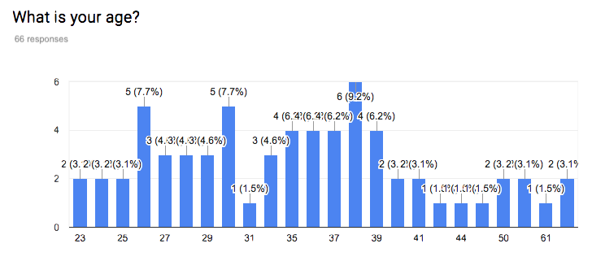

# Models for binary/binomial response 

This week we will learn how to model outcomes of interest that take one of two categorical values (e.g. yes/no, success/failure, alive/dead). The independent responses $Y_i$ can either be

* *binary* (ungrouped), taking the value 1 (say success, with probability $p_i$) or 0 (failure, with probability $1-p_i$) or

* *binomial* (grouped), where $Y_i$ is the number of successes in a given number of trials $n_i$, with the probability of success being $p_i$ and the probability of failure being $1-p_i$.

In both cases the distribution of the $Y_i$ is binomial, but in the first case it is Bin$(1,p_i)$ and in the second case it is Bin$(n_i,p_i)$.

## Binomial response

We will begin with models for binomial responses and we will look at exploratory plots of the data, different choices of link function and hypothesis tests about terms in the model. Finally we will examine measures of goodness of fit of the model. Let's begin with an example.

```{r,echo=FALSE, include=FALSE, fig.height=4, fig.align='center'}
knitr::opts_chunk$set(comment=NA, warning = FALSE, message = FALSE)
library(ggplot2)
library(knitr)
library(dplyr)
library(ROCR)
library(sjPlot)
set_theme(base = theme_grey(), theme.font = NULL, title.color = "black",
title.size = 1.2, title.align = "left", title.vjust = NULL,
geom.outline.color = NULL, geom.outline.size = 0,
geom.boxoutline.size = 0.5, geom.boxoutline.color = "black",
geom.alpha = 1, geom.linetype = 1, geom.errorbar.size = 0.7,
geom.errorbar.linetype = 1, geom.label.color = NULL,
geom.label.size = 4, geom.label.alpha = 1, geom.label.angle = 0,
axis.title.color = "grey30", axis.title.size = 1.1,
axis.title.x.vjust = NULL, axis.title.y.vjust = NULL, axis.angle.x = 0,
axis.angle.y = 0, axis.angle = NULL, axis.textcolor.x = "grey30",
axis.textcolor.y = "grey30", axis.textcolor = NULL,
axis.linecolor.x = NULL, axis.linecolor.y = NULL, axis.linecolor = NULL,
axis.line.size = 0.5, axis.textsize.x = 1, axis.textsize.y = 1,
axis.textsize = NULL, axis.tickslen = NULL, axis.tickscol = NULL,
axis.ticksmar = NULL, axis.ticksize.x = NULL, axis.ticksize.y = NULL,
panel.backcol = NULL, panel.bordercol =NULL, panel.col = NULL,
panel.major.gridcol = NULL, panel.minor.gridcol = NULL,
panel.gridcol = NULL, panel.gridcol.x = NULL, panel.gridcol.y = NULL,
panel.major.linetype = 1, panel.minor.linetype = 1, plot.backcol = NULL,
plot.bordercol = NULL, plot.col = NULL, plot.margins = NULL,
legend.pos = "right", legend.just = NULL, legend.inside = FALSE,
legend.size = 1, legend.color = "black", legend.title.size = 1,
legend.title.color = "black", legend.title.face = "bold",
legend.backgroundcol = "white", legend.bordercol = "white",
legend.item.size = NULL, legend.item.backcol = "grey90",
legend.item.bordercol = "white")
library(gridExtra)
```

###[video, videoid="d2nG7Y17sQw", duration="9m59s"] Binomial response models applied to beetle mortality data

###[example] Beetle mortality


Data for this example consists of the number of beetles dead (*killed*) after five hours exposure to gaseous carbon disulphide at various concentrations (*dose*). The goal for this analysis is to model the probability of a beetle dying as a function of the carbon disulphide dose.

```{r, results = 'hide'}
beetles <- read.csv(url("http://www.stats.gla.ac.uk/~tereza/rp/beetles.csv"))
beetles
```
```{r, echo = FALSE}
knitr::kable(beetles, format = "markdown", padding = 2)
```
Since we have grouped data (multiple beetles per dose), we can visualise the probability of the outcome of interest (beetles killed) by plotting the proportion killed for each dose against the dose. We see that the proportion killed increases with increasing dose.

```{r}
beetles$propkilled <- beetles$killed / beetles$number
p1 <- ggplot(beetles, aes(x = dose, y = propkilled))+
      geom_point(size = 1) + xlab ("Dose") + ylab ("Proportion killed")
```

```{r, echo = FALSE}
p1 + geom_point(size = 1) + xlab ("Dose") + ylab ("Proportion killed") +
               theme(panel.background = element_rect(fill = "transparent", colour = NA),
               plot.background = element_rect(fill = "transparent", colour = NA),
               panel.border = element_rect(fill = NA, colour = "black", size = 1))
```

Since the response variable $Y_i$ can only take one of two values (killed or not), we need to apply a generalised linear model. This takes the form $g(p_i) = \beta_0 + \beta_1 x_i$ where $x_i$ is the dose for $i=1,...,8$, $Y_i\overset{indep}\sim \text{Bin}(n_i,p_i)$ and $p_i$ is the proportion of beetles killed for the $i$th dose. We have several choices of link function $g(p_i)$. We start by considering the *logit* link function $g(p_i)=\log\left(\frac{p_i}{1-p_i} \right)$.

This model can be fitted in R using the `glm()` function as follows:


```{r}
beetles.mat <- cbind(beetles$killed, beetles$number-beetles$killed)
m1 <- glm(beetles.mat ~ beetles$dose, family = binomial(link = 'logit'))
```
Notice that we specify the response as a matrix with two columns, the first being the number of successes (`beetles$killed`) and the second the number of failures (`beetles$number-beetles$killed`). 

The output is given below:


```{r}
summary(m1)
```

From the `glm()` output we can get the estimates $\hat{\beta}_0=-60.72$ and $\hat{\beta}_1=34.27$ with standard errors 5.18 and 2.91 respectively. We can test the hypothesis $H_0: \beta_1=0$ by comparing $z=\frac{\hat{\beta}_1}{\text{se}(\hat{\beta}_1)}=11.77$ with a standard normal distribution. This is called a *Wald* test. Under $H_0$ the probability of observing this value or an even more extreme one is very small (less than $2\times 10^{-16}$ as can be seen from the $p$-value in the output), suggesting that it is unlikely that the data came from a distribution with $\beta_1=0$. In other words, the dose coefficient is significant in the model.

The same conclusion can be reached if we compare the residual deviance (this is the deviance for the model with dose included as a predictor) and the null deviance (this is the deviance for the model with just an intercept term in it). The difference in deviances is $284.202-11.232=272.97$ which is much larger than the 95th percentile of a $\chi^2(7-6)=\chi^2(1)$ distribution:

```{r}
qchisq(df=1, p=0.95)
```
 so we once again conclude that including `dose` in the model is worthwhile.

The value of the deviance for this model is $D = 11.23$. If the model is a good fit for the beetle data the deviance should approximately follow the $\chi^2(8-2)=\chi^2(6)$ distribution. The degrees of freedom are determined as the number of distinct covariate patterns in the data (in this case doses, thus 8) minus the number of parameters in the model (intercept and dose coefficient, thus 2). The 95th percentile of the $\chi^2(6)$ distribution is 


```{r}
qchisq(df=6, p=0.95)
```

and since $11.23<12.59$, we don't have evidence of lack of fit. However, we have to be careful when using the approximate chi-squared distribution as a measure of goodness of fit, because this approximation relies on having reasonably large fitted values. 

For the logit model the fitted values can be obtained by taking the predicted probabilities, $\hat{p}_i$, and multiplying them by the corresponding total number of beetles for $i=1,\dots,8$:

```{r}
p.hat <- predict(m1, type="response")
fitted <- beetles$number * p.hat

cbind(beetles$killed, round(fitted,2))
```
All fitted values with the exception of the first are quite large (as a rule of thumb $>5$), so in this case we can say that the chi-squared approximation seems plausible.

Last but not least on the logit model is the interpretation of the coefficient of dose in terms of the odds ($\frac{p_i}{1-p_i}$) of success. We usually interpret $\hat{\beta}$ in a logit model by taking $\exp(\hat{\beta})$. For the beetles this would give the *odds ratio* $\exp(\hat{\beta}_1)=\exp(34.270)=7.643141 \times 10^{14}$. For each unit increase in dose, the odds of being killed get multiplied by this amount.

The logit link is the most commonly used link for binary/binomial data for this interpretability in terms of the odds of the outcome of interest. 

However, there are situations where another link may also be suitable for a specific application. For instance here we have what is called a dose-response model in which we look at the response as a function of increasing doses of a toxic substance. In this setting, it may be quite natural to consider the *probit* link, $$ g(p_i)=\Phi^{-1} (p_i) = \beta_0 +\beta_1 x_i,$$ where $\Phi$ denotes the cumulative distribution function of the standard normal distribution. As a reminder, here are plots of the probability density function (p.d.f.) and cumulative distribution function (p.d.f.) of the standard normal distribution.

```{r echo=FALSE, fig.height=3.5}
par(mfrow = c(1,2))
plot (seq(-3, 3, le=100), dnorm(seq(-3, 3, le=100), mean = 0, sd = 1), type = "l", xlab = "", ylab="Probability density function")
abline (v=0, lty =2)

plot(seq(-3,3,le=100), pnorm(seq(-3,3,le=100), mean = 0, sd = 1), type = "l", lwd =2, xlab = "", ylab="Cumulative distribution function")
abline (h=0.5, lty = 2)
abline (v=0, lty =2)
```
We can also write this model as $p_i =  \Phi \left(\frac{x_i-\mu}{\sigma} \right)$. Then we can see that $\beta_0 = -\frac{\mu}{\sigma}$, $\beta_1 = \frac{1}{\sigma}$.

Note that at the *median lethal dose* $x_i=\mu$, the probability $p_i$ equals 0.5, and therefore we'd expect half of the beetles to be killed. We can fit the probit model by changing the link option in the `glm` function to `probit`:

```{r}
m2 <- glm(beetles.mat ~ beetles$dose, family = binomial(link = 'probit'))
summary(m2)
```

From the output we get the estimates $\hat{\beta}_1=-34.93$ and $\hat{\beta}_2=19.72$ with standard errors 2.65 and 1.49 respectively. These differ from the coefficient estimates in the logit model because the model equation is totally different between the two. The interpretation of the coefficients also differs. We are still able to conduct hypothesis tests for the significance of the dose coefficient (small $p$-value, hence significant), and a goodness-of-fit test based on the residual deviance ($D=10.12<12.59$ so no evidence of lack of fit). As the deviance is slightly lower than that of the logit model, we can say that the fit is better for the probit model, but the difference is rather small.


Finally, a third choice of link that we could consider is the  *complementary log-log* link, with the GLM equation given by

$$ g(p_i)=\log[-\log(1-p_i)]=\beta_0 + \beta_1 x_i.$$
Fitting this model in R is just a matter of specifying the link as follows:

```{r}
m3 <- glm(beetles.mat ~ beetles$dose, family = binomial(link = 'cloglog'))
summary(m3)
```

The parameter estimates are $\hat{\beta}_1=-39.57$ and $\hat{\beta}_2=-22.04$ with standard errors 3.24 and 1.80 respectively. The deviance is $D=3.45$ which is quite a bit smaller than the deviances obtained with the other two link functions.

We can plot the fitted curves (on the probability scale) for each of the three regression models as follows:
```{r, fig.height=4}
beet_p <- data.frame(beetles = beetles,
                     logit = fitted(m1),
                     probit = fitted(m2),
                     cloglog = fitted(m3))

p2 <- ggplot(beet_p, aes(x = beetles$dose, y = beetles$propkilled)) +
      geom_point() + xlab("Dose") + ylab("Proportion killed") +
      geom_line(aes(x = beetles$dose, y = logit, colour = "Logit")) + 
      geom_line(aes(x = beetles$dose, y = probit, colour = "Probit")) + 
      geom_line(aes(x = beetles$dose, y = cloglog, colour = "C log-log")) +
      guides(colour = guide_legend("Method"))
```


```{r, echo = FALSE}
p2 + geom_point(size = 1)+
     theme(panel.background = element_rect(fill = "transparent", colour = NA),
            plot.background = element_rect(fill = "transparent", colour = NA),
            panel.border = element_rect(fill = NA, colour = "black", size = 1), 
            legend.background = element_rect(fill = "transparent", colour = NA))
```
We see that all three links give a good fit, with the complementary log-log being the best (although in practice we rarely choose the link based on fit: for one thing, the logit and probit are symmetric and can often be quite similar to each other, and for another, we tend to like the interpretability of the logit link and stick with it most of the time). 
###[/example]

Now let us look at another example for which you will do all the work.

###[example] Challenger disaster

In January 1986, the [space shuttle Challenger exploded shortly after launch](https://en.wikipedia.org/wiki/Space_Shuttle_Challenger_disaster). It was subsequently found that the rubber O-ring seals in the rocket boosters were susceptible to breaking in low temperatures. At the time of the launch the temperature was 31 degrees Fahrenheit. Could the failure of the O-rings have been predicted?
Data from the previous 23 missions shows some evidence of damage on some of the six O-rings on each shuttle, as well as the temperature during the shuttle launch. The data is available from `library(faraway)` and is called `orings`. The first column of the data gives the temperature at launch in degrees F and the second column gives the number of damage incidents out of 6 possible.

Here are the first few rows of the data:

```{r}
library(faraway)
head(orings)
```
We wish to use as our predictor $x_i$ the temperature (in degrees F) during launch for the $i$th mission, $i=1,\dots,23$, with the response $y_i$ being the number of damaged O-rings (out of 6 total). The model for the probability $p_i$ of damage to the O-rings is $Y_i \overset{indep}\sim \text{Bin}(n,p_i)$ with $g(p_i)=\beta_0 + \beta_1 x_i$. Here $n=6$.

Here is a plot of the data:

```{r}
p1<- ggplot(orings, aes(x=temp, y=damage/6)) + 
     geom_point()+ xlim (c(25,85)) + ylim(c(0,1)) + 
     xlab ("Temperature (F)") + ylab("Probability of damage")
```

```{r, echo = FALSE, fig.height=4}
p1 + theme(panel.background = element_rect(fill = "transparent", colour = NA),
               plot.background = element_rect(fill = "transparent", colour = NA),
               panel.border = element_rect(fill = NA, colour = "black"))
```

###[/example]

###[task]
Fit a binomial regression model to the data, trying out the logit, probit and complementary log-log options for the link function. 

####[answer]
Logit link:

```{r, results= 'hide'}
lmod <- glm(cbind(damage, 6-damage) ~ temp, family=binomial, data=orings) 
summary(lmod)
```

Probit link:

```{r, results='hide'}

pmod <- glm(cbind(damage, 6-damage) ~ temp, family=binomial(link="probit"), 
            data=orings)
summary(pmod)
```

Complementary log-log link:

```{r, results= 'hide'}
cmod <- glm(cbind(damage, 6-damage) ~ temp, family=binomial(link="cloglog"), data=orings) 
summary(cmod)
```

####[/answer]
###[/task]

###[task]
Superimpose the fitted probabilities from each of the three models on the above plot.

####[answer]
Here is some code for plotting the three fits.

```{r, fig.height=4}
pred1 <- predict(lmod, newdata=data.frame(temp=seq(25,85,le=23)), type="response")
pred2 <- predict(pmod, newdata=data.frame(temp=seq(25,85,le=23)), type="response")
pred3 <- predict(cmod, newdata=data.frame(temp=seq(25,85,le=23)), type="response")
pred <- data.frame(logit = pred1, probit= pred2, cloglog=pred3, px = seq(25,85,le=23),orings)
p1.1 <- ggplot(pred, aes(x=orings$temp, y= orings$damage/6)) +  
        geom_point(size = 1)+ xlim (c(25,85)) + ylim(c(0,1)) + 
        xlab ("Temperature (F)") + ylab("Probability of damage") +
        geom_line(aes(x = px, y = logit, color = "Logit")) +
        geom_line(aes(x = px, y = probit, color = "Probit"))+
  geom_line(aes(x = px, y = cloglog, color = "Complementary log-log"))

```

```{r, echo = FALSE}
p1.1 + theme(panel.background = element_rect(fill = "transparent", colour = NA),
              plot.background = element_rect(fill = "transparent", colour = NA),
              panel.border = element_rect(fill = NA, colour = "black", size = 1))

```
####[/answer]

###[/task]

###[task] 
Calculate a point estimate of the probability of damage to the O-rings when the temperature is 31 degrees Fahrenheit using each of the three models. 

####[answer]
We can obtain the predicted probabilities using the model equation:

```{r}
exp(11.6630-0.2162*31)/(1+exp(11.6630-0.2162*31))
```

We can get the same answer using the `predict()` function as follows: 
```{r}
predict(lmod, newdata=data.frame(temp=31), type="response")
```

Similarly, we can obtain the prediction for the probit model using the cumulative distribution function of a normal distribution:
```{r}
pnorm(5.5915-0.1058*31) 
```

or by using the `predict()` function:
```{r}
predict(pmod, newdata=data.frame(temp=31), type="response")
```

Finally for the complementary log-log model the predicted probability is
```{r}
predict(cmod, newdata=data.frame(temp=31), type="response")
```

The predicted probability of damage is very high for all models.

####[/answer]
###[/task]


## Binary response

Now let us turn our attention to models with a binary response $Y_i \sim \text{Bin}(1,p_i)$. We will go over the main ideas through examples, starting with a light-hearted one. 

###[video, videoid="iNJkAER2ZPg", duration="3m19s"] Yanny or Laurel?

###[example] Yanny or Laurel?
This auditory illusion first appeared on the internet in May 2018. An explanation of why people hear different things can be found in this [short video](https://www.youtube.com/watch?v=yDiXQl7grPQ), just one of many internet sources discussing the phenomenon. The main reason behind the difference appears to be that as we age we lose the ability to hear certain sounds. To see if we could find evidence of such an age effect, we asked people (mainly students on the online MSc programme, and staff and PhD students at the School of Mathematics and Statistics at the University of Glasgow) to fill out a survey on what they hear. Below you can see summaries of the first 66 responses. 

<!--  -->

```{r, echo=FALSE, out.width = '95%'}

knitr::include_graphics("yl2.png")

```

<!--  -->

<!--  -->

The proportions hearing "Yanny" and "Laurel" are very similar to each other, and there are some respondents who hear both or even something completely different. This may be because people do not listen to the audio file using the same device, something we couldn't control for in our online survey. Ignoring for the time being the responses that list something other than just "Yanny" or just "Laurel", we have 53 observations left. Here are the first few rows of the data:

```{r}
yl<- read.csv(url("http://www.stats.gla.ac.uk/~tereza/rp/yl53.csv"))
head(yl)
yl$hear <- factor(yl$hear)
```
For exploratory plots we can consider a boxplot for age, the continuous covariate, and a bar chart for gender, the categorical covariate.
```{r, fig.height=4}
yl.plot1 <- ggplot(yl, aes(y=age, x=hear)) 

yl.plot1 + geom_boxplot()+ xlab("What do you hear?") +
           theme(panel.background = element_rect(fill = "transparent", colour = NA),
           plot.background = element_rect(fill = "transparent", colour = NA),
           panel.border = element_rect(fill = NA, colour = "black", size = 1))

```
We see in the boxplot that the people who hear "Yanny" are younger on average, but that there is a substantial overlap between the two.

The plot of the proportions against gender is shown below. There is a slightly smaller proportion of men hearing "Yanny", but the proportions look very similar overall.

```{r, fig.height=4}
library(sjPlot)
plot_xtab(yl$hear,yl$gender, show.values = FALSE, show.total = FALSE, 
         axis.labels = c("Laurel", "Yanny"), 
         axis.titles=c("What do you hear?"))
```

Let us look at a logistic regression model with age as the explanatory variable. Here $Y_i=1$ if the $i$th respondent heard "Yanny" and $Y_i=0$ if the $i$th respondent heard "Laurel", with $x_i$ being the respondent's age for $i=1,\dots, 53$. The model we will consider is of the form $$g(p_i)=\log\left(\frac{p_i}{1-p_i} \right)=\beta_0+\beta_1 x_i$$ and we fit it in R as follows:

```{r}

mod.yl <- glm(hear ~ age, family=binomial, data=yl)
summary(mod.yl)

```
Notice that the age coefficient is negative, suggesting that older people are less likely to hear "Yanny", but that this coefficient is not significant ($p$-value of 0.16 greater than 0.05, 95\% confidence interval of $-0.04812\pm 1.96 \times 0.03423=(-0.0115,0.019)$ includes zero). Still, if we wanted to use the estimated coefficient to quantify the effect of age, we would need to look at `exp(-0.04812)=0.953`. This suggests that for two people who differ by one year in age, the older person's odds of hearing "Yanny" are 0.953 times those of the younger person. And the odds of hearing "Laurel" get multiplied by a factor of `exp(0.04812)=1.049`. If we look at a ten-year age difference the odds multiplier becomes `exp(0.04812*10)=1.618`. For two people who differ by ten years in age, the older person's odds of hearing "Laurel" are 1.618 times those of the younger person. Finally we can plot the predicted probabilities from this model as a function of age and, as expected, we see that the predicted probability of hearing "Yanny" decreases with age:

<!-- ```{r} -->
<!-- sjp.glm(mod.yl,type="pred",vars=c("age"),facet.grid = FALSE,  -->
<!--         axis.title=c("Age", "Prob (hear Yanny)"), title="") -->
<!-- ``` -->

```{r}
library(sjPlot)
plot_model(mod.yl,type="pred",terms=c("age"), axis.title=c("Age", "Prob(hear Yanny)"), 
           title="", ci.lvl=NA)
```
###[/example]

###[task]
Fit appropriate logistic regression models to explore if gender is related to whether people hear "Yanny" or "Laurel".

####[answer]

We can fit a model with just `gender` as a predictor:

```{r}

mod.yl2 <- glm(hear ~ gender, family=binomial, data=yl)
summary(mod.yl2)

```

or we can add `gender` to the model with `age`:

```{r}

mod.yl3 <- glm(hear ~ gender+age, family=binomial, data=yl)
summary(mod.yl3)

```
In both cases we see that there is no significant gender effect.

####[/answer]

###[/task]

For our second example of a binary logistic regression model, let us look at another famous disaster, the sinking of the Titanic.

##[video, videoid="q6gaSm-7sXE", duration="8m04s"] A logistic regression model for predicting which of the passengers of the Titanic were more likely to survive

###[example] Titanic
On 15th April 1912, during its maiden voyage, the [Titanic](https://en.wikipedia.org/wiki/RMS_Titanic) sank after colliding with an iceberg, killing 1502 out of 2224 passengers and crew. One of the reasons that the shipwreck led to such loss of life was that there were not enough lifeboats for the passengers and crew. Although there was some element of luck involved in surviving the sinking, some groups of people were more likely to survive than others, such as women, children, and the upper-class. 

Our goal is to build a model to predict the survival of a passenger based on information about the passenger's age, gender and ticket class. Here are the first few rows of the data:


```{r}
titanic <- read.csv(url("http://www.stats.gla.ac.uk/~tereza/rp/titanic.csv"))
titanic$passenger.class <- factor(titanic$passenger.class)
head(titanic)
```

The response variable $Y_i$ is the survival status for $n=891$ passengers, taking value 1 for `survived` and 0 for `died`. Predictors include the passenger's ticket class, gender, age, fare, number of relatives on board and so on.
We assume that $Y_i \overset{indep}\sim \text{Bin}(1,p_i)$ where $p_i$ is the probability of survival for the $i$th passenger. We fit a logistic regression model of the form $g(p_i)=\log \left(\frac {p_i}{1-p_i}\right)=\textbf{x}^T_i \boldsymbol{\beta}$, where $\textbf{x}_i$ is the vector of covariates for the $i$th passenger.

First, let us look at some exploratory plots:

```{r, fig.height=3.5}

plot_xtab(titanic$survived,titanic$gender, show.values = FALSE,
         show.total = FALSE, axis.labels = c("Died", "Survived"), 
         legend.title = "Gender")
```
There is a clear pattern here with the proportion surviving much higher for women than for men.

```{r}
plot_xtab(titanic$survived,titanic$passenger.class, show.values = FALSE,
         show.total = FALSE, axis.labels = c("Died", "Survived"), 
         legend.title = "Class")
```
The largest group amongst the passengers who died were third class passengers while amongst those who survived the largest group was first class passengers. 

Now let's fit a model with age, gender and passenger's ticket class as predictors:
```{r, fig.height=3.5}
mod.titan <- glm(survived~gender + passenger.class + age,
                 family=binomial(link="logit"), data=titanic)
summary(mod.titan)
```
We see from the output that the coefficient for males is negative, indicating a lower chance of survival for male passengers. Similarly the coefficients for second and third class are negative, with the magnitude of the third class coefficient larger than that of the second class coefficient, suggesting that second class passengers had a worse chance of survival than first class passengers, and that third class passengers had an even worse chance. Finally the age coefficient is also negative, suggesting that older people were less likely to survive.

To quantify the effect of each of these predictors, we look at *odds ratios* which can be computed as $\exp(\hat{\beta})$. These are shown in the plot below.
<!-- ```{r} -->
<!-- sjp.glm(m1,  vline.color = 5, geom.colors = 4) -->
<!-- ``` -->

```{r}
plot_model(mod.titan, show.values=TRUE)
```

We interpret the odds ratios as follows: men's odds of survival were 0.07 times those of women, third class passengers' odds of survival were 0.10 times those of first class passengers, and second class passengers' odds of survival were 0.33 times those of first class passengers. Finally, for each year increase in the passenger's age, the odds of survival decrease (get multiplied by a factor of 0.97).

Note that the plot also includes confidence intervals for the odds ratios. To illustrate how these are calculated, let's take the coefficient of gender as an example:

An approximate 95\% confidence interval for the gender coefficient (this is on the *log odds* scale, hence a *log odds ratio*) is:

\[-2.61131 \pm 1.96 \times 0.18671=(-2.977,-2.245).\]

The corresponding interval on the *odds scale* is obtained by exponentiating the endpoints:

\[(\exp(-2.977),\exp(-2.245))=(0.051,0.106).\] Thus the *odds ratio* comparing men to women is between 0.05 and 0.10 (point estimate of 0.07): the odds of survival for men are between 0.05 and 0.10 times the odds for women.

We can also plot the predicted probabilities of survival against the passenger's age by the passenger's gender and ticket class. The plot also shows pointwise confidence intervals for the predicted probabilities.

<!-- ```{r} -->
<!-- sjp.glm(mod.titan,type="pred",vars=c("age","passenger.class", "gender"), -->
<!--                       facet.grid = FALSE, legend.title = c("Class"),  -->
<!--                       point.alpha = 0.7) -->
<!-- ``` -->

```{r}
plot_model(mod.titan,type="pred",terms=c("age","passenger.class", "gender"))
```

We see the gender and class differences in survival we have already discussed, and also that survival probabilities decrease by age.

<!-- ```{r, echo = FALSE} -->
<!-- p4 + theme(panel.background = element_rect(fill = "transparent", colour = NA), -->
<!--            plot.background = element_rect(fill = "transparent", colour = NA), -->
<!--            panel.border = element_rect(fill = NA, colour = "black", size = 1),  -->
<!--            legend.background = element_rect(fill = "transparent", colour = NA)) -->
<!-- ``` -->
###[/example]

## Probabilities, odds, odds multipliers and odds ratios

In logit models, we interpret coefficients in terms of the odds, and terms involving the word "odds" inevitably come up when describing the model fit. Here we present all of these terms in the same place and describe the relationships between them.

The odds are defined as $\text{Odds}=\dfrac{p}{1-p}$ where $p$ is the probability of the outcome of interest. We can express the probability in terms of the odds as $p=\dfrac{\text{Odds}}{\text{Odds}+1}.$

In logistic regression we model the **log odds**: $\log\left(\text{Odds}\right)=\log\left(\dfrac{p}{1-p}\right)=\mathbf{x}^T\boldsymbol{\beta}.$ 

The $\beta$ coefficients are **log odds ratios**: Suppose we have a predictor with two levels, say `gender` in the Titanic example, which is coded 1 for men and 0 for women. 

This means that the gender coefficient is the difference between $\log\left(\text{Odds}_2\right)=\log\left(\frac{p_2}{1-p_2}\right)$ (the log odds for men) and $\log\left(\text{Odds}_1\right)=\log\left(\frac{p_1}{1-p_1}\right)$ (the log odds for women). 

And since $\log\left(\text{Odds}_2\right)-\log\left(\text{Odds}_1\right)=\log\left(\dfrac{\text{Odds}_2}{\text{Odds}_1}\right)$, the gender coefficient is equal to the log odds ratio: \[\beta=\log\left(\dfrac{\text{Odds}_2}{\text{Odds}_1}\right)=\log \left( \dfrac{\frac{p_2}{1-p_2}}{\frac{p_1}{1-p_1}}\right).\]

By exponentiating both sides we see that $\exp(\beta)$ is the **odds ratio** for comparing the two levels of the predictor (here men and women) in terms of the **odds** of the outcome of interest.

And since we can express this as $\text{Odds}_2=\exp(\beta) \times \text{Odds}_1,$ we also call $\exp(\beta)$ the **odds multiplier**.

For the Titanic example, a year increase in age is associated with multiplying the odds of survival by a facor of $\exp(-0.03330)=0.97$. 

If the explanatory variable $x$ in the model is continuous rather than a factor, the odds multiplier gives the effect of an increase of one unit in $x$ on the odds of the outcome of interest.

The following video, in which Prof. David Spiegelhalter talks about odds ratios and their interpretation, may be of further use in clarifying these concepts.

##[video, videoid="ixKhS0Silb4", duration="7m03s"] Prof. David Spiegelhalter on odds ratios.


## Model checking and diagnostics for logistic regression

We saw that the deviance, $D$, is one possible goodness-of-fit statistic for GLMs. Another one is the Pearson chi-squared statistic.

###[definition] Pearson' s chi-squared statistic
Pearson's chi-squared statistic is defined as \[X^2= \sum_{i=1}^n \frac{(y_i-n_i\hat{p}_i)^2}{n_i\hat{p}_i(1-\hat{p}_i)} , ~~ i=1,\dots,n\] where $y_i$ represents the observed number of successes, $n_i$ is the number of trials and$\hat{p}_i$ for the $i$th covariate pattern.
###[/definition]

###[theorem] Sampling/asymptotic distribution of $X^2$
$X^2$ is asymptotically equivalent to the deviance. Therefore, under $H_0$: the model fits the data well, $X^2$ is approximately distributed as $\chi^2(n-p)$ where $n$ is the number of parameters in the saturated model (usually equal to the number of observations), and $p$ is the number of parameters in the model of interest. This results holds for relatively large fitted values.
###[/theorem]

<!-- ###[video, videoid="_Gf9eH7C1UM", duration="4m41s"] Pearson's goodness of fit statistic -->


###[example] Beetle data, revisited
Suppose that we would like to assess the fit of the logistic model in the beetle mortality example seen earlier. The data and fitted values obtained from the logit model were as follows.
\begin{center}
\begin{tabular}{cccr}
\hline
$x_i$ &  $n_i$ & $y_i$ & $\hat{y}_i=n_i \hat{p}_i$\\
\hline
1.6907 &    59  &    6 & 3.46\\
1.7242 &    60  &   13 & 9.84\\
1.7552 &    62  &   18 & 22.45\\
1.7842 &    56  &   28 & 33.90\\
1.8113 &    63  &   52 & 50.10\\
1.8369 &    59  &   53 & 53.29\\
1.8610 &    62  &   61 & 59.22\\
1.8839 &    60  &   60 & 58.74\\
\hline
\end{tabular}
\end{center}

We wish to test $H_0$: the model fits the data well against $H_1$: the model does not fit the data well. Instead of using maximum likelihood we could estimate the model parameters by minimising the weighted sum of squares
\[S_w = \sum_{i=1}^n \frac{(y_i-n_ip_i)^2}{n_ip_i(1-p_i)}\] since $E(Y_i)=n_ip_i$ and $\mathrm{Var}(Y_i)=n_ip_i(1-p_i)$. This turns out to be equivalent to minimising the Pearson chi-squared statistic since
\begin{align*} X^2&= \sum_{i=1}^n \frac{(y_i-n_ip_i)^2}{n_ip_i}
+\sum_{i=1}^n \frac{[(n_i-y_i)-n_i(1-p_i)]^2}{n_i(1-p_i)}\\
&= \sum_{i=1}^n \frac{(y_i-n_ip_i)^2}{n_ip_i(1-p_i)}(1-p_i+p_i)=S_w
\end{align*} 
When $X^2$ is evaluated at the estimated expected frequencies, the statistic is \[X^2= \sum_{i=1}^n \frac{(y_i-n_i\hat{p}_i)^2}{n_i\hat{p}_i(1-\hat{p}_i)} \] which will be approximately $\chi^2(n-p)$ if the model is true.

For the beetle mortality example, $D=11.23$ and $X^2=10.03$. Both are relatively large compared with a $\chi^2(6)$ distribution, but not greater than the 95th percentile of the $\chi^2(6)$ distribution:

```{r}
qchisq(p=0.95, df=6)
```

Therefore there is no evidence of lack of fit for the logit model.
###[/example]

**Note:** The chi-squared approximation for the deviance and $X^2$ relies on having expected frequencies (fitted values) that are not too small. It should be ok to use for checking the fit of the beetle mortality model, but if each observation has a different covariate pattern so that $y_i$ is either 0 or 1, as in the Yanny-Laurel example, then neither $D$ nor $X^2$ provides a useful measure of goodness of fit. For this reason, a modification of the chi-squared test has been proposed.

### Hosmer-Lemeshow goodness of fit test

Suppose that for a model for binary responses we wish to test $H_0$: the model fits the data well (observed and expected response frequencies are close to each other) versus $H_1$: the model is not a good fit for the data (observed frequencies are far from expected frequencies). The Hosmer-Lemeshow test statistic is calculated as follows:

1. Order the fitted values
2. Group the fitted values into $g$ classes (where $g$ is between 6 and 10) of roughly equal size.
3. Calculate the observed and expected number in each group
4. Perform a chi-squared goodness-of-fit test, with $\chi^2(g-2)$ as the reference distribution.

<!-- ###[video, videoid="a_fQkJvC7TY", duration="4m08s"] Hosmer-Lemeshow test -->

###[example] Yanny-Laurel revisited

Recall the Yanny-Laurel example we saw earlier, with the model of interest predicting the probability of hearing "Yanny" as a function of the age of the participant.

We can use an implementation of the Hosmer-Lemeshow test to check for evidence of lack of fit in the model.

```{r, warning=TRUE}
source(url("http://www.chrisbilder.com/categorical/Chapter5/AllGOFTests.R"))
HLTest(mod.yl, g=10)

```
The large $p$-value indicates  no lack of fit. To make sure this is not just due to the choice of $g$, we try a few more values, *e.g.* here

```{r, warning=TRUE}
HLTest(mod.yl,g=6)
```
Note the warning that some expected counts are less than 5. This suggests that the chi-squared approximation may not be very reliable for these data.
###[/example]

**Notes on the Hosmer-Lemeshow test:** 

* Failing to reject $H_0$ does not mean that the fit is good. 
* The power of the test can be too small to detect lack of fit.
* How the fitted values are grouped together matters -- use different values of $g$ and see if that changes the conclusion.
* Other tests can be used in addition to the Hosmer-Lemeshow test, see
\url{http://www.chrisbilder.com/categorical/Chapter5/AllGOFTests.R} for some.

<!-- ###[video, videoid="rXJwlvzFZus", duration="8m53s"] Other diagnostics/model checking for binomial models -->

## Other diagnostics/model checking for binomial models

### Likelihood ratio chi-squared statistic

The likelihood ratio chi-squared statistic is defined as twice the difference in maximised log-likelihood under the model of interest and under the null (minimal) model.  Under the null model $\tilde{p}=\sum y_i/\sum n_i$. Let $\hat{p}$ be the MLE under the model of interest. Then \[C=2 [l(\hat{\mathbf{p}};\mathbf{y})-l(\tilde{\mathbf{p}},\mathbf{y})]\] should be approximately $\chi^2(p-1)$ if all the $p$ parameters except the intercept $\beta_0$ are zero. 

We have already used this in models of the form $g(\mu)=\beta_0+\beta1 x$ to test $H_0: \beta_1=0$.

### AIC and BIC

The \textbf{Akaike information criterion (AIC)} and the Schwartz or \textbf{Bayesian information criterion} (BIC) are other goodness-of-fit statistics based on the log-likelihood function with adjustment for the number, $p$, of parameters estimated. 

$$AIC = -2l(\hat{\mathbf{p}};\mathbf{y})+2p$$
$$BIC = -2l(\hat{\mathbf{p}};\mathbf{y})+2p\times \log(\text{number of observations})$$

A small value of these statistics indicates that there is no lack of fit in the model. These statistics could be used as model selection criteria, especially when the models under comparison are not nested.

### Residuals

There are two main forms of residuals for logistic regression: \textbf{deviance} and \textbf{Pearson} (or \textbf{chi-squared}) residuals. These are the contributions to $D$ and $X^2$ respectively of each distinct covariate pattern. Suppose there are $m$ distinct covariate patterns and that $Y_k$, $n_k$ and $\hat{p}_k$ are the number of successes, the number of trials and the estimated probability of success for the $k$th covariate pattern.

###[definition] Pearson residuals
The Pearson or chi-squared residual is \[X_k=\frac{y_k-n_k \hat{p}_k}{\sqrt{n_k\hat{p}_k(1-\hat{p}_k)}}.\]

The standardised Pearson residual is 
\[r_{Pk}=\frac{X_k}{\sqrt{1-h_k}},\] where $h_k$ is the leverage which is obtained from the hat matrix.

###[/definition]


###[definition] Deviance residuals
The deviance residual is \begin{align*} d_k &=\text{sign}(y_k-n_k \hat{p}_k) \\
& \times
\left \lbrace 2 \left[ y_k \log \left( \frac{y_k}{n_k \hat{p}_k}\right)+(n_k-y_k) \log \left( \frac{n_k-y_k}{n_k-n_k\hat{p}_k}\right) \right]\right \rbrace^{1/2}.\end{align*}

The standardised deviance residual is 
\[r_{Dk}=\frac{d_k}{\sqrt{1-h_k}}.\]

###[/definition]

The residuals can be plotted against continuous covariates to check the linearity assumption, and in the order of the measurements to check for serial correlation. Normal probability plots could also be used as the residuals should be approximately $N(0,1)$ provided the numbers of observations for each covariate pattern are not too small. 

However, the residuals are not informative if the response is binary of if $n_k$ is small for most covariate patterns. So residual plots wouldn't be useful for the Yanny-Laurel data where the outcome variable is binary and the predictor (age) is continuous, but they could be used for the beetle data.


###[task]
Compare residual plots from the Yanny-Laurel model with those from the logit model used for the beetle data.

####[answer]

Residual plots for the Yanny-Laurel model:

```{r}

dres.yl <- resid(mod.yl, type="deviance") # Deviance residuals
pres.yl <- resid(mod.yl, type="pearson") # Pearson residuals
pred.yl <- predict(mod.yl, type="response") # Fitted probabilities
d.yl <- data.frame(pred.yl=pred.yl,dres.yl=dres.yl, pres.yl=pres.yl)

ggplot(d.yl, aes(x = pred.yl, y = dres.yl)) +   geom_point() 

```

and for the beetles logit model:

```{r}

m1.b <- glm(beetles.mat ~ beetles$dose, family = binomial(link = 'logit'))
dres.b <- resid(m1.b, type="deviance")
pres.b <- resid(m1.b, type="pearson")
pred.b <- predict(m1.b)

d.b <- data.frame(pred.b=pred.b,dres.b=dres.b, pres.b=pres.b)

ggplot(d.b, aes(x = pred.b, y = dres.b)) +   geom_point() 

```
We can see that the beetle model residuals scatter around zero in a similar way to a linear regression model, while for the Yanny-Laurel model they follow a distinct pattern.

####[/answer]

###[/task]


## Logistic regression as a classifier

<!-- You have already had an introduction to using logistic regression for classification in Predictive Modelling.  -->

A way to assess the predictive power of a model is to look at the receiver operating characteristic (ROC) curve, which is a measure of classifier performance. Using the proportion of positive data points that are correctly predicted as positive (true positive rate) and the proportion of negative data points that are incorrectly predicted as positive (false positive rate), one can generate a graph that shows the trade off between the rate at which the model predicts the response correctly versus predicting it incorrectly. On the horizontal axis of the ROC curve we have the false positive rate and on the  vertical axis the true positive rate. The area under the ROC curve, known as AUC, is used as a measure of a diagnostic test’s discriminatory power. An AUC value of 0.5 indicates that the predictive model is of no discriminative value. We would like models to perform better than a random guess, so we would like the AUC to be greater than 0.5. We can also compare the ROC curves for different models to help us choose between them. 

##[example]
Here is one way to produce the ROC curve and AUC for the model fitted to the Titanic data:

```{r}
library(ROCR)
titanic$Prid <- predict(mod.titan, titanic, type="response")
score <- prediction(titanic$Prid,titanic$survived)
perf <- performance(score,"tpr","fpr")
auc <- performance(score,"auc")
perfd <- data.frame(x= perf@x.values[1][[1]], y=perf@y.values[1][[1]])
p4<- ggplot(perfd, aes(x= x, y=y)) + geom_line() +
       xlab("False positive rate") + ylab("True positive rate") + 
       ggtitle(paste("Area under the curve:", round(auc@y.values[[1]], 3)))
```
```{r, echo=FALSE}
p4 + theme(panel.background = element_rect(fill = "transparent", colour = NA),
            plot.background = element_rect(fill = "transparent", colour = NA),
            panel.border = element_rect(fill = NA, colour = "black", size = 1), 
            legend.background = element_rect(fill = "transparent", colour = NA))
```
Here `perf` is the performance of the predictions from our model in terms of the true positive and false positive rates.

The area under the curve is about 0.85, which is reasonable considering that we have only used three of the predictors available in the data. 

We can also change the decision boundary according to some criterion. Let's say that we want to keep the false positive rate lower than $20\%$, in other words we don't want to incorrectly predict that a passenger survived with a probability of more than $0.2$. In that case we can find the cutoff point as follows:

```{r, echo=TRUE}
cutoffs <- data.frame(cut=perf@alpha.values[[1]], fpr=perf@x.values[[1]], 
                      tpr=perf@y.values[[1]])
cutoffs <- cutoffs[order(cutoffs$tpr, decreasing=TRUE),]
head(subset(cutoffs, fpr < 0.2))
```
##[/example] 

Note that `library(ROCR)` is just one package that produces ROC curves. For more recent packages you can also try `library(plotROC)` or `library(ROCit)`.

As a final note, there is a lot more that one can do with the Titanic dataset. We have only used three explanatory variables and one could try to improve predictive performance by adding more terms to the model. In fact there is a [prediction competition](https://www.kaggle.com/c/titanic) on this dataset, with the data we've used as the training set and also a test set available on which the predictions are made.


<!-- ##[example] Possum classification  -->

<!-- This data set records variables of common brushtail possums found in various Australian regions (source: OpenIntro Statistics). We consider 104 brushtail possums from two regions in Australia, where the possums may be considered a random sample from the population. The first region is Victoria, which is in the eastern half of Australia and traverses the southern coast. The second region consists of New South Wales and Queensland, which make up eastern and northeastern Australia. The outcome variable, called `population`, takes value 1 when a possum is from Victoria and 0 when it is from New South Wales or Queensland.  -->

<!-- In this example, we want to demonstrate how to build a model that differentiates between the possums in Victoria (region 1) and New South Wales & Queensland (region 2) based on the variables provided. -->

<!-- ```{r, results='hide'} -->
<!-- possum <- read.table('possum.txt', header = TRUE) -->
<!-- head(possum) -->
<!-- attach(possum) -->
<!-- ``` -->

<!-- ```{r, echo = FALSE, results = 'asis' } -->
<!-- knitr::kable(head(possum), format = "markdown", padding = 2) -->
<!-- ```  -->


<!-- We can explore the relationships between the variables by looking at plots: -->

<!-- ```{r, warning=FALSE, message=FALSE} -->
<!-- sex_male <- 0 -->
<!-- sex_male [sex == 'm'] <- 1 -->
<!-- sex_male [sex == 'f'] <- 0 -->

<!-- p4<- ggpairs(possum, columns = c(3,4,5,6,7,8), columnLabels = c("Sex", " Age", "Head length",  -->
<!--      "Skull width", "Total length", "Tail length"), aes(colour = pop, alpha = 0.4),  -->
<!--       upper = list(continuous = wrap("cor", size = 2))) -->
<!-- ``` -->

<!-- ```{r, echo=FALSE} -->
<!-- p4+ theme(panel.background = element_rect(fill = "transparent", colour = NA), -->
<!--             plot.background = element_rect(fill = "transparent", colour = NA), -->
<!--             panel.border = element_rect(fill = NA, colour = "black", size = 1),  -->
<!--             legend.background = element_rect(fill = "transparent", colour = NA)) -->
<!-- ``` -->


<!-- We can use logistic regression to classify the possums in the two regions. We use `population` as the outcome variable and five predictors: `sex_male` (an indicator for a possum being male), `head_length`, `skull_width`, `total_length`, and `tail_length`. The full logistic regression model and a reduced model after variable selection are summarized in the table. -->


<!-- ```{r} -->
<!-- population <- 0  -->
<!-- population [pop == "Vic"] <- 1 -->
<!-- population [pop == "other"] <- 0 -->
<!-- ``` -->

<!-- ```{r, results = "hide"} -->
<!-- m1 <- glm(population ~ sex_male + headL + skullW + totalL + tailL,  -->
<!--            family = binomial, data = possum) -->
<!-- summary(m1) -->
<!-- ``` -->

<!-- In model `m1` we can see that `head_length` and `skull_witdh` are not significant predictors (p-values > 0.05), which means we can probably simplify it by dropping one of these variables. -->


<!-- ```{r, results = "hide"} -->
<!-- m2 <- glm(population ~ sex_male  + skullW + totalL + tailL,  -->
<!--            family = binomial, data = possum) -->
<!-- summary(m2) -->
<!-- ``` -->


<!-- Based on the summary for model `m2` we can write the equation as follows: -->

<!-- $$ \log\frac{\hat{p}} {1-\hat{p}} = 33.51 - 1.421 \times \text {sex male} -0.279 \times \text{skull length} +0.569 \times \text{total length} - 1.806 \times \text{tail length},  $$ -->
<!-- where $p$ denotes the proportion of possums from Victoria. -->
<!-- Using this equation, we can calculate the probability that a particular male possum with its skull about 63mm wide, its tail 37cm long, and its total length of 83cm comes from the Victoria area of Australia: -->

<!-- $$ \log\frac{\hat{p}} {1-\hat{p}} = 33.51 - 1.421 \times 1 -0.279 \times 63 +0.569 \times 83 - 1.806 \times 37 = -5.083 \Rightarrow \hat{p} = \frac { \exp (-5.083)} {1+ \exp(-5.083)} = 0.006$$ -->

<!-- As such, it appears the estimated probability is 6% making it very unlikely that the possum comes from the Victoria area. We can perform a similar calculation to obtain estimated probabilities for any possums given their measurements.  -->

<!-- ```{r, echo = FALSE} -->
<!-- detach(possum) -->
<!-- ``` -->

<!-- ##[/example] -->


<!-- ##[example] Hair analysis -->


<!-- Hair samples from 125 subjects were analysed and various biomarkers were measured: *FAEEs, EtG, AST, ALT, GGT, MCV, CDT, BMI*. -->
<!-- Reference to the study can be found [here](https://www.sciencedirect.com/science/article/pii/S2352340917301026). -->

<!-- The question of interest is how well can we classify a subject as *chronic* (y=1) or *non-chronic* (y=0) drinker based on the biomarkers measured? -->

<!-- First, we read in the data set: -->
<!-- ```{r, results='hide'} -->
<!-- rawdata <- read.csv("hairbiomarkers.csv", header = TRUE) -->
<!-- y <- ifelse(rawdata[ , 2] == "Positive", 1, 0) -->
<!-- dat <- as.data.frame(cbind(y, rawdata[ , 3:10])) -->
<!-- ``` -->


<!-- ```{r, echo = FALSE} -->
<!-- knitr::kable(head(dat), format = "markdown", padding = 2) -->
<!-- ```  -->

<!-- ```{r, results='hide', include = FALSE} -->
<!-- set.seed(0956) -->
<!-- ``` -->


<!-- First, we split the data into a training and a test set. -->
<!-- ```{r} -->
<!-- smp_size <- floor(0.6 * nrow(dat)) -->
<!--    index <- sample(seq_len(nrow(dat)), size=smp_size) -->
<!--    train <- dat[index, ] -->
<!--     test <- dat[-index, ] -->
<!-- ``` -->


<!-- Model with CDT as predictor -->

<!-- ```{r} -->
<!-- dat$yf<- factor(y) -->
<!-- levels(dat$yf) <- c("Non-chronic","Chronic") -->
<!-- ggplot(dat, aes(x = dat$y, y = dat$CDT, group = dat$y, fill = dat$yf))  +  -->
<!--     geom_boxplot() + xlab ("Chronic group") + ylab ("CDT") + -->
<!--     guides(fill = guide_legend("Chronic group")) -->
<!-- ``` -->

<!-- Then, we fit a logistic regression model to the training data with CDT as the predictor: -->
<!-- ```{r} -->
<!-- model<- glm(y ~ CDT, family = binomial, data = train) -->
<!-- summary(model) -->
<!-- ``` -->

<!-- We use this model to obtain predicted probabilities for the data in the test set: -->
<!-- ```{r} -->
<!-- results_prob <- predict(model, newdata = test, type = "response") -->
<!-- ``` -->

<!-- Classify subjects in the test set as chronic or non-chronic drinkers based on their predicted probabilities. -->
<!-- E.g. if predicted probability > 0.5 assign subject’s class as *chronic*. -->
<!-- ```{r} -->
<!-- results <- ifelse(results_prob > 0.5, 1, 0) -->
<!-- ``` -->

<!-- Finally, we can obtain measures of classification performance to assess how well the classifier works: -->
<!-- ```{r} -->
<!-- answers <- test$y -->
<!-- misClassificError <- mean(answers != results) -->
<!-- acc <- 1 - misClassificError -->
<!-- acc -->
<!-- all <- data.frame(answers = answers, results = results) -->
<!-- trueneg <- all[answers == 0, ] -->
<!-- truepos <- all[answers == 1, ] -->
<!-- fpr <- mean(trueneg$answers != trueneg$results) -->
<!-- fpr -->
<!-- fnr <- mean(truepos$answers != truepos$results) -->
<!-- fnr -->
<!-- ``` -->
<!-- This indicates that our model's accuracy is 84%, the false posistive rate is 2.4% and the false negative rate is 77%.  -->


<!-- We can use the `ROCR` library in R to measure the performance of different logistic models as classifiers, using a variety of measures.  -->

<!-- ```{r} -->
<!-- p <- predict(model, test, type="response") -->
<!-- pr <- prediction(p, test$y) -->
<!-- # TPR = sensitivity, FPR=specificity -->
<!-- prf <- performance(pr, measure = "tpr", x.measure = "fpr") -->
<!-- auc <- performance(pr, measure = "auc") -->
<!-- auc <- auc@y.values[[1]] -->
<!-- auc -->
<!-- prf_p <- data.frame (x = prf@x.values[[1]], -->
<!--                      y = prf@y.values[[1]]) -->
<!-- ggplot(prf_p, aes(x = prf_p$x, y = prf_p$y)) + geom_line() +  -->
<!-- xlab ("False positive rate") + ylab ("True positive rate") -->
<!-- ``` -->


<!-- Model with EtG as predictor -->

<!-- Repeat the analysis with a different biomarker, EtG, now: -->
<!-- ```{r} -->
<!-- ggplot(dat, aes(x = dat$y, y = dat$EtG, group = dat$y, fill = dat$yf))  +  -->
<!--     geom_boxplot() + xlab ("Chronic group") + ylab ("EtG") + -->
<!--     guides(fill = guide_legend("Chronic group")) -->
<!-- ``` -->

<!-- ```{r} -->
<!-- modelEtG<- glm(y~EtG, family=binomial, data=train) -->
<!-- ``` -->


<!-- ```{r} -->
<!-- results_prob <- predict(modelEtG, newdata = test, type = "response") -->
<!-- results <- ifelse(results_prob > 0.5,1,0) -->
<!-- answers <- test$y -->
<!-- misClassificError <- mean(answers != results) -->
<!-- acc <- 1-misClassificError -->
<!-- acc -->
<!-- all <- data.frame(answers=answers, results=results) -->
<!-- trueneg <- all[answers==0,] -->
<!-- truepos <- all[answers==1,] -->
<!-- fpr <- mean(trueneg$answers!=trueneg$results) -->
<!-- fpr -->
<!-- fnr <- mean(truepos$answers!=truepos$results) -->
<!-- fnr -->
<!-- p <- predict(modelEtG, test, type="response") -->
<!-- pr <- prediction(p, test$y) -->
<!-- prf<- performance(pr, measure = "tpr", x.measure = "fpr") -->
<!-- auc <- performance(pr, measure = "auc") -->
<!-- auc <- auc@y.values[[1]] -->
<!-- auc -->

<!-- prf2_p <- data.frame (x = prf@x.values[[1]], -->
<!--                      y = prf@y.values[[1]]) -->
<!-- ggplot(prf2_p, aes(x = prf2_p$x, y = prf2_p$y)) + geom_line() +  -->
<!-- xlab ("False positive rate") + ylab ("True positive rate") -->

<!-- ``` -->

<!-- The closer to 1 the area under curve (AUC) the better the classification performance. From the two models we presented, the one with biomarker EtG sems to have a higher accuracy (98% compared to 69%).  -->
<!-- Furthermore, the closer the ROC curve to the upper left corner, the better the classification performance. Hence, based on Figures 1 and 2, we draw the same conclusion: that the model with EtG provides a better classification than the model with biomarker CDT. -->


<!-- ##[/example] -->

Now let's look at another example where logistic regression can help us predict an outcome of interest.

###[example] Trump tweets
Donald J. Trump was the 45th President of the United States, inaugurated on 20th January, 2017. Trump was an avid user of [twitter](www.twitter.com), an online news and social networking service where users post and interact with messages, called "tweets". In the beginning of his presidency there was some question as to who wrote the tweets from Trump's official twitter account @realDonaldTrump: Trump himself, or his team?

Donald Trump was known to have used a Samsung Galaxy smartphone to write his tweets, whereas his team used iOS devices. The device used to send a tweet can be retrieved using the Twitter API, so it used to be easy to determine whether a tweet was written by Donald Trump himself or his team. However, in March 2017, Donald Trump switched to an iPhone, after which point there was no way of telling whether Donald Trump had written a tweet himself. 

The dataset provided contains a set of 3329 tweets from January 1st 2016 to his inauguration on 20th January 2017. During this period Donald Trump used an Android phone throughout.

The data file `trump.csv` contains the following columns:

* `source` - device used: "Android" (Trump) or "iOS" (team) 
* `text` - text of the tweet
* `nwords` - number of words in the tweet
* `contains_url` - whether the tweet contains a URL
* `sentiment` - sentiment obtained from a simple sentiment analysis 
* `dow` - day of the week ("Monday" to "Sunday")
* `day` - day (in days since 1 January 2016)
* `hour` - decimal hour in the day

Let us read in the data:

```{r}
trump <- read.csv(url("http://www.stats.gla.ac.uk/~tereza/rp/trump.csv"))
```

We define a new variable, `Source`, to be the outcome variable such that when the tweet is written from an iOS device (i.e. by the team) this is set to 0 and when the tweet is written by Trump himself, this is set to 1.

```{r}
trump$Source <- 0
trump$Source[trump$source == "Android"] <- 1
```

We also add a "none" level to `sentiment` to replace `NA` values:

```{r}
trump$sentiment[is.na(trump$sentiment)] <- "none"
trump$sentiment <- factor(trump$sentiment)
```

<!-- We can plot these variables according to the `source` of the tweets: -->

<!-- FIX CODE FOR TRUMP EXAMPLE -->

<!-- ```{r} -->
<!-- p1 <- ggplot(trump, aes(x = source, y = nwords, fill = source)) + geom_boxplot() + -->
<!--       xlab("Source") + ylab("Number of words") -->

<!-- trump_t2 <- data.frame(table(contains_url,source)) -->
<!-- p2 <- ggplot(trump_t2, aes(x = source, -->
<!--                           y = Freq, -->
<!--                           fill = contains_url, -->
<!--                           group = contains_url)) + -->
<!--     geom_bar(stat = "identity", position = "dodge") + -->
<!--     xlab("Source") + ylab("Counts of URLs") + -->
<!--     scale_fill_discrete(name = "Contains URL") -->

<!-- trump_t3 <- data.frame(table(sentiment, source)) -->
<!-- p3 <- ggplot(trump_t3, aes(x = sentiment, y = Freq , fill = source, group = source)) + -->
<!--     geom_bar(stat = "identity", position = "dodge") + -->
<!--     xlab("Sentiment") + ylab("Counts for sentiments") + -->
<!--     scale_fill_discrete(name = "Source") + -->
<!--     theme(axis.text.x = element_text(angle = 45)) -->

<!-- trump_t4 <- data.frame(table(dow, source)) -->
<!-- p4 <- ggplot(trump_t4, aes(x = dow, y = Freq , fill = source, group = source)) + -->
<!--     geom_bar(stat = "identity", position = "dodge") + -->
<!--     xlab("Day of the week") + ylab("Counts for each week day") + -->
<!--     scale_fill_discrete(name = "Source") + -->
<!--     theme(axis.text.x = element_text(angle = 45)) -->

<!-- p5 <- ggplot(trump, aes(x = day , fill = source, group = source)) + -->
<!--     geom_histogram() + -->
<!--     xlab("Day") + ylab("Tweet counts") + -->
<!--     scale_fill_discrete(name = "Source") -->

<!-- p6 <- ggplot(trump, aes(x = hour , fill = source, group = source)) + -->
<!--     geom_histogram() + -->
<!--     xlab("Hour") + ylab("Tweet counts") + -->
<!--     scale_fill_discrete(name = "Source") -->

<!-- grid.arrange(p1, p2, p3, p4, p6, p5, -->
<!--   nrow = 3, -->
<!--   top = "Variables in the Trump tweets dataset") -->
<!-- ``` -->


<!-- In general, in a logistic regression model the outcome is a two-level categorical variable where the outcome variable takes the value 1 (in our application, this represents *a tweet from Trump*) with probability $p_i$ and the value 0 with probability $1-p_i$. It is the probability $p_i$ that we model in relation to the predictor variables. -->

<!-- A logistic regression model including all the variables can be fitted using the `glm` function: -->

<!-- <!-- ```{r} --> -->
<!-- <!-- m0 <- glm (source ~ nwords + contains_url + sentiment + dow + day + hour,  --> -->
<!-- <!--             data = trump, family = binomial) --> -->
<!-- <!-- summary (m0) --> -->
<!-- <!-- ``` --> -->


<!-- As we can see from the p-values of the coefficients in the model output, most of the coefficients are significant, however, notice that the levels of the `sentiment` variable seems to be mostly unsignificant. -->

<!-- Furthermore, just like in any regression model, the positive coefficients (for example those corresponding to the predictors `contains_URL` and `hour`) indicate a possitive association with the reponse variable, while the negative coefficients (for example those corresponding to `day` and `nwords`) decreases the probability that the tweet was written by Trump.  -->

<!-- We can calculate probabilites associated with each of the two events of interest (tweet written by *Trump* versus tweet written by *team*), for given values of the predictors in the model. For example, a tweet with the following predictors `nwords` = 25, `contains_url` = TRUE, `sentiment` = negative , `dow` = Thursday, `day` = 100, and `hour` = 20 has the following associated probability of being written by *Trump*: -->

<!-- $$ \log\frac{\hat{p}} {1-\hat{p}} = 0.414 - 0.086 \times 25 + 5.872 - 0.009 - 0.1206- 0.002 \times 100 + 0.096 \times 20 = 5.7264  $$ -->

<!-- And so:  -->
<!-- $$ \hat{p} = \frac { \exp(5.7264)} {1+\exp(5.7264)} = 0.997 $$  -->

<!-- This means a tweet with those specifications has a 99.7% probability of being written by *Trump* himself.  -->

<!-- ```{r, echo = FALSE} -->
<!-- detach(trump) -->
<!-- ``` -->
###[/example]

###[task]
Fit a logistic regression model with `Source` as the response and `nwords`, `contains_url`, `sentiment`, `dow`, `day`, and `hour` as predictors. Are all the terms significant in the model?

####[answer]
Fitting a model with the required set of predictors gives the following results:
```{r}
mod.trump <- glm(Source ~ nwords + contains_url + sentiment + dow + day + hour, 
 data = trump, family = binomial)
summary(mod.trump)
```
We can look at what happens to the residual deviance as we add each term by using 
```{r}
anova(mod.trump)
```
We see that the largest reduction in residual deviance comes when adding `contains_url` and the smallest when adding `sentiment`. We could try a model without `sentiment` as the resulting reduction in deviance (10.47) is smaller than the 95th percentile of a $\chi^2(9)$ distribution:

```{r}
qchisq(df=9,p=0.95)
```

Alternatively one can use a stepwise procedure to select which terms to include in a final model, using the *Akaike Information Criterion (AIC)* or similar as the criterion to optimise.

####[/answer]
###[/task]

###[task]
From the fitted model with all terms in it, is a tweet with a url in it more likely to have been written by Trump or his team? What about the number of words? Is a longer tweet more likely to have been written by Trump or his team?

####[answer]

The coefficient of `contains_url` is negative, suggesting that such a tweet is less likely to have been written by Trump. Conversely, the coefficient of `nwords` is positive, suggesting that a longer tweet is more likely to have been written by Trump.
####[/answer]

###[/task]

###[task]
Assess the predictive performance of the above model by producing a ROC curve and obtaining the area under the curve.

####[answer]
We can produce a ROC curve and calculate the area under the curve as follows:
  
```{r}

library(ROCR)
trump$pred <- predict(mod.trump, trump, type="response")
score <- prediction(trump$pred,trump$Source)
perf <- performance(score,"tpr","fpr")
auc <- performance(score,"auc")
perfd <- data.frame(x= perf@x.values[1][[1]], y=perf@y.values[1][[1]])
roc.trump<- ggplot(perfd, aes(x= x, y=y)) + geom_line() +
       xlab("False positive rate") + ylab("True positive rate") + 
       ggtitle(paste("Area under the curve:", round(auc@y.values[[1]], 3)))
```
```{r, echo=FALSE}
roc.trump + theme(panel.background = element_rect(fill = "transparent", colour = NA),
            plot.background = element_rect(fill = "transparent", colour = NA),
            panel.border = element_rect(fill = NA, colour = "black", size = 1), 
            legend.background = element_rect(fill = "transparent", colour = NA))
```

The area under the curve is 0.91. It may be possible to improve the predictive performance of the model by adding more predictors or even by removing some of the terms currently in the model.

####[/answer]
###[/task]

## Other issues with models for binary/binomial data

### Separation/perfect prediction
##[video, videoid="H4UpxY3dpIM", duration="1m21s"] Separation in logistic regression

Separation occurs in logistic regression models when a hyperplane exists that perfectly separates responses from non-responses. In that case the MLE $\hat{\beta}$ does not exist. Consider the following illustration:

```{r}
dat<- read.table(url("http://www.stats.gla.ac.uk/~tereza/rp/separation.txt"), header=TRUE)
dat
```

Here the binary response $y$ can be perfectly predicted from the value of explanatory variable $x_2$, as can be seen in the following plot.

```{r, echo=FALSE}
with(dat,plot(x1[y==1],x2[y==1], pch=16,  xlab="x1",
               ylab="x2", ylim=c(20,85)))
with(dat,points(x1[y==0],x2[y==0], pch=17))

abline(a=58, b=0) 
```

When we fit the model using `glm` we get a warning:

```{r, warning=TRUE}
mod.sep <- glm(y~x1+x2, family="binomial", data=dat)
```

And the output looks strange:

```{r}
summary(mod.sep)
```

Notice the large standard errors, large $p$-values and zero deviance!

For more information on separation in logistic regression and on ways to deal with this problem follow [this link.](https://stats.idre.ucla.edu/other/mult-pkg/faq/general/faqwhat-is-complete-or-quasi-complete-separation-in-logisticprobit-regression-and-how-do-we-deal-with-them/) In particular, Firth's logistic regression implemented in the function `logistf()` in `library(logistf)`, `bayesglm()` from `library(arm)` and `glmnet()` from `library(glmnet)` may be useful here.

### Overdispersion

In a model for binomial responses $Y_i$, we model the mean $E(Y_i)$ as a function of explanatory variables. And since the variance of a binomial distribution  is $\mathrm{Var}(Y_i)=n_i p_i(1-p_i)$, it is related to the mean, so by fitting a model for the mean of binomial responses we are implicitly also modelling the variance.

Observations $y_i$ may have observed variance greater than the binomial variance $n_i p_i (1-p_i)$. This is called *overdispersion*. Similarly, *underdispersion* occurs when $\mathrm{Var}(Y_i)$ is much smaller than $n_ip_i(1-p_i)$. This could be caused by omission of important explanatory variables, correlated $Y_i$, misspecification of the link function or other data complexities. Overdispersion can be detected if the deviance is much greater than its degree of freedom of $n-p$. One approach to correct for overdispersion is to include an extra dispersion parameter $\phi$ in the model so that $\mathrm{Var}(Y_i)=\phi n_i p_i (1-p_i)$. We will see more on how to deal with overdispersed data later, in the context of count regression.

### Rare events

Logistic regression is frequently used to model the probability of a rare event such as a disease, an equipment failure or natural disaster. The problem is that if there are only a few instances of the rare event in the data, the logistic regression model estimates will be biased, leading to poor prediction outcomes. This means that if we have very few 1s in our data, any logistic regression model we fit will do a poor job of predicting the 1s. One strategy to try and deal with this problem is to sample all of the 1s in the data but only some of the 0s before fitting the logistic regression model. 

## Additional resources
 You can read more about models for binomial data in Chapter 2 from *Extending linear models with R: generalized linear, mixed effects and nonparametric regression models by Julian Faraway*:

###[weblink,target="http://encore.lib.gla.ac.uk/iii/encore/record/C__Rb2939999?lang=eng",icon=book]


###[/weblink]

For more examples in R, along with a summary of issues relating to logistic regression, see [this data analysis example from UCLA's Institute for Digital Research and Education](https://stats.idre.ucla.edu/r/dae/logit-regression/). The same source also provides an [example of probit regression](https://stats.idre.ucla.edu/r/dae/probit-regression/).

## Week 3 learning outcomes

* Recognise the types of data that require a model for binary(ungrouped)/binomial (grouped) response

* Distinguish which type of model, binomial or binary, is appropriate for a given dataset

* Use appropriate plots to explore the relationship between the response and explanatory variables (e.g. boxplots for continuous explanatory variables, and barcharts for categorical explanatory variables)

* Fit a GLM for binary/binomial outcomes using any of the three link functions presented here (logit, probit, complementary log-log)

* Recognise the model being fit from the R code used to fit it

* Interpret logistic regression (logit model) coefficients in terms of the odds of the outcome of interest

* Test hypotheses about regression coefficients using Wald tests and deviances

* Interpret logistic regression output presented in the form of odds ratios

* Check the goodness of fit of a binomial model using the deviance, but only if the fitted values are relatively large (in particular do not use the deviance for goodness of fit of a binary logistic regression model)

* Obtain predicted probabilities and fitted values from a GLM for binary/binomial responses

* Use logistic regression as a classification tool

* Use ROC curves and the area under curve to assess classification performance

* Be aware of the difficulty with trying to predict rare events and the resulting poor classification performance

* Recognise the warnings that separation (perfect prediction) may be occurring in a logistic regression model and be familiar with possible remedies

* Be aware of the issue of overdispersion in logistic regression models