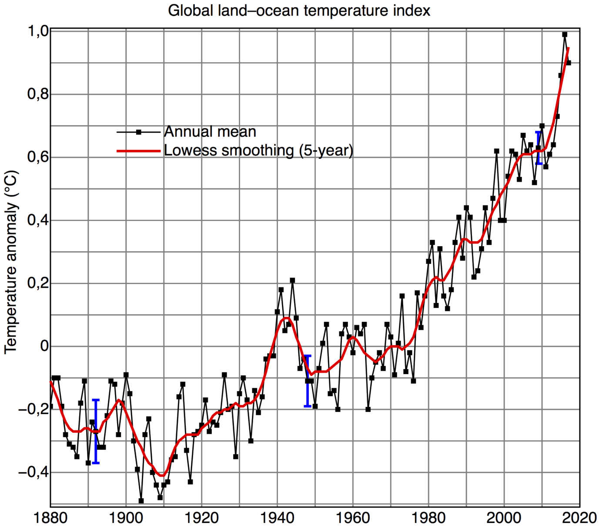
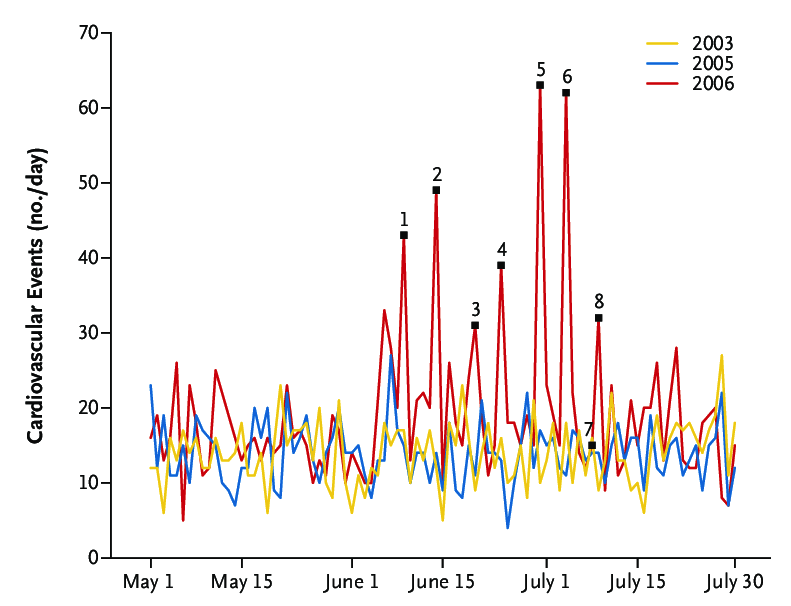
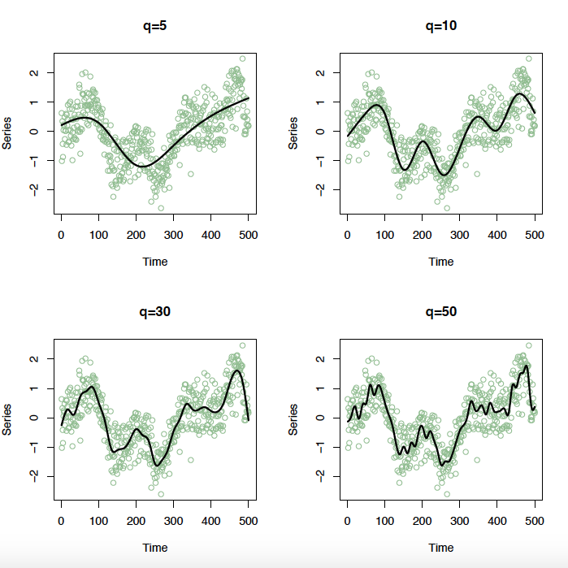

# Introduction

```{r setup, include=FALSE}
knitr::opts_chunk$set(comment=NA, warning = FALSE, message = FALSE)
library(ggplot2)
library(GGally)
library(gridExtra)

# transparent theme
Rmkd_theme <- theme_light()+
        theme(panel.background = element_rect(fill = "transparent", colour = NA),
              plot.background = element_rect(fill = "transparent", colour = NA),
              panel.border = element_rect(fill = NA, colour = "black", size = 1),
              legend.background = element_rect(fill = "transparent", colour = NA))
theme_set(Rmkd_theme)

g_legend <- function(a.gplot){
  tmp <- ggplot_gtable(ggplot_build(a.gplot))
  leg <- which(sapply(tmp$grobs, function(x) x$name) == "guide-box")
  legend <- tmp$grobs[[leg]]
  return(legend)}

```

This week will begin with an introduction to time series analysis. The term refers to the analysis of correlated observations that are measured over time. We will introduce concepts such as autocorrelation and stationarity and briefly go over the theoretical properties of time series. We will describe the main features we may see in a time series: trend, seasonality and short-term correlation, and how to determine whether or not they are present. Finally we will present different ways of modelling time series data.


## What is a time series? 

Time series data are found in a wide variety of application areas, examples of which include:

-   **Environmental:** yearly average temperature levels, daily C02 levels in the atmosphere.

-   **Economic:** Daily value of the FTSE share index, the UK's yearly gross domestic product (GDP), monthly levels of unemployment.

-   **Medical:** Daily number of deaths in Glasgow due to heart attack, size of the monthly transplant waiting list.

-   **Educational:** Number of students obtaining degrees from the University of Glasgow per year, weekly attendance at lectures.

-   **Business:** Monthly sales figures for a leading supermarket, number of chocolate bars made per week by Cadbury's.

-   **Leisure:** Number of goals scored in the Premier league each week of the season, number of people going to the cinema per week.


A time series is a single set of data whose observations are ordered in time. The most important feature of time series data is that the observations relate to a single quantity measured at a number of points in time. Therefore observations that are close in time are likely to be correlated and not independent. As a result, the majority of statistical models you have met are not appropriate for modelling time series data, because they assume the observations are independent.

###[definition] Time series process

A **time series process** is a stochastic process $\{X_{t}~| ~t\in T\}$, which is a collection of random variables that are ordered in time. Here $T$ is called the **index set**, and determines the set of times at which the process is defined and observations are made.
###[/definition] 

We will restrict our attention to

- random variables $X_{t}$ that are continuous, i.e. their set of possible outcomes is a continuous range;

- index sets $T$ that are discrete and equally spaced in time, so that observations are collected hourly, daily, monthly, yearly, etc.

We adopt the following notation:

-   **Random variables** are denoted by capital letters, $X_{t}$, and are random quantities that have a distribution. Random variables can be defined for infinitely many time points $t\in T$.

-   **Observations** are denoted by lower case letters, $x_{t}$, and are realisations of the random variables (numbers). Such realisations are only available at a finite number of time points (i.e. since records began), meaning that only $n$ observations $\{x_{1},\ldots,x_{n}\}$ are available.


###[definition] Time plot
The most important descriptive tool with which to analyse a time series is the **time plot**, which is a plot of the data on the vertical axis against time, on the horizontal axis. The time plot gives you a visual description of the time series which allows you to pick out any prominent features.
###[/definition]

<!-- \pagebreak -->

###[example] Air pollution in Glasgow

The data file `anderstonpm10.csv` contains daily average air pollution concentrations in Glasgow Anderston for the last three months of 2007. The pollutant measured is called particulate matter, which comprises small particles of liquid and solids that are suspended in the air. We can read in the data and plot the time series as follows:

```{r echo=TRUE, fig.align='center', fig.width=5.5, fig.height=3}
anderston <- read.csv(url("http://www.stats.gla.ac.uk/~tereza/rp/anderstonpm10.csv"))

# Create a date variable for ggplot
anderston$Date2 <- as.Date(anderston$Date, "%d/%m/%Y")

ggplot(anderston, aes(Date2, Glasgow.Anderston)) + geom_line(color = "#41ab5d") +
    scale_x_date(date_labels = "%d-%b-%y", date_breaks = "2 week") +  xlab("Date") +
    ylab("Particulate matter") + ggtitle("Pollution concentrations in Glasgow")

```

###[/example]


###[example] Air traffic
The graph below shows the number of foreign passengers entering the UK per quarter between 2000 and 2007. The data can be read in from the file `airtraffic.csv`. Notice that we are using function `as.yearqtr()` from `library(zoo)` to create a quarterly date variable before plotting the time series.

```{r echo=TRUE, fig.align='center', fig.width=5.5, fig.height=3}
library(zoo)
airtraffic<-read.csv(url("http://www.stats.gla.ac.uk/~tereza/rp/airtraffic.csv"))
# Create a quarterly date variable
airtraffic$Date <- as.yearqtr(paste(airtraffic$Year, airtraffic$Quarter), 
                              format="%Y %q")

ggplot(airtraffic, aes(Date, passengers)) + geom_line(color = "#41b6c4") +
    scale_x_yearqtr(format = "%Y-Q%q") +  xlab("Date") +  ylab("Passengers") + 
    ggtitle("Number of air travellers into the UK per quarter")
```
###[/example]

##[video,videoid="0cNCYpTbJKc", duration="2m55s"] Introduction to time series data

# Objectives of a time series analysis

Given a set of time series data, you as the analyst will generally be asked to answer one or more questions of interest about it. The main types of questions that arise for time series data depend on the context of the data and why it was collected.  Some of the main reasons for collecting and analysing time series data are described below.

1. **Description:** Describe the main features of the time series such as: is the series increasing or decreasing; are there any seasonal patterns (*e.g.* higher in summer and lower in winter); and how does a second explanatory variable affect the value of the time series?

2. **Monitoring:** Detect when changes in the behaviour of the time series have occurred, *e.g.* sudden drops in sales.

3. **Forecasting:** Predict future values of the time series from the current values, and quantify the uncertainty in these predictions.

The following examples show time series and possible questions of interest.

<!-- \pagebreak -->

###[example] Share price

This graph shows the share price of a well known UK retailer (Woolworths) between 2001 and 2009.

```{r echo=FALSE, fig.align='center', fig.width=5.5, fig.height=3}
woolworths<-read.csv(url("http://www.stats.gla.ac.uk/~tereza/rp/woolworths.csv"))

# convert to "Date"" type variable
woolworths$Date <- as.Date(woolworths$Date, "%d/%m/%Y")

ggplot(woolworths, aes(Date, Value)) + geom_line(color = "#dd3497") +
    scale_x_date(date_labels = "%b-%y", date_breaks = "1 year") +  xlab("Date") + ylab("Share price") + ggtitle("Woolworths share price between 2001-2009")


```

A possible question of interest would be: When did the share price start to drop and what caused this drop?

###[/example]

###[example] Global temperature anomaly
This graph [^1] shows the average global temperature anomaly over the last 140 years.

[^1]: [Source](https://commons.wikimedia.org/wiki/File:Global_Temperature_Anomaly.svg)

```{r echo=FALSE,  fig.align='center', out.height='40%'}

```
A possible question of interest would be: What will the temperature be over the next 10 to 50 years?
###[/example]

<!-- \pagebreak -->

###[example]
This graph [^2] shows the numbers of cardiovascular events in Munich in the summer of 2006 during the World Cup.  
```{r echo=FALSE, fig.align='center', out.width='80%'}

```
[^2]: Source: [Wilbert-Lampen et al. Cardiovascular Events during World Cup Soccer, New England Journal of Medicine, 2008:358:475-483. ](https://www.nejm.org/doi/full/10.1056/NEJMoa0707427)

A possible question of interest would be: Why do the peaks occur?

###[/example]

###[task]
The graph below shows the daily number of hospital admissions due to respiratory disease in Glasgow between 2000 and 2007.

```{r echo=FALSE,  fig.align='center', fig.width=5.5, fig.height=3}
resp <- read.csv(url("http://www.stats.gla.ac.uk/~tereza/rp/resp.csv"))

# convert to "Date"" type variable
resp$Date <- as.Date(as.character(resp$Date), format="%Y%m%d")

ggplot(resp, aes(Date, admissions_glasgow)) + geom_line(color = "#4d4d4d") +
    scale_x_date(date_labels = "%b-%y", date_breaks = "1 year") +  xlab("Date") + ylab("Respiratory admissions") + ggtitle("Hospital admissions due to respiratory disease in Glasgow")


```
What are some possible questions of interest here?
  
####[answer]
Questions of interest could be:

* Over time are hospital admissions due to respiratory disease increasing, decreasing or staying constant?

* Are there particular times in the year when hospital admissions are higher than average?

* What are the seasonal patterns in admissions, so we know (roughly) how many beds will be required next year?

* How are the number of admissions affected by external factors such as air pollution concentrations?

####[/answer]
###[/task]


# Time series modelling

Time series data are often decomposed into the following three components:

- **Trend**: A trend is a long-term change in the mean of the process over time.  If a trend exists its shape will often be of interest, although it may not be linear.

- **Seasonal effect**: A seasonal effect is a trend in the time series that repeats itself at regular intervals.  Strictly speaking a seasonal effect is only one that repeats itself every year, but in this course we use the term more broadly to mean any regularly repeating pattern.

- **Unexplained variation**: Unexplained variation is the remaining variation in a time series once any trend and seasonal variation have been removed. This unexplained variation may be independent or exhibit short-term correlation, and the latter is the case of most interest in this course.

Therefore two simple schematic models for time series data are given by

- **Additive**:                 $X_{t}=m_{t}+s_{t}+e_{t}$

- **Multiplicative**:            $X_{t}=m_{t}s_{t}e_{t}$

where $m_{t}$ represents the trend, $s_{t}$ is the seasonal variation, and $e_{t}$ is the unexplained variation.

Thus the series is partitioned into three components: trend, seasonal variation and unexplained error, and separate models can be specified for each component.

An **additive** model is appropriate when the trend and seasonal variation act independently, while a **multiplicative** model is required if the size of the seasonal effect depends on the size of the trend. These differences are displayed graphically below.


```{r echo=FALSE,  fig.align='center', out.width='90%'}
time <- 1:40

trend1 <- 10 + 0.5*time
seasonal1 <- rep(c(-5, 1, 5, -1),10)
random1 <- rnorm(40)
additive <- trend1 + seasonal1 + random1

trend2 <- 10 + 0.5*time
seasonal2 <- rep(c(0.5, 1.2, 1.5, 0.8),10)
random2 <- rnorm(n=40, mean=1, sd=0.05)
multiplicative <- trend2 * seasonal2 * random2

modData <- data.frame(t=time, add=additive, mult=multiplicative)

p1<- ggplot(modData, aes(t,add)) + geom_line(color="#FC4E07") + xlab("Quarter") + ylab(" ") + ggtitle("Additive time series")
p2<- ggplot(modData, aes(t,mult)) + geom_line(color="#00AFBB") + xlab("Quarter") + ylab(" ") + ggtitle("Multiplicative time series")

grid.arrange(p1, p2, nrow=2)

```

There are a number of reasons why representing a time series as an additive decomposition of trend, seasonal variation and error is preferable to a multiplicative one.

- The independent effects of trend and seasonality are typically of interest, so that the average effect of being in a particular season can be assessed.

- Multiplicative seasonal effects and trends are harder to estimate than additive ones.

- Data with a constant level of variation are easier to model than that with a non-constant variance.

So if we have time series data that has a multiplicative structure, how do we model it?

## Transformations

Data that appear to have a multiplicative structure can be transformed into an additive structure by modelling the data on the natural log scale. Indeed, if you take natural logarithms of the multiplicative model on both sides you end up with an additive model on the log scale.

$$\log(X_{t})=\log(m_{t}s_{t}e_{t})=\log(m_{t}) + \log(s_{t}) + \log(e_{t})$$
###[example]
The top panel of the graph below shows time series data where the variance increases with the mean. This non-constant variance can be removed by taking natural logarithms as shown in the bottom panel.

```{r echo=FALSE,  fig.align='center', out.width='90%'}
time <- 1:100
trend <- 10 + 0.5*time
random <- rnorm(n=100, mean=1, sd=0.1)
data <- trend * random

exData <- data.frame(t=time, d=data, ld=log(data))

exp1<- ggplot(exData, aes(t,d)) + geom_line(color="#FC4E07") + xlab("Time") + ylab("Data") + ggtitle("Original data")
exp2<- ggplot(exData, aes(t,ld)) + geom_line(color="#FC4E07") + xlab("Time") + ylab("log(Data)") + ggtitle("Log transformed data")

grid.arrange(exp1, exp2, nrow=2)
```
###[/example]

The natural logarithm is just one of a number of possible transformations you can make to time series data. Transformations can be used:


1. **To stabilise the variance**: If the variation in the time series increases with the trend, then a transformation may make the variance constant.

2. **To make the seasonal effects additive**:  Multiplicative trends and seasonal variation can be changed to additive effects by transformation.

3. **To make the data normally distributed**: A number of time series models assume the data are normally distributed, so a transformation may improve normality.

Two of the most common transformations in time series are natural log and square root, but a more general class of transformations is called the Box-Cox transformation, named after two very famous statisticians, George Box and Sir David Cox. 

###[definition] Box-Cox transformation
Given an observed time series $\{x_{t}\}$, the **Box-Cox** transformation is given by

$$y_{t}=\left\{\begin{array}{cc}(x_{t}^{\lambda}-1)/\lambda& \lambda\neq0\\ \log(x_{t})& \lambda=0\\\end{array}\right.$$

where the transformation parameter $\lambda$ is chosen by the time series analyst, possibly using trial and error.

###[/definition]

## Properties of time series
Given a time series process $\{X_{t}~| ~t\in T\}$ and corresponding observations $x_{1},\ldots,x_{n}$, the following properties  largely define its characteristics.

###[definition] Mean function
The **mean function ** of a time series process is defined for all $t\in T$ as

$$\mu_{t}=E(X_{t}),$$

the average value of the process. For real data if we assume the mean is constant, i.e. $\mu_{t}=\mu$, then the obvious estimate is

$$\hat{\mu}=\frac{1}{n}\sum_{t=1}^{n}x_{t}.$$

###[/definition]

###[definition] Variance function
The **variance function** of a time series process is defined for all $t\in T$ as

$$\sigma^{2}_{t}=\mathrm{Var}(X_{t})=E(X_{t}^{2})-[E(X_{t})]^{2}$$

while the standard deviation function is given by $\sigma_{t}=\sqrt{\sigma^{2}_{t}}$. For real data if we assume the variance is constant, i.e. $\sigma^{2}_{t}=\sigma^{2}$, then the obvious estimate is

$$\hat{\sigma}^{2}=\frac{1}{n-1}\sum_{t=1}^{n}(x_{t}-\hat{\mu})^{2}.$$

There are time series models with non-constant variance, although in this course we are not going to consider them.

###[/definition]

Recall that for any random variables $X$ and $Y$, the covariance and correlation measure the level of dependence between the variables. They are given by

**Covariance**: $\mathrm{Cov}(X,Y)=E{(X-E(X)(Y-E(Y)} = E(XY)-E(X)E(Y)$,

**Correlation**: $\mathrm{Corr}[X,Y] = \mathrm{Cov}(X,Y) / \sqrt{\mathrm{Var}(X)\mathrm{Var}(Y)}$.

The correlation is a scaled version of the covariance that lies between -1 and 1, where 1 represents strong positive correlation, 0 represents independence and -1 represents strong negative correlation.

###[supplement]
The following are facts about random variables that you should know from previous courses. Let $X$ be a continuous random variable. Its mean, variance and standard deviation are given by

- **Mean**: $E(X)=\int_{-\infty}^{\infty} x f(x)\mbox{d}x$.

- **Variance**: $\mathrm{Var}(X)=E[(X-E(X)^2] = E(X^{2})-[E({X})]^{2}$.

- **Standard deviation**:  $\mathrm{SD}(X) = \sqrt{\mathrm{Var}(X)}$.

Now let $X$ and $Y$ be two continuous random variables. The following properties hold for random variables.


\begin{eqnarray*}
E(aX+b)&=&aE(X)+b\\
E(aX+bY)&=&aE(X)+bE(Y)\\
\mathrm{Var}(aX+bY)&=&a^{2}\mathrm{Var}(X)+b^{2}\mathrm{Var}(Y) + 2ab\mathrm{Cov}(X,Y)\\
\mathrm{Var}(aX-bY)&=&a^{2}\mathrm{Var}(X)+b^{2}\mathrm{Var}(Y) - 2ab\mathrm{Cov}(X,Y)\\
\mathrm{Cov}(X,X) &=& \mathrm{Var}(X)\\
\mathrm{Cov}(a+X,Y) &=& \mathrm{Cov}(X,Y) \\
\mathrm{Cov}(X,Y) &=& \mathrm{Cov}(Y,X)\\
\mathrm{Cov}(aX,Y) &=& a\mathrm{Cov}(X,Y)\\
\mathrm{Cov}(a, X) &=& 0\\
\mathrm{Cov}(X+Y,Z) &=& \mathrm{Cov}(X,Z) +\mathrm{Cov}(Y,Z)\\
\mathrm{Cov}(X+Y,V+W) &=&\mathrm{Cov}(X,V) + \mathrm{Cov}(X,W) \\
&+&\mathrm{Cov}(Y,V) + \mathrm{Cov}(Y,W)
\end{eqnarray*}

###[/supplement]

For a time series process the random variables $(X_{t}, X_{s})$ relate to the same quantity measured at different points in time. Therefore the dependence between them is described by the autocovariance and autocorrelation functions, with the 'auto' prefix being added to denote the fact that both random variables measure the same quantity (albeit at different time points).

###[definition] Autocovariance function

The **autocovariance function (acvf)** is defined for all $s,t\in T$ as

$$\gamma_{s,t}=\mathrm{Cov}(X_{s}), X_{t}=E(X_{s}X_{t})-E(X_{t})E(X_{s})$$

where $\gamma_{t,t} = \mathrm{Cov}(X_{t},X_{t}) = \mathrm{Var}(X_{t}) = \sigma^{2}_{t}$.
###[/definition] 

###[definition] Autocorrelation function

The **autocorrelation function (acf)** is given by

$$\rho_{s,t} = \mathrm{Corr}(X_{s}, X_{t}) = \frac{\mathrm{Cov}(X_{s},X_{t})}{\sqrt{\mathrm{Var}(X_{s})\mathrm{Var}(X_{t})}} = \frac{\gamma_{s,t}}{\sigma_{s}\sigma_{t}}$$

where $\rho_{t,t} = \mathrm{Corr}(X_{t},X_{t}) = 1$.
###[/definition] 

The second most important time series plot is the **correlogram**, which is a plot of the autocorrelation function on the vertical axis against lag $\tau$ on the horizontal axis.

To calculate the autocovariance and autocorrelation functions for real data we assume that the dependence structure in the data does not change over time. That is we assume that

$$\gamma_{s,t} = \mathrm{Cov}(X_{s}, X_{t}) = \mathrm{Cov}(X_{s+r}, X_{t+r}) = \gamma_{s+r,t+r}$$

for any time points $(s,t)$ and increment vector $r$. Under this assumption, the only factor that affects the covariance is the distance $\tau=|s-t|$ between the observations, which is called the **lag**. Therefore the only autocovariances that need to be calculated are the set

$$\gamma_{\tau} = \mathrm{Cov}(X_{t}, X_{t+\tau})\hspace{0.5cm}\tau=0,1,2,\ldots$$

### Notes

  -   The covariances only depend on the lag $\tau$ and not on the starting location $t$.

  -   When $\tau=0$ we have $\gamma_{0} = \mathrm{Cov}(X_{t}, X_{t}) = \mathrm{Var}(X_{t}) = \sigma^{2}$ so the variance is constant over time and does not depend on $t$.

  -   Under this simplification the autocorrelation function becomes

$$\rho_{\tau} = \mathrm{Corr}(X_{t},X_{t+\tau}) = \frac{\mathrm{Cov}(X_{t},X_{t+\tau})}{\sqrt{\mathrm{Var}(X_{t})\mathrm{Var}(X_{t+\tau})}} = \frac{\gamma_{\tau}}{\gamma_{0}}$$

so that the autocorrelation function also does not depend on the original time point $t$.


###[definition] Sample autocovariance function

The **sample autocovariance function (ACVF)** for a time series $(x_{1},\ldots,x_{n})$ is given by

$$\hat{\gamma}_{\tau}=\frac{1}{n}\sum_{t=1}^{n-\tau}(x_{t}-\bar{x})(x_{t+\tau}-\bar{x})\hspace{1cm}\tau=0,1,\ldots$$
###[/definition]

###[definition] Sample autocorrelation function

The **sample autocorrelation function (ACF)** is therefore given by

$$\hat{\rho}_{\tau}=\frac{\sum_{t=1}^{n-\tau}(x_{t}-\bar{x})(x_{t+\tau}-\bar{x})}{\sum_{t=1}^{n}(x_{t}-\bar{x})^{2}} = \frac{\hat{\gamma}_{\tau}}{\hat{\gamma}_{0}}\hspace{1cm}\tau=0,1,\ldots$$
###[/definition]

The sample autocorrelation function can be calculated by hand or automatically in R using the function
`acf(x, lag.max)` where `x` is the time series, `lag.max` is the maximum lag for which you wish to calculate  the autocorrelation function.

### Interpreting the correlogram

The correlogram will tell a time series analyst a lot about a time series, including the presence of trends, seasonal variation and short-term correlation.

### [video, videoid="MHlpHIm4vGg", duration="2m14s"] Interpreting the correlogram

<!-- \pagebreak -->

###[example] Purely random data
Consider a realisation of a time series generated from a purely random process $X_{t} \sim N(0,1)$, which has no trend, seasonality or short-term correlation. We can simulate such data and plot the time series and correlogram in R as shown below. The simplest way to plot a time series and its autocorrelation function is using the `plot()` and `acf()` functions in R:

```{r echo=TRUE,  fig.align='center', fig.width=5.5, fig.height=3}

x <- rnorm(100, mean=0, sd=1)
plot(x, type="l", main="", xlab="")
acf(x, main="")
```

Alternatively using `ggplot()`:

```{r echo=TRUE,  fig.align='center', out.width='90%'}
xacf <- acf(x, plot = FALSE)
exRandAcf <- data.frame(lag=xacf$lag, acf=xacf$acf)
exRandData <- data.frame(t=c(1:100), d=x)

exRandp1<- ggplot(exRandData, aes(t,d)) + geom_line(color="#8dd3c7") + 
           xlab("Time") + ylab("Data") + ggtitle("Original data")
exRandp2<- ggplot(exRandAcf, aes(lag, acf)) + 
           geom_segment(aes(xend = lag, yend = 0)) +
           geom_hline(aes(yintercept = 0)) + xlab("Lag") + ylab("ACF") +
           geom_hline(aes(yintercept = 0.196), linetype = 2, color = 'blue') +
           geom_hline(aes(yintercept = -0.196), linetype = 2, color = 'blue') +
           ggtitle("Correlogram")


grid.arrange(exRandp1, exRandp2, nrow=2)
```


###[/example]

### Notes  
1. The correlogram will always equal one when the lag is zero, because it is the correlation of the series with itself. This value can therefore be ignored.

2. The dashed (blue) lines are approximate $95\%$ confidence intervals for the autocorrelation function assuming that the true correlation is zero. They are equal to $\pm1.96/\sqrt{n}.$ Therefore lags where the correlogram is inside the blue lines do not have correlation significantly different from zero. Note that these are only 95$\%$ confidence intervals, so on average you would expect one out of twenty to be outside the blue lines by chance.

3. For a purely random series that has no correlation, you would expect the correlogram to equal one at lag zero, but show no further evidence of correlation at other lags.

<!-- \pagebreak -->

###[example] Short-term correlation
Time series data with no trend or seasonality but short-term correlation will look like this:
```{r echo=FALSE,  fig.align='center', out.width='90%'}
x <- arima.sim(model=list(ar=0.6), n=100)

xacf <- acf(x, plot = FALSE)
exStAcf <- data.frame(lag=xacf$lag, acf=xacf$acf)
exStData <- data.frame(t=c(1:100), d=x[1:100])

exStp1<- ggplot(exStData, aes(t,d)) + geom_line(color="#bebada") +
           xlab("Time") + ylab("Data") + 
           ggtitle("Original data")
exStp2<- ggplot(exStAcf, aes(lag, acf)) + 
           geom_segment(aes(xend = lag, yend = 0)) +
           geom_hline(aes(yintercept = 0)) + xlab("Lag") + ylab("ACF") +
           geom_hline(aes(yintercept = 0.196), linetype = 2, color = 'blue') +
           geom_hline(aes(yintercept = -0.196), linetype = 2, color = 'blue') +
           ggtitle("Correlogram")

grid.arrange(exStp1, exStp2, nrow=2)
```

and have positive significant autocorrelation at the first few lags, followed by values close to zero at larger lags.
###[/example]

###[example] Alternating data
Time series data that has no trend or seasonality but alternates between large and small values will look like this:

```{r echo=FALSE,  fig.align='center', out.width='90%'}
z <- rep(c(1,-1),50) 
y <- arima.sim(model=list(ar=0.6), n=100)
x = z*y

xacf <- acf(x, plot = FALSE)
exAltAcf <- data.frame(lag=xacf$lag, acf=xacf$acf)
exAltData <- data.frame(t=c(1:100), d=x[1:100])

exAltp1<- ggplot(exAltData, aes(t,d)) + geom_line(color="#80b1d3") + xlab("Time") +
           ylab("Data") + ggtitle("Original data")
exAltp2<- ggplot(exAltAcf, aes(lag, acf)) + geom_segment(aes(xend = lag, yend = 0)) +
           geom_hline(aes(yintercept = 0)) + xlab("Lag") + ylab("ACF") +
           geom_hline(aes(yintercept = 0.196), linetype = 2, color = 'blue') +
           geom_hline(aes(yintercept = -0.196), linetype = 2, color = 'blue') +
           ggtitle("Correlogram")

grid.arrange(exAltp1, exAltp2, nrow=2)
```

and have negative autocorrelations at odd lags and positive autocorrelations at even lags.  As the lag increases the autocorrelations get closer to zero.
###[/example]

<!-- \pagebreak -->

###[example] Data with a trend
Time series data that has a trend will look like this:

```{r echo=FALSE,  fig.align='center', out.width='90%'}
time <- 1:100
x <- -0.1*time + rnorm(100, mean=0, sd=1)

xacf <- acf(x, plot = FALSE)
exTAcf <- data.frame(lag=xacf$lag, acf=xacf$acf)
exTData <- data.frame(t=c(1:100), d=x[1:100])

exTp1<- ggplot(exTData, aes(t,d)) + geom_line(color="#fdb462") + xlab("Time") +
           ylab("Data") + ggtitle("Original data")
exTp2<- ggplot(exTAcf, aes(lag, acf)) + geom_segment(aes(xend = lag, yend = 0)) +
           geom_hline(aes(yintercept = 0)) + xlab("Lag") + ylab("ACF") +
           geom_hline(aes(yintercept = 0.196), linetype = 2, color = 'blue') +
           geom_hline(aes(yintercept = -0.196), linetype = 2, color = 'blue') +
           ggtitle("Correlogram")

grid.arrange(exTp1, exTp2, nrow=2)
```

and have positive autocorrelations at a large number of lags. Note that the same correlogram would be observed if the trend was increasing over time.
###[/example]


###[example] Data with a seasonal effect
Time series data that has a seasonal effect will look like this:

```{r echo=FALSE,  fig.align='center', out.width='90%'}
time <- 1:100
seasonal <- 2*cos(time/(0.5*pi))
x <- seasonal + rnorm(100, mean=0, sd=1)

xacf <- acf(x, plot = FALSE)
exSAcf <- data.frame(lag=xacf$lag, acf=xacf$acf)
exSData <- data.frame(t=c(1:100), d=x[1:100])

exSp1<- ggplot(exSData, aes(t,d)) + geom_line(color="#fb9a99") + xlab("Time") +
           ylab("Data") + ggtitle("Original data")
exSp2<- ggplot(exSAcf, aes(lag, acf)) + geom_segment(aes(xend = lag, yend = 0)) +
           geom_hline(aes(yintercept = 0)) + xlab("Lag") + ylab("ACF") +
           geom_hline(aes(yintercept = 0.196), linetype = 2, color = 'blue') +
           geom_hline(aes(yintercept = -0.196), linetype = 2, color = 'blue') +
           ggtitle("Correlogram")

grid.arrange(exSp1, exSp2, nrow=2)
```
and has a regular seasonal pattern in the correlogram.
###[/example]

<!-- \pagebreak -->

###[example] Data with a trend and a seasonal effect
Time series data that has a trend and a seasonal effect will look like  

```{r echo=FALSE,  fig.align='center', out.width='90%'}
time <- 1:100
seasonal <- 2*cos(time/(0.5*pi))
x <- seasonal + rnorm(100, mean=0, sd=1) + 0.1*time

xacf <- acf(x, plot = FALSE)
exTSAcf <- data.frame(lag=xacf$lag, acf=xacf$acf)
exTSData <- data.frame(t=c(1:100), d=x[1:100])

exTSp1<- ggplot(exTSData, aes(t,d)) + geom_line(color="#bc80bd") + xlab("Time") +
           ylab("Data") + ggtitle("Original data")
exTSp2<- ggplot(exTSAcf, aes(lag, acf)) + geom_segment(aes(xend = lag, yend = 0)) +
           geom_hline(aes(yintercept = 0)) + xlab("Lag") + ylab("ACF") +
           geom_hline(aes(yintercept = 0.196), linetype = 2, color = 'blue') +
           geom_hline(aes(yintercept = -0.196), linetype = 2, color = 'blue') +
           ggtitle("Correlogram")

grid.arrange(exTSp1, exTSp2, nrow=2)
```

and has a regular seasonal pattern in the correlogram, although due to the trend, the correlogram will generally have positive values.
###[/example]


**Note**: If the correlogram exhibits a trend and seasonal variation, then the presence or absence of short-term correlation is hidden. Therefore to assess the presence of short-term correlation in  a time series, the trend and seasonal variation must first be removed, using the methods described in next week's notes.

<!-- \pagebreak -->

###[task]
For each of the sample autocorrelation functions plotted below, assess whether the data contain any trend, seasonal variation or short-term correlation.

```{r echo=FALSE,  fig.align='center', out.width='100%'}
knitr::include_graphics('correlograms.pdf')
```

####[answer]
Panel (a) is a long-term trend, but it does not appear to be linear. In fact it was a natural log trend. There is no apparent seasonal variation and short-term correlation cannot be determined as it is hidden by the trend.

Panel (b) shows clear seasonal variation with a period of 10 time units. No trend is apparent and short-term correlation cannot be determined as it is hidden by the seasonal variation.

Panel (c) could be either a non-linear trend or seasonal variation, it is impossible to tell unless you plot the ACF for more than 25 lags. Again it is not possible to determine if short-term correlation is present.

Panel (d) has no trend or seasonal variation, and may have weak short-term correlation (lag 1 is just significant) or may be independent.
####[/answer]

###[/task]

## Stationarity
A fundamental concept in time series analysis is stationarity, and it determines how a set of data can be modelled. There are two types of stationarity, both of which are defined below.  

###[definition] Strict stationarity
A time series process $\{X_{t}~|~t\in T\}$ is **strictly stationary** (or strongly stationary) if the joint distribution $f(X_{t_{1}},\ldots, X_{t_{k}})$ is identical to the joint distribution  $f(X_{t_{1}+r},\ldots, X_{t_{k}+r})$ for all collections $t_{1},\ldots,t_{k}$ and separation values $r$. In other words, shifting the time origin of the series by $r$ has no effect on its joint distribution.   
###[/definition]

### Notes

1. When $k=1$, strict stationarity implies that $f(X_{t})=f(X_{t+r})$ for all $r$, so that the marginal distributions are the same for all time points. This in turn implies that the mean and variance functions are constant, i.e. $\mu_{t}=E(X_{t}) = \mu$ and $\sigma^{2}_{t}=\mathrm{Var}(X_{t}) = \sigma^{2}$.  

2. Again when $k=1$ the distribution of $f(X_{t})$ is proper, so that both mean and variance are finite, i.e. $\mu, \sigma^{2}<\infty$.  

3. When $k=2$ strict stationarity implies that $f(X_{t_{1}},X_{t_{2}})=f(X_{t_{1}+r},X_{t_{2}+r})$, so that the joint distribution only depends on the lag $\tau=|t_{2}-t_{1}|$. This in turn implies that the theoretical covariance and correlation functions only depend on the lag and not the original location, so that

\begin{eqnarray}
\gamma_{t,t+\tau}&=&\mathrm{Cov}(X_{t},X_{t+\tau}) = \gamma_{\tau}\nonumber\\
\rho_{t,t+\tau}&=&\mathrm{Corr}(X_{t},X_{t+\tau}) = \rho_{\tau}\nonumber
\end{eqnarray}

4. Strict stationarity is very restrictive and few processes achieve it. In this course only the purely random process is strictly stationary.  

###[definition] Weak stationarity
A time series process $\{X_{t}~|~t\in T\}$ is **weakly stationary** (or second-order stationary) if

- the mean function is constant and finite $\mu_{t}=E(X_{t}) = \mu<\infty$; 

- the variance function is constant and finite $\sigma^{2}_{t} = \mathrm{Var}(X_{t}) = \sigma^{2}<\infty$;

- the autocovariance and autocorrelation functions only depend on the lag

\begin{eqnarray}
\gamma_{t,t+\tau}&=&\mathrm{Cov}(X_{t},X_{t+\tau}) = \gamma_{\tau}\nonumber\\
\rho_{t,t+\tau}&=&\mathrm{Corr}(X_{t},X_{t+\tau}) = \rho_{\tau.}\nonumber
\end{eqnarray}

###[/definition] 

### Notes

1. If a time series process is strictly stationary then it is weakly stationary, although the converse is not true unless the process is normally distributed. This is because a normal distribution is completely defined by its first two moments.

2. The difference between strict and weak stationarity is that the latter only assumes the first two moments are constant over time, whereas the former assumes the higher moments are also constant.

3. A number of common time series models are weakly stationary, so can only be applied to data that appear to be stationary (i.e. contain no trend or seasonal variation).

# Modelling strategy
A time series analysis typically has three stages.

1. **Model formulation**: Using numerical and graphical summaries, determine an appropriate model for the data that addresses the relevant question of interest.

2. **Model fitting**: Estimate the parameters of the chosen model, which is most easily done using computer software.

3. **Model checking**: Determine how well your chosen model fits the data by looking at numerical and graphical summaries of the residuals. If your model appears to be adequate then stop and answer the questions of interest, otherwise return to stage 1 and reformulate your model.  

There are two general approaches to modelling time series data that contain a trend and/or seasonal variation.

1. First model the trend and seasonality in the data, and then use a stationary time series model to represent the short-term correlation.

2. Model the trend, seasonality and short-term correlation in the data simultaneously using a non-stationary time series model.  


Now we move on to discuss how we remove trend and seasonal variation from time series data.  

## Modelling trends and seasonal patterns

Modelling trends and seasonal patterns is an important part of a time series analysis for a number of reasons.  

1. Describing the trend and seasonal pattern may be the goal of the time series analysis.  

2. The presence of short-term correlation cannot be determined before any trend or seasonal pattern has been modelled and removed from the data.  

We will continue assuming that an additive time series model is appropriate for our data (if it is not, then a logarithmic transformation can be applied), so schematically we represent the time series as  

$X_{t} = m_{t} + s_{t} + e_{t}$

where $m_{t}$ is the trend, $s_{t}$ is the seasonal pattern and $e_{t}$ is the stationary unexplained variation.  

A common approach to modelling time series is to first model the trend and seasonal variation, before modelling the short-term correlation in the stationary residual series. This is encompassed in the following two-stage process:  

1. The first stage is to estimate the trend and seasonal variation $\hat{m}_{t} + \hat{s}_{t}$.  

2. The second stage is to calculate the residual series $e^{*}_{t} = X_{t} - \hat{m}_{t} - \hat{s}_{t}$  

which should be stationary, and model its short-term correlation using a time series model.  

The remainder of this week's material will cover Stage 1 of this modelling process, and next week the learning material will focus on modelling the short-term correlation. There are many methods for modelling trend and seasonal variation in a time series. We will go over three methods here. 

## Regression 

The first method we will consider to remove trend and/or seasonality is a linear regression model. The idea is to represent the trend and seasonal variation as a linear combination of known covariates and unknown regression parameters. Parameters are estimated by ordinary least squares which assumes that the observations are independent, which is clearly not the case. However, this assumption is made to remove the trend before the correlation in the data is explicitly modelled by a stationary time series process.  

###[example] 

Consider the following time series:


```{r echo=FALSE,  fig.align='center', fig.width=5.5, fig.height=3.5}
t <- 1:100
t2 <- t^2
x <- 0.05 * t + 0.02*t2 + 40 + rnorm(100, sd=10)
exRegData <- data.frame(t=c(1:100), d=x)

ggplot(exRegData, aes(t,d)) + geom_line(color="#7a0177") + xlab("Time") +
           ylab("Series")

```

These data have a linear trend and no seasonality, so an appropriate model is

$$X_{t}=\beta_{0} + \beta_{1}t + e_{t.}$$

The trend is represented by $m_{t}=\beta_{0} + \beta_{1}t$, a linear function in time, while the seasonal variation $s_{t}=0$. We can estimate the trend using ordinary least squares, which yields estimates $(\hat{\beta}_{0},\hat{\beta}_{1})$. Subtracting the estimated trend from the original series, i.e calculating:

$$X_{t} - \hat{\beta}_{0} - \hat{\beta}_{1}t = e_{t}^{*}$$

leaves a stationary residual series $e_{t}^{*}$ which is shown below.


```{r echo=FALSE,  fig.align='center', fig.width=5, fig.height=3.5}
Z <- cbind(rep(1,100), t, t2)
beta.tilde <- solve(t(Z)%*% Z) %*% t(Z) %*% x
trend <- Z %*% beta.tilde
exRegData$res <- x - trend

ggplot(exRegData, aes(t, res)) + geom_line(color="#dd3497") + xlab("De-trended series") +
           ylab("Series")
```
###[/example]

### Common trend and seasonality models

More generally, we can represent the trend and seasonality by any linear combination of known covariates or functions of time. This means, the trend and seasonality can be written as 
$$m_{t}+s_{t}=\beta_{0}+\textbf{z}_{t}^{\scriptsize\intercal\normalsize}\boldsymbol{\beta}_{*}$$

where $\boldsymbol{\beta}=(\beta_{0},\boldsymbol{\beta_{*}})$ are unknown parameters to be estimated, while $\textbf{z}_{t}^{\scriptsize\intercal\normalsize}$ is a vector of $r$ known covariates or functions of time. A selection of trend and seasonality models commonly used are given below:

* **Polynomials**: A common trend model is a polynomial in time,

$$m_{t}=\beta_{0}+\beta_{1}t+\ldots+\beta_{q}t^{q}$$


where the higher the order $q$ the more flexible the trend will be.

* **Harmonics**: A common seasonality model is sine and cosine regression

$$s_{t}=\beta_{0}+\beta_{1}\sin(\omega t)+\beta_{2}\cos(\omega t)$$


where $\omega$ is fixed (by you) and controls the period of the sine wave (i.e. how many observations it takes to make one complete cycle. This model can be made more flexible by including pairs of sine and cosine terms with different periods (values of $\omega$).

* **Seasonal factors**: Harmonics assume the seasonal pattern has a regular shape, i.e. the height of the peaks is the same as the depth of the troughs. Assuming the seasonal pattern repeats itself every $d$ time points, a less restrictive approach is to model it as

    $$s_{t}=\left\{\begin{array}{cc}0&\mbox{if}~t=1, d+1, 2d+2,\ldots\\
    s_{2}&\mbox{if}~t=2, d+2, 2d+2,\ldots\\
    \vdots&\vdots\\
    s_{d}&\mbox{if}~t=d, 2d, 3d,\ldots\\\end{array}\right.$$

This model can be fitted by creating $d-1$ dummy variables in the design matrix, that contain 1's and 0's.

* **Other covariates**: Given a covariate $a_{t}$ that is related to the time series, the trend can be represented by

$$m_{t}=\beta_{0}+\beta_{1}a_{t}$$

where multiple covariates can be used if they are available.

* **Splines**: When we have the case that the time series plot isn't polynomial or it doesn't have a regular sinusoidal pattern we can use more flexible regression models such as natural cubic splines as shown in the figure below. We are not going to go into the details of splines, but one important aspect that you need to be aware of is the number of knots, $q$, which determines the smoothness of the fitted curve. More knots result in a more flexible curve, as can be seen in the figure below.


```{r echo=FALSE,  fig.align='center', out.width='90%'}

```

Splines can estimate any smooth non-linear shaped relationship without the analyst having to specify the shape in advance. This is estimated from the data itself.  Splines can be implemented within a linear regression model.

<!-- \pagebreak -->

###[example] Glasgow respiratory admissions data 

Let us revisit the data on respiratory hospital admissions in Glasgow between 2000 and 2007. The health data are daily counts of the numbers of admissions to hospital due to respiratory disease, for the population living within Glasgow. The aim is to remove the trend and seasonal variation and then estimate 
the relationship with air pollution.

We fit two separate models to these data,

\begin{eqnarray}
\textbf{A}\hspace{0.5cm}X_{t}&=&\beta_{0}+\beta_{1}t+\beta_{2}\sin(2\pi t/365)+\beta_{3}\cos(2\pi t /365) + e_{t}\nonumber\\
\textbf{B}\hspace{0.5cm}X_{t}&=&\beta_{0}+\beta_{1}t+\beta_{2}t^{2}+\beta_{3}t^{3}+\sum_{j=1}^{48}(t-\kappa_{j})^{3}_{+}\beta^{*}_{j}+e_{t}\nonumber
\end{eqnarray}

which are a linear trend with a harmonic seasonal component model (**A**) and a natural cubic spline model (**B**) with 48 knots. For a refresher on splines please refer to your Predictive Modelling course. Basically this is one of the many options to fit a flexible nonparametric function as a linear combination of basis functions (in equation **B** a truncated power basis with knots $\kappa_{j}$, $j=1,\dots,48$ is used). As with all such models, there is no unique way to choose the number of knots, $q$. Here $q=48$ was chosen as the smallest value that adequately removed the trend and seasonality based on the correlogram of the residual series.

Here is the R code used to fit the models, along with the fitted curves (top row of plots) and the de-trended series (bottom row).

```{r}
library(splines)
resp <- resp <- read.csv(url("http://www.stats.gla.ac.uk/~tereza/rp/resp.csv"))

# convert to "Date" type variable
resp$Date <- as.Date(as.character(resp$Date), format="%Y%m%d")

ggplot(resp, aes(Date, admissions_glasgow)) + geom_line(color = "#4d4d4d") +
    scale_x_date(date_labels = "%b-%Y", date_breaks = "1 year") +  xlab("Date") + 
    ylab("Respiratory admissions") + 
    ggtitle("Hospital admissions due to respiratory disease in Glasgow 2000-2007")

x <- resp[,2]
n <- length(x)
t <- 1:n

# linear trend with harmonic seasonal component:
Z.fixed <- cbind(t, sin(2*pi*t/365), cos(2*pi*t/365))
resp$trend.fixed <- lm(x~Z.fixed)$fitted.values
resp$x.fixed <- x - resp$trend.fixed

# natural cubic spline model:
Z.flexible <- ns(t, df=48) 
resp$trend.flexible <- lm(x~Z.flexible)$fitted.values
resp$x.flexible <- x - resp$trend.flexible

p1 <- ggplot(resp, aes(Date, admissions_glasgow)) + 
      geom_point(color="#4d4d4d", alpha=0.4) + 
      geom_line(aes(y=trend.fixed), color = "#d73027", size=1) +
      scale_x_date(date_labels = "%b-%Y", date_breaks = "2 year") +
      xlab("Date") + ylab("Respiratory admissions") + 
      ggtitle("Fitted trend from model A")

p2 <- ggplot(resp, aes(Date, x.fixed)) + 
      geom_line(color = "#d73027", alpha=0.7) +
      scale_x_date(date_labels = "%b-%Y", date_breaks = "2 year") +
      xlab("Date") + ylab("Respiratory admissions") + 
      ggtitle("De-trended data from model A")

p3 <- ggplot(resp, aes(Date, admissions_glasgow)) + 
      geom_point(color="#4d4d4d", alpha=0.4) + 
      geom_line(aes(y=trend.flexible), color = "#4575b4", size=1) +
      scale_x_date(date_labels = "%b-%Y", date_breaks = "2 year") +
      xlab("Date") + ylab("Respiratory admissions") + 
      ggtitle("Fitted trend from model B")

p4 <- ggplot(resp, aes(Date, x.flexible)) + 
      geom_line(color = "#4575b4", alpha=0.7) +
      scale_x_date(date_labels = "%b-%Y", date_breaks = "2 year") +
      xlab("Date") + ylab("Respiratory admissions") + 
      ggtitle("De-trended data from model B")
    
grid.arrange(p1,p3,p2,p4, nrow=2)

```

###[/example]

## Moving average smoothing

The second method we consider to removing trend and seasonal variation is called moving average smoothing. It is similar to natural cubic splines in that it estimates the trend and seasonal variation but does not specify a fixed parametric form (such as linear, sine, etc) for its shape. 

###[definition] Moving average smoother

A \textbf{moving average} smoother estimates the trend and seasonal variation at time $t$ by

$$\hat{m}_{t}+\hat{s}_{t}=\frac{1}{2q+1}\sum_{j=-q}^{q}x_{t-j}$$

where $q$ acts as a smoothing parameter, with larger values causing the estimated trend to be smoother. The de-trended data are then calculated by subtraction, creating the residual series

$$e_{t}^{*}=x_{t}-\frac{1}{2q+1}\sum_{j=-q}^{q}x_{t-j}.$$


###[/definition]

In R you can implement moving average smoothing by using the function `filter()`. A drawback of moving average smoothing is that you lose the end $q$ data points. For example, if $q=1$ then

$$m_{1}+s_{1}=\frac{1}{3}\sum_{j=-1}^{1}x_{t-j} = \frac{x_{0}+x_{1}+x_{2}}{3}$$

and $x_{0}$ does not exist! When the trend is fairly smooth and $q$ is large the series shortens substantially.


###[example] Respiratory admissions data again

Recall again the daily respiratory admissions data for Glasgow between 2000 and 2007. Below are plots of the original series with the estimated moving average smooth, and the de-trended series $\{e_{t}^{*}\}$. The three rows show different values of the smoothing parameter $q$, to illustrate the importance of choosing an appropriate value. $q=1$ shows a trend that is more flexible than what is required. $q=30$ seems appropriate, while $q=500$ is too smooth.


```{r echo=FALSE,  fig.align='center', out.width='100%'}
knitr::include_graphics('chpt2_plot9.pdf')
```

###[/example]

## Differencing

The final method we consider for removing trends and seasonal patterns is differencing.

###[definition] Difference operators

Define the **first order difference** operator $\nabla$ as  

$\nabla X_{t} = X_{t} - X_{t-1} = (1 - B)X_{t}$

where $B$ is called the **backshift operator** and is defined as $BX_{t} = X_{t-1}$.  

Similarly, the **general order difference** operator $\nabla^{q}$ is defined recursively as  

$\nabla^{q} X_{t} = \nabla [\nabla^{q-1} X_{t}]$  

and the backshift operator is defined for a general power $q$ as  

$B^{q} X_{t} = X_{t-q}$  

so that $B X_{t} = X_{t-1}, \ B^{2} X_{t} = X_{t-2}$, etc.  
###[/definition] 

###[example]
The second order difference is given by 

\begin{eqnarray}
\nabla^{2} X_{t}&=&\nabla(\nabla X_{t})\nonumber\\
&=&\nabla(X_{t}-X_{t-1})\nonumber\\
&=&(X_{t}-X_{t-1}) - (X_{t-1}-X_{t-2})\nonumber\\
&=&(1-2B+B^{2})X_{t}\nonumber
\end{eqnarray}
###[/example]

### Removing trends by differencing  

Trends $m_{t}$ can be removed by differencing the data. Consider the following polynomial.

###[example] Removing trend
Consider data with a linear trend that is modelled by $X_{t}=\beta_{0}+\beta_{1}t + e_{t}$, where $e_{t}$ is a stationary time series. Then first order differencing results in a stationary series with no trend.

\begin{eqnarray}
\nabla X_{t}&=&X_{t}-X_{t-1}\nonumber\\
&=&[\beta_{0}+\beta_{1}t + e_{t}] - [\beta_{0}+\beta_{1}(t-1) + e_{t-1}]\nonumber\\
&=&\beta_{1} + e_{t}-e_{t-1}\nonumber
\end{eqnarray}

This is the sum of a stationary series and a constant, and is hence stationary.
###[/example]


### Notes
1. A polynomial trend of order $q$ can be removed by $q$th order differencing.
2. Typically, in real data only first or second order differencing is required.  
3. By $q$th order differencing a time series you are shortening its length by $q$. 
4. Differencing does not allow you to estimate the trend, only to remove it. Therefore, it is not appropriate if the aim of the analysis is to describe the trend.  


###[task]
Consider data with a quadratic trend that is modelled by $X_{t}=\beta_{0}+\beta_{1}t + \beta_{2}t^{2} + e_{t}$, where $e_{t}$ is a stationary time series. Remove the trend using second order differencing.

####[answer]
Second order differencing results in a stationary series with no trend.

\begin{eqnarray}
\nabla^{2} X_{t}&=&\nabla\{\nabla X_{t}\}\nonumber\\
&=&\nabla\{[\beta_{0}+\beta_{1}t + \beta_{2}t^{2} + e_{t}] - [\beta_{0}+\beta_{1}(t-1) + \beta_{2}(t-1)^{2} + e_{t}]\}\nonumber\\
&=&\nabla\{\beta_{1} + \beta_{2}(t^{2}-(t-1)^{2}) +  e_{t}-e_{t-1}\}\nonumber\\
&=&\nabla\{\beta_{1} + \beta_{2}(2t-1) +  e_{t}-e_{t-1}\}\nonumber\\
&=&[\beta_{1} + \beta_{2}(2t-1) +  e_{t}-e_{t-1}] - [\beta_{1} + \beta_{2}(2(t-1)-1) +  e_{t-1}-e_{t-2}]\nonumber\\
&=&2\beta_{2} + e_{t} - 2e_{t-1} + e_{t-2}\nonumber
\end{eqnarray}

This is the sum of a stationary series and a constant, and is hence stationary.  
####[/answer]
###[/task]


### Removing seasonal variation by differencing 

###[definition] Seasonal difference 
The **seasonal difference** of order $d$ is the operator $\nabla_{d}$ given by

$$\nabla_{d} X_{t}=X_{t}-X_{t-d}=(1-B^{d})X_{t}$$
###[/definition] 

###[example] Removing seasonality
Consider data that arise from the simple seasonal model $X_{t}=s_{t}+e_{t}$, where the seasonal component repeats itself every $d$ time points. That is $s_{t}=s_{t-d}=s_{t+d}$. Then seasonal differencing the series makes it stationary.

\begin{eqnarray}
\nabla_{d} X_{t}&=&X_{t} - X_{t-d}\nonumber\\
&=&(s_{t}+e_{t}) - (s_{t-d}+e_{t-d})\nonumber\\
&=&e_{t} - e_{t-d}\nonumber
\end{eqnarray}

By seasonal differencing a series of order $d$ you make it shorter by $d$ time points.

###[/example]

### Removing trend and seasonal variation by differencing

Trend and seasonal variation can be removed by combining the difference operators. 

### Notes

1. The choice of which difference operator to use is not always clear, and a trial and error approach is often used. 

2. Always try and difference the data the least number of times possible, as simplicity is a good quality of a statistical model. There is no point differencing twice if once is adequate.

3. Differencing your data increases the variance, so that you are less certain of quantities of interest. Consider a purely random process $X_t$, where $E(X_t) = 0$, $\mathrm{Var}(X_t)=\sigma^2$, where all values are independent. Then clearly $\mathrm{Var}(X_t) = \sigma^2$, but

$$\mathrm{Var}(\nabla X_t)~=~\mathrm{Var}(X_t - X_{t-1}) ~=~ \mathrm{Var}(X_t) - \mathrm{Var}(X_{t-1}) ~=~ 2\sigma^2$$

When we difference a time series the order of the difference operator $\nabla^{q}$ acts as the smoothing parameter.  How best to choose this $q$ is a grey area in statistics, there is no one right answer. Sometimes the best way to choose is simply by selecting the **simplest** model (provided it fits well!) since usually the simplest model that adequaltely removes the trend and seasonal variation is the most natural to interpret. (Compare interpreting a linear model with a quadratic -- the linear is much more intuitive.)  

Another method of selecting the best $q$ is with objective criteria. This includes the two common model selection criteria: Akaike's Information Criteria (AIC) and Bayesian Information Criterion (BIC). It should be noted, however, that AIC and BIC will not agree on the best value of $q$.  This is because AIC favours models that are more complex than BIC and so other selection such as generalised cross validation, Mallow's Cp, etc. could be considered.


###[task]

Suppose that a time series had a **linear trend** and **seasonality** with period 12, i.e.

$$X_{t} = \beta_{0} + \beta_{1}t + s_{t} + e_{t},  \hspace{1cm} s_{t} = s_{t-12}.$$

Show that first order differencing and seasonal differencing removes the trend and seasonality from the time series.


####[answer]
If we start by calculating first order differences, we have:

\begin{eqnarray*}
d_{t} &=& \nabla X_{t} \\
&=& X_{t} - X_{t-1} \\
&=& \beta_{0} + \beta_{1}t + s_{t} + e_{t} - (\beta_{0} + \beta_{1}(t-1) + s_{t-1} + e_{t-1}) \\
&=& \beta_{0} - \beta_{0} + \beta_{1}t - \beta_{1}t + s_{t} - s_{t-1} + \beta_{1} + e_{t} - e_{t-1} \\
&=& s_{t} - s_{t-1} + \beta_{1} + e_{t} - e_{t-1}.
\end{eqnarray*}

A seasonality component remains, so we now apply seasonal differences of order 12.

\begin{eqnarray*}
\nabla_{12} d_{t} &=& d_{t} - d_{t-12} \\
&=& s_{t} - s_{t-1} + \beta_{1} + e{t} - e_{t-1} (s_{t-12} - s_{t-13} + \beta_{1} + e_{t-12} - e_{t-13}) \\
&=& s_{t} - s_{t-12} + s_{t-13} - s_{t-1} + \beta_{1} - \beta_{1} + e_{t} - e_{t-1} - e_{t-12} + e_{t-13} \\
&=& e_{t} - e_{t-1} - e_{t-12} + e_{t-13}
\end{eqnarray*}

which is a random variable of mean zero and with no trend nor seasonality.

**Note**: If we start by taking 12th-order differences, we have 

\begin{eqnarray*}
\nabla_{12} X_{t} &=& X_{t} - X_{t-12} \\
&=& \beta_{0} + \beta_{1}t + s_{t} + e_{t} - (\beta_{0} + \beta_{1}(t-12) + s_{t-12} + e_{t-12}) \\
&=& \beta_{0} - \beta_{0} + \beta_{1}t + s_{t} - s_{t-12} + 12\beta_{1} + e_{t} - e_{t-12} \\
&=& 12\beta_{1} + e_{t} - e_{t-12}
\end{eqnarray*}

which has no trend nor seasonality but is not zero mean, but that is irrelevant for our purposes.

When faced with a choice of a number of ways of removing trend and seasonality, it might make sense to choose the method that differences the data the least number of times possible (i.e. the second method here).

####[/answer]

###[/task]

###[example] Respiratory admission data continued
Recall again the daily respiratory admissions data for Glasgow between 2000 and 2007. Below are plots of the original series (top plot) together with first order differences (middle plot) and seasonal differences with $d = 365$ (bottom plot). The first order differences appear stationary because the trend is very smooth and does not change too rapidly. Therefore this seems appropriate. In contrast, the seasonal differences exhibit some seasonal pattern, which is because the peaks in respiratory admissions shift by a few days each year and are not regular.

The R code for calculating the differences and for plotting the data is given below. Notice the use of the `diff()` function and how its application shortens the time series. 

```{r, fig.height=10}

x <- resp[,2]

# we use function diff(x, lag) for the difference operator
diff.1 <- data.frame(d=diff(x, lag = 1, differences = 1), 
                     ind=resp$Date[-1])
diff.365 <- data.frame(d=diff(x, lag = 365, differences = 1), 
                     ind=resp$Date[-(1:365)])

p1 <- ggplot(resp, aes(Date, admissions_glasgow)) + 
      geom_point(color="#b10026", alpha=0.4) +
      scale_x_date(date_labels = "%b-%Y", date_breaks = "2 year") +
      xlab("Time index") + ylab("Respiratory admissions") + 
      ggtitle("Original data")

p2 <- ggplot(diff.1, aes(y=d, ind)) + 
      geom_point(color="#fc4e2a", alpha=0.4) + 
      scale_x_date(date_labels = "%b-%Y", date_breaks = "2 year") +
      xlab("Time index") + ylab("Lag 1 difference") + 
      ggtitle("First order differences")

p3 <- ggplot(diff.365, aes(y=d, ind)) + 
      geom_point(color="#feb24c", alpha=0.4) + 
      scale_x_date(date_labels = "%b-%Y", date_breaks = "2 year") +
      xlab("Time index") + ylab("Lag 365 difference") + 
      ggtitle("Seasonal differences: d=365")

grid.arrange(p1,p2,p3, nrow=3)
```

###[/example]

<!-- \pagebreak -->

###[task] 
Recall again the quarterly air traffic data describing the total foreign passengers entering the UK between 2000 and 2007. Plot the original series along with 

* first order differenced series to remove the trend;

* $d$-differenced series to remove the seasonality (what should $d$ be?); and

* combined seasonal and first order difference series.

Which of the three differenced series appears stationary?

####[answer]
Below is some R code and plots of the original series (top left) together with first order differences (top right), seasonal differences with $d = 4$ (bottom left) and combined seasonal and first order differences (bottom right). This time only the combined seasonal and first order differences appear stationary, although even then the variance appears to be uneven.


```{r, fig.height=11}

x <- airtraffic[,3]

diff.1 <- data.frame(d=diff(x, lag = 1, differences = 1), 
                     Date=airtraffic$Date[-1])

diff.4 <- data.frame(d=diff(x, lag = 4, differences = 1), 
                     Date=airtraffic$Date[-(1:4)])

diff.4.1 <- data.frame(d=diff(diff.4$d, lag = 1, differences = 1), 
                     Date=airtraffic$Date[-(1:5)])


p1<- ggplot(airtraffic, aes(Date, passengers)) + 
     geom_line(color = "#7a0177", size=1) +
     scale_x_yearqtr(format = "%Y-Q%q") +  
     xlab("Date") + ylab("Passengers") + 
     ggtitle("Original series")

p2<- ggplot(diff.1, aes(Date, d)) + 
     geom_line(color = "#c51b8a", linetype="dotted", size=1) +
     scale_x_yearqtr(format = "%Y-Q%q") +  
     xlab("Date") + ylab("Passengers") + 
     ggtitle("First order differences")

p3<- ggplot(diff.4, aes(Date, d)) + 
     geom_line(color = "#fa9fb5", linetype="dashed", size=1) +
     scale_x_yearqtr(format = "%Y-Q%q") +  
     xlab("Date") + ylab("Passengers") + 
     ggtitle("Seasonal differences: d=4")

p4<- ggplot(diff.4.1, aes(Date, d)) + 
     geom_line(color = "#f768a1", linetype="dotdash", size=1) +
     scale_x_yearqtr(format = "%Y-Q%q") + 
     xlab("Date") + ylab("Passengers") + 
     ggtitle("Seasonal (d=4) and first order differences")

grid.arrange(p1,p2,p3,p4, nrow=4)
```
####[/answer]
###[/task]


## Additional resources on properties of time series and approaches for modelling the trend and seasonality

###[weblink,target="", icon=book]

[**Time Series Analysis with Applications in R by Cryer and Chan**](http://encore.lib.gla.ac.uk/iii/encore/record/C__Rb2727391):

* Chapter 2 gives an overview of fundamental concepts in time series such as autocorrlation and stationarity.

* Chapter 3 discusses the regression approach to modelling the trend and seasonality.

[**Time Series Analysis and Its Applications: With R Examples by Shumway and Stoffer**](https://glasgow.summon.serialssolutions.com/#!/search?bookMark=ePnHCXMw42LgTQStzc4rAe_hSmFm4DIGRrMpaIYPNHEIbJBYAItLI0MO-EiIBbDRbGDEyaAJ2vWgABoVSi1WgJ3JoQDsUCt4lgAFkCZ0eRhY8oA9NG4GBTfXEGcPXVBLMz2_PB465BGfBOylm5qArvkjQgkA7q4zFA):

* Chapter 2 gives examples of times series and describes the properties of time series.

* Chapter 3 goes over the regression approach and moving average smoothing approach for modelling trend and seasonality.

###[/weblink]

## Week 6 learning outcomes

By the end of this week, you should be able to:

* recognise time series data;  

* describe the main features of a time series (trend, seasonal effect and unexplained variation);

* transform a multiplicative times series using a log transformation;  

* interpret a correlogram; 

* define stationarity;  

* remove the trend, seasonality or both from time series data.

