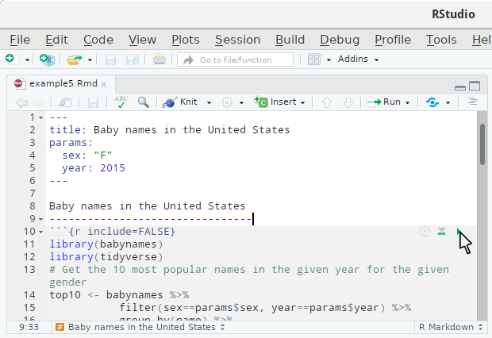
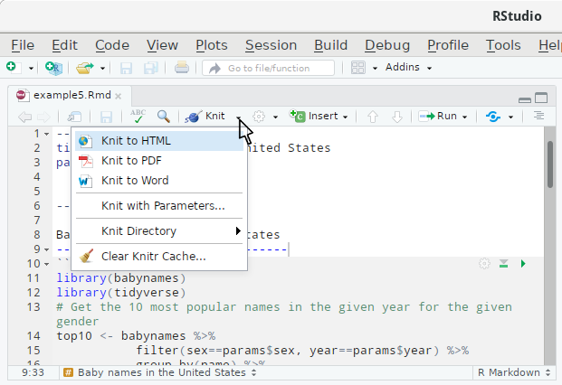

## Using knitr and R Markdown

### Markdown

[Markdown](https://en.wikipedia.org/wiki/Markdown) is a simple document formatting language, which is almost [WYSIWYG](https://en.wikipedia.org/wiki/WYSIWYG) ("what you see is what you get"). Below is an example document written in Markdown.

```
# This is the first section
	
## This is a subsection
	
This text is an underlined heading
----------------------------------

This is a paragraph of text using *italics*, **bold** and `verbatim code` text.

This is a new paragraph with a [link to the University of Glasgow](https://www.gla.ac.uk).
	
* This is an item in an unordered list
* This is another item

Below is a table ...
  
|Column 1|Column2|
|--------|-------|
|123     |456    |
 		 
```
The simplicity of Markdown makes it very easy to automatically convert a Markdown document to a variety of other formats (HTML/Word/PDF documents, presentations, etc.).


### Including chunks of R code
We can include an R code chunk in a Markdown document using the following syntax.

```{r include=FALSE}
source("trick.R")
```
`r I(printsrc("#R code goes here", opt="#chunk options go here"))`

R will run the code and depending on the chunk options (see [below](ref://rmarkdown_chunk_opts)) show the R code and/or output. By default, both the R code and output will be shown. 


####[example] A simple first R Markdown document
The R Markdown document ...

`r I(printfile("example1.Rmd"))`

... generates the output shown below.

```{r child = 'example1.Rmd'}
```
The R Markdown file for this example and the other examples in this unit is available  in the [zip file with all R Markdown files for this week](http://www.stats.gla.ac.uk/~levers/rp/week11.zip).
####[/example]

### Inline R expressions
Sometimes you want to include an R expression within a paragraph of prose. You can do this using inline R expressions. The syntax is

	`r #R expression goes here`

which can be placed inside paragraphs of text.

####[example] Inline R expressions
The R Markdown document ...

`r I(printfile("example2.Rmd"))`

... generates the output shown below.

```{r child = 'example2.Rmd'}
```
####[/example]


###[label=rmarkdown_chunk_opts] Chunk options

#### Labelling chunks
It is generally a good idea to label chunks. This makes it easier to locate errors. Chunks can be labelled by simply including the desired label name as the first argument.

`r I(printsrc("#R code goes here", opt="chunk-label"))`

#### What to show?
The table below shows the options which control whether code is being run and what is shown in the document. 

Option             | Show code | Run code | Output | Plots | Messages | Warnings 
-------------------|----------|-----------|--------|-------|----------|---------
`eval = FALSE`     | (Yes)    | No        | No     | No    | No       | No      
`include = FALSE`  | No       | (Yes)     | No     | No    | No       | No      
`echo = FALSE`     | No       | (Yes)     | (Yes)  | (Yes) | (Yes)    | (Yes)   
`results = "hide"` | (Yes)    | (Yes)     | No     | (Yes) | (Yes)    | (Yes)   
`fig.show = "hide"`| (Yes)    | (Yes)     | (Yes)  | No    | (Yes)    | (Yes)   
`message = FALSE`  | (Yes)    | (Yes)     | (Yes)  | (Yes) | No       | (Yes)   
`warning = FALSE`  | (Yes)    | (Yes)     | (Yes)  | (Yes) | (Yes)    | No      

The option `error` controls what `knitr` will do when it encounters an error: if it is `FALSE` then `knitr` will stop if it encounters an error (default behaviour in `rmarkdown`). If `error` is `TRUE`, then `knitr` will continue if it encounters an error and show the error message in the document. This is rarely useful, unless you want to illustrate the error message.


#### Other useful options

You can add a caption to plots generated using the option `fig.cap="Figure caption"`. The options `fig.width` and `fig.height` let you control the size of the plot.

#### Global options
You can use `knitr::opts_chunk$set(option=value)` inside a code chunk to change default options for subsequent chunks.

### Including data tables in the report
If you want to include tables showing data from R, you can use the function `kable` from `knitr` to produce these tables.

####[example] Data tables
The R Markdown document ...

`r I(printfile("example3.Rmd"))`

... generates the table shown below.

```{r child = 'example3.Rmd'}
```

You can pass on additional arguments to `kable` to change the appearance of the table. 

####[/example]

There are a variety of R packages providing more sophisticated functions for creating tables such as [stargazer](https://cran.r-project.org/web/packages/stargazer/) or [xtable](https://cran.r-project.org/web/packages/xtable/). 

### Caching
You do not want to repeat expensive calculations every time you recompile the report. In this case you can use the option `cache=TRUE`. In this case `knitr` will only re-run this chunk if its code changes.

This can however be dangerous. `knitr` will for example *not* detect if a data file you read in has changed. So even after the file has changed, `knitr` will not update the chunk output.
The same problem arises if a chunk uses a variable created in another chunk. There is however a solution for the latter problem. You can either let `knitr` figure out automatically how chunks depend on each other (using the option `autodep=TRUE`, which works in most circumstances) or manually set up dependencies (using the option `dependson="label-of-other-chunk"`, which is safer, but also a lot more work). `knitr` can then take the dependencies between chunks into account. The knitr documentation contains [examples illustrating the cache functionality in more detail](https://yihui.name/knitr/demo/cache/)


### How to knit
So far we have looked at how to write R Markdown documents, but we have not looked at how we "knit", i.e. how we translate the R Markdown into the final report.

If you open the R Markdown file (extension `.Rmd`) in RStudio you can simply click on the *Knit* button.


You can also compile the document by using
```{r, eval=FALSE}
library(rmarkdown)
render("filename.Rmd")
```

In RStudio you can also run individual chunks by clicking on the small play icon at the top right of each chunk.



### Output formats
R Markdown supports various output formats, the main ones being HTML, PDF (requires a working installation of LaTeX) and Word. When using RStudio you can select the output format by clicking on the expand icon next to the *Knit* button and selecting the corresponding output.



When using the command line you can use the argument `output_format` and set it to `html_document`, `pdf_document` or `word_document` (or other supported formats). 

You can also specify the output format and other options (including the title of the report) by including a [YAML](https://en.wikipedia.org/wiki/YAML) header. The YAML header is delimited by a line consisting of three dashes ("`---`"). 


####[example] YAML header
The YAML header below sets the title and author. It also specifies HTML as the default output.

`r I(printfile("example4.Rmd"))`

####[/example]

### Parameterising your report
Suppose you use R Markdown to generate a monthly sales report. You then might want to run it for different months without having to change the R Markdown source.

You can declare parameters in the YAML header using the following syntax.
```
---
title: A Parameterised Report
params:
    key1: value1
    key2: value2
	...
---
```
These parameters (`key1` and `key2`) are then available in your R code chunks as `params$key1` and `params$key2`. Their default values will be `value1` and `value2`.

When using RStudio you can click on *Knit with parameters* which will then show a dialog box letting you input values for the parameters.

You can also set the parameters from the command line using the following syntax.
```{r, eval=FALSE}
library(rmarkdown)
render("report.Rmd", params=list(key1="anothervalue1", key2="anothervalue2"))
```

Note that you can only set parameters you have declared in the YAML header.
####[example] Baby names
The R Markdown document below has two parameters: `sex` and `year`.

`r I(printfile("example5.Rmd"))`

With the default values it produces the output below.
```{r child = 'example5bis.Rmd'}
```

We can generate a report about the most popular names for boys in 1977 using 
```{r, eval=FALSE}
library(rmarkdown)
render("example5.Rmd", params=list(sex="M", year=1977))
```
####[/example]


[More detailed information](http://rmarkdown.rstudio.com/developer_parameterized_reports.html) (including how to set up Shiny controls for the parameters) is available [on the RStudio website](http://rmarkdown.rstudio.com/developer_parameterized_reports.html).


###[weblink, target="https://github.com/rstudio/cheatsheets/raw/master/rmarkdown-2.0.pdf"]R Markdown cheat sheet
RStudio have put together a very handy and compact cheat sheet for R Markdown.
###[/weblink]


###[weblink, target="https://www.rstudio.com/wp-content/uploads/2015/03/rmarkdown-reference.pdf"]R Markdown reference guide
The R Markdown reference contains a more detailed reference of the Markdown syntax and chunk options.
###[/weblink]


###[weblink, target="http://rmarkdown.rstudio.com/lesson-1.html"]R Markdown tutorial
RStudio have produced a short tutorial for R Markdown.
###[/weblink]


###[weblink, target="http://r4ds.had.co.nz/r-markdown.html", icon="book"]Background reading: Chapter 27 (and 29 & 30) of R for Data Science
Chapter 27 of *R for Data Science* gives an introduction to R Markdown. Chapter 29 explains the different output formats and the associated options. Chapter 30 contains helpful hints for developing an efficient analytics workflow using R Markdown.
###[/weblink]
 
 
 
<!--[if PDF]>
\newpage
<![endif]-->
