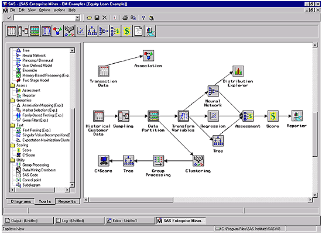

## Tidyverse

[Tidyverse](https://www.tidyverse.org/) is a collection of R packages designed to help data scientists to make more efficient use of R. It contains the following packages:

- [tibble](http://tibble.tidyverse.org/) provides a "modern reimagining" of the good old `data.frame`, which you learned about last week. Tibbles (or `tbl_df`s) are more flexible in terms of what they can store, but (purposefully) less flexible in terms of "sloppy code": tibbles are stricter about recycling and do not perform partial matching. We will look at `tibble` in more detail this week.

- [readr](http://readr.tidyverse.org/) provides alternative functions for reading in text data in tabular form. It provides faster and more consistent alternatives to `read.table` and `read.csv`.
- [dplyr](http://dplyr.tidyverse.org/) provides a powerful suite of functions for data manipulation with a focus on allowing for clean and simple code. We will look at `dplyr` in more detail this week.
- [tidyr](http://tidyr.tidverse.org/) helps with reshaping data. Information can be organised in many different ways. `tidyr` is designed to make it easy to switch between these formats and has a focus on what its author (Hadley Wickham) believes is "tidy" data.
- [ggplot2](http://ggplot2.tidyverse.org/) is a very featureful and systematic set of plotting functions, which we will focus on in week 6.
- [purr](http://purrr.tidyverse.org/) provides a more advanced interface for functional programming. We will come to this package in week 8.

## Pipelines

Pipelines are at the centre of all the tidyverse packages. The R package [magrittr](https://cran.r-project.org/web/packages/magrittr/) provides a forward-pipe operator for R. If you are wondering about the package name: it is named after the Belgian surrealist artist [René Magritte](https://en.wikipedia.org/wiki/Ren%C3%A9_Magritte) and his painting [*La trahison des images*](https://en.wikipedia.org/wiki/The_Treachery_of_Images), which shows a pipe together with the text "Ceci n'est pas une pipe" (which is French for "This is not a pipe").

####[video, videoid="9UtN2mH52EM", duration="12m50s"] Pipelines

Suppose we have a function `f` defined in R
```{r}
f <- function(x)
  x^2
```
Then we can apply `f` to an argument `x` using
```{r}
x <- 3
f(x)
```
The forward-pipes from magrittr allow us to rewrite this function call as 
```{r}
library(magrittr)
x %>% f
```
instead. The advantage of this alternative notation might not become immediately clear, but its advantage becomes more obvious when looking at nested function calls.

Consider the R data set `mtcars`, which contains data from the 1974 edition from the US magazine Motor Trend. Suppose we want to convert the fuel consumption to litres per 100 kilometres and then only retain the cars with a fuel economy better than 10 litres per 100 kilometres. 

```{r}
mtcars2 <- transform(mtcars, lp100k=235.21/mpg)
subset(mtcars2, lp100k<=10)
```
(If you are wondering where the number of 235.21 comes from: A US gallon is roughly 3.785 litres and a mile is roughly 1.609 kilometres, and $\frac{100\times 3.785}{1.609}\approx 235.21$)

If we want to perform both steps in one go, we can nest the two calls within one another and use
```{r,eval=FALSE}
subset(transform(mtcars, lp100k=235.21/mpg), lp100k<=10)
```
This gives exactly the same results, but is not very easy to read and understand. It is not easy to see that the argument `lp100k<=10` belongs to `subset`. When nesting function calls, the arguments get increasingly far from the function call to which they belong. 

The `%>%` operator however allows us to write this much more cleanly:
```{r,eval=FALSE}
mtcars %>%
  transform(lp100k=235.21/mpg) %>%
  subset(lp100k<=10)
```

GUI-based software for data science like the [SAS Enterprise Miner](https://www.sas.com/en_gb/software/enterprise-miner.html) or [Alteryx](https://www.alteryx.com/) are based on visual representations of workflows like the one shown in Figure 1. Pipelines allow for arranging your code in a similar way.



####[task]
The R code below uses pipelines. Convert it to nested function calls.
```{r, eval=FALSE}
rnorm(1000) %>% sin() %>% max()
```
#####[answer]
The code generates a random sample of size 1000 (from a standard normal distribution), computes the sine of each entry and then takes the maximum.
```{r}
max(sin(rnorm(1000)))
```
In this case the nested function call is easy to read because every function only takes one argument. 
#####[/answer]
####[/task]

####[task]
Convert the R code below to pipelines.
```{r,eval=FALSE}
library(MASS)                       # Load package MASS, which contains the data
subset(transform(mammals, ratio=brain/body), ratio==max(ratio))
```
#####[answer]
You can use the following R code using pipelines.
```{r}
library(MASS)
mammals %>%
  transform(ratio=brain/body) %>%
  subset(ratio==max(ratio))
```
```{r, echo=FALSE}
detach("package:MASS")
````
Oddly enough, ground squirrels have a higher brain-to-body weight ratio than humans.
#####[/answer]
####[/task]

## Additional pipeline operators
The package `magrittr` defines additional pipeline operators. We will look at two of them: `%$%` and `%<>%`.

`%$%` makes the variables in the data set on the left-hand side visible as variables in the expression on the right-hand side.

In the above example, suppose that after having subset the data we would like calculate correlation between `disp` (engine displacement) and `hp` (gross horsepower). We could store the result in a temporary data frame and then calculate the correlation.

```{r}
mtcars2 <- mtcars %>%
               transform(lp100k=235.21/mpg) %>%
               subset(lp100k<=10)
cor(mtcars2$disp, mtcars2$hp)
```

With `%$%` we can write this as
```{r}
library(magrittr)
mtcars %>%
    transform(lp100k=235.21/mpg) %>%
    subset(lp100k<=10) %$%
    cor(disp, hp)
```

Another useful (but potentially dangerous) operator in `magrittr` is `%<>%`.
When we want to make changes to a data set, we sometimes do want to replace the data frame at hand, rather than storing the result in a new data frame. We would for example use code like

```{r}
mtcars <- mtcars %>%
             transform(lp100k=235.21/mpg) %>%
             subset(lp100k<=10)
```

The `%<>%` operator from magrittr lets us write this more compactly as

```{r}
mtcars %<>% transform(lp100k=235.21/mpg) %>%
               subset(lp100k<=10)
```
In other words, the `%<>%` operator "pipes" the left-hand side into the right-hand side, just like `%>%`, but it then also stores the result of the right-hand side in the variable given on the left-hand side.

###[weblink, target="https://speakerdeck.com/hadley/pipelines-for-data-analysis-in-r", icon="video"]Pipelines for Data Analysis in R 
Hadley Wickham has produced a series of excellent slides about pipelines, which covers much of what we will look at this week.  
###[/weblink]

###[weblink, target="http://r4ds.had.co.nz/pipes.html", icon="book"]Background reading: Chapter 18 of R for Data Science
Chapter 18 of *R for Data Science* gives a detailed overview of pipes and some of the underpinning technology (though the latter is rather advanced).
###[/weblink]


<!--[if PDF]>
\newpage
<![endif]-->
