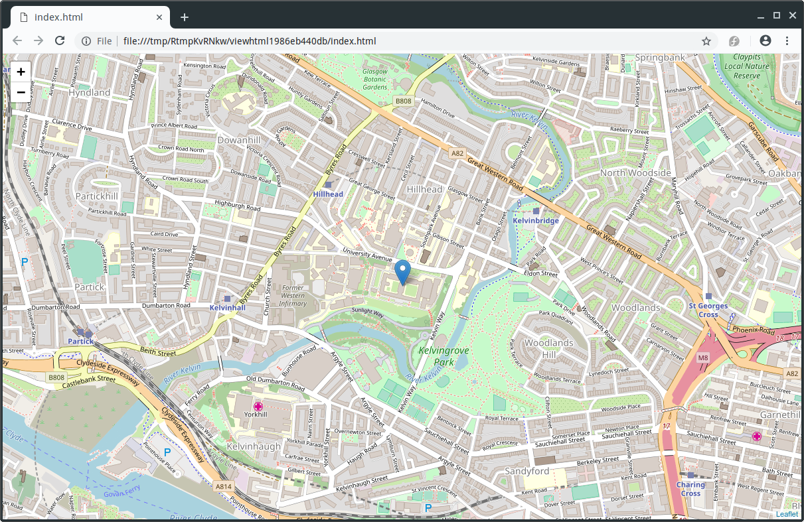
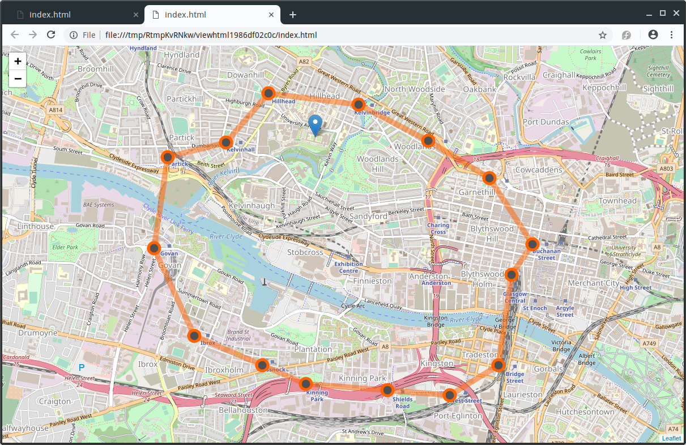

## Bonus material: Maps in R

### Producing maps using ggmap

The R package `ggmap` can download maps from Google maps (or OpenStreetMap) which can then be used as a background layer in a `ggplot2` plot.

The function `get_map(location, zoom)` downloads a map. `location` can be a pair of longitude and latitude, a character string describing the location, or a bounding box. `zoom` controls the zoom level (from 3 (continent) to 21 (highest resolution)). The optional argument `maptype` can be used to select the type of map downloaded (for example `"roadmap"`, `"hybrid"` or `"satellite"` when using Google maps)

Note that access to the Google API (for Google map tiles and for geolocation (translation of location description to GPS coordinates) requires a Google API key. When using a bounding box and `"stamen"` as `source`, no API key is required.

```{r, message=FALSE, results="hide"}
library(ggmap)
boundingbox <- c(left = -4.30, bottom = 55.865, right = -4.28, top = 55.875)
map <- get_map(boundingbox, zoom=16, source="stamen")
```

The map can the be plotted using `ggmap(map)`. Layers can be added to the map using the usual `ggplot2` commands.
```{r, dev.args=list(pointsize=10)}
ggmap(map) + 
    geom_label(x=-4.289, y=55.873, label="The University of Glasgow") 
```
 
####[task]
Amend your commands from ref://ggplotsf to show a map of San Francisco in the background of the plots from parts (d) and (f).

You can use the following bounding box for part (d)
```{r}
boundingbox <- c(left = -122.5, bottom = 37.25, right = -121.75, top = 38)
```
and the following bounding box for part (f)
```{r}
boundingbox <- c(left = -122.43, bottom = 37.76, right = -122.38, top = 37.81)
```

#####[answer]
For part (d) we can use the following code.

```{r, message=FALSE, results="hide"}
boundingbox <- c(left = -122.5, bottom = 37.25, right = -121.75, top = 38)

map <- get_map(boundingbox, zoom=9, source="stamen")

ggmap(map) + 
    geom_point(data=stations, aes(x=long, y=lat,  colour=city)) +
    xlab("Longitude") + ylab("Latitude") + 
    ggtitle("Bicycle stations in the San Francisco Bay Area")
```
	
For part (f) we can use the following code.
```{r, message=FALSE, results="hide"}
boundingbox <- c(left = -122.43, bottom = 37.76, right = -122.38, top = 37.81)
map <- get_map(boundingbox, zoom=13, source="stamen")

ggmap(map) + 
    geom_point(data=sf_stations, aes(long, lat, size=dockcount), col="orange") +
    geom_segment(data=odall, aes(long, lat, xend=long_end, yend=lat_end, alpha=ntrips), col="orange")+
    xlab("Longitude") + ylab("Latitude") + 
    ggtitle("Bicycle trips in San Francisco")
``` 
#####[/answer]
####[/task]

### Producing maps using leaflet

Maps plotted using `ggmap` cannot be panned and zoomed in and out  like maps on Google Maps or OpenStreetMap. The package `leaflet` allows for this. It works somewhat the other way round than `ggmap`: rather than downloading the map and integrating it into an R plot it overlays the data over the map interface. 

The following command puts a marker where the University of Glasgow is located.
```r
library(leaflet)
leaflet() %>%
   addTiles(urlTemplate = "http://{s}.tile.openstreetmap.org/{z}/{x}/{y}.png") %>% 
   addMarkers(lng=-4.2885, lat=55.8715, popup="The University of Glasgow")
```
The argument `urlTemplate` is only required when opening the file locally.



####[task]
Add the locations of the bike stations in San Francisco from ref://ggplotsf to a map created using `leaflet`.

#####[answer]
We can use the following R code.
```r
library(leaflet)
m <- leaflet() %>%
  addTiles(urlTemplate = "http://{s}.tile.openstreetmap.org/{z}/{x}/{y}.png") %>%  
m
```
#####[/answer]

####[/task]

Lines can be added to the map using the function `addPolylines`. 

The data frame `subway`  contains the GPS coordinates of all subway stations in Glasgow and is contained in `t3.RData`. You can produce a map of the Glasgow subway network using the following code.
```r
subway2 <- rbind(subway, subway[1,])     # Make sure line goes back to Hillhead
leaflet() %>%   
   addTiles(urlTemplate = "http://{s}.tile.openstreetmap.org/{z}/{x}/{y}.png") %>% 
   addMarkers(lng=-4.2885, lat=55.8715, popup="The University of Glasgow") %>%
   addPolylines(subway2$long, subway2$lat, color="#ff6200", opacity=0.5, weight=10) %>% 
   addCircleMarkers(subway$long, subway$lat, popup=subway$station, color="#ff6200", 
                    opacity=1, fillColor="#4d4f53", fillOpacity=1) 
```



\newpage

####[task]
Add lines indicating the number of trips to your `leaflet` map of San Francisco.

*Hint:* It is easiest if you add the lines one-by-one using a loop.

#####[answer]
We can use the following R code.

```r
library(leaflet)
m <- leaflet() %>%
  addTiles(urlTemplate = "http://{s}.tile.openstreetmap.org/{z}/{x}/{y}.png") %>%  
  addMarkers(sf_stations$long, sf_stations$lat, popup=sf_stations$name)
max.ntrips <- max(odall$ntrips)

for (i in 1:nrow(odall))
  m <- m %>% 
          addPolylines(unlist(odall[i,c("long","long_end")]), 
                       unlist(odall[i,c("lat","lat_end")]), 
                       opacity=odall$ntrips[i]/max.ntrips)
```
#####[/answer]

####[/task]


\newpage


