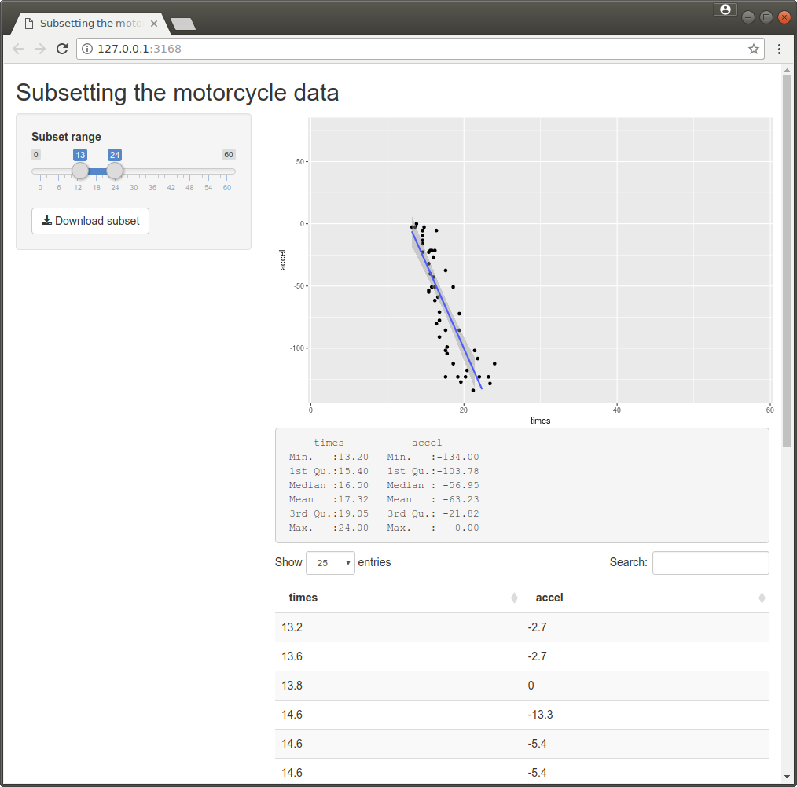
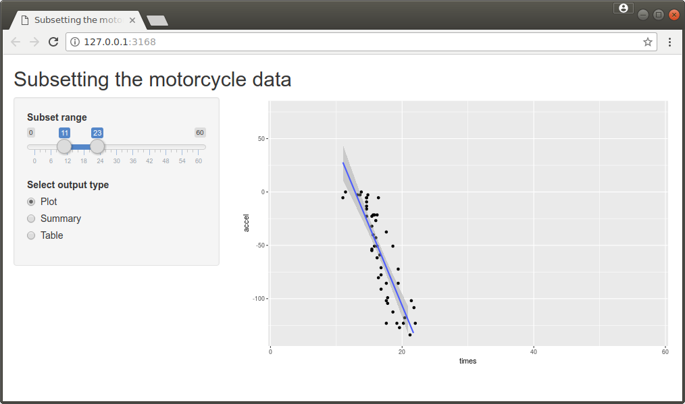

## Data-driven components

So far we have only put together a user interface containing controls, but not data-driven components showing plots or other output. In order to have a component that shows output from R we need to set up this component in both `ui.R` and `server.R`. In `ui.R` we need to specify that a reactive component will occupy a certain place in the app. In `server.R` we need to specify a function which generates the content. 

There are different types of content we might want to show in the app. The table below gives an overview of the most common content types.

| Content type  | Output function (`ui.R`)| Render function (`server.R`)|
|---------------|---------------|---------------|
| Plots         | `plotOutput`  | `renderPlot`  |
| Raw text / R output | `verbatimTextOutput` | `renderPrint` |
| Data (basic table) | `tableOutput` |  `renderTable` |
| Data (fancy table) | `dataTableOutput` | `renderDataTable` |
| Download | `downloadButton` | `downloadHandler` |
| Shiny controls (adaptive) | `uiOutput` | `renderUI` |


For every piece of content there needs to be a call to the output function in `ui.R` and a call to the corresponding render function in `server.R`.

The basic structure of `server.R` is

```r
shinyServer(function(input, output) {
    
    output$outputid <-  renderTYPE( {
        # Generate content for this piece of content
    } )

    # Set more outputs
})
```

It is important that the input ids also match up. In `ui.R` the input id is the first argument to the output function. This input id label must then be used when updating the content in `server.R`: the value returned by the render function needs to stored in `output$outputid`.

For example, in ref://shiny_example1 we have created the plot output in `ui.R` using the command
```r
plotOutput("densityPlot")
#          ^^^^^^^^^^^^^ output id
```
In `server.R` we have provided the code to create and update the plot using
```r
output$densityPlot <-  renderPlot( { ... } )
#      ^^^^^^^^^^^ must be the same output id as used in ui.R
```
Note that we have to make sure the output id ('"densityPlot"') in 'ui.R' matches the one used in 'server.R'.

All `renderXYZ` functions take an expression as first argument which will be evaluated to generate the corresponding output. Inside this expression we can access the values from the input components using `input$inputid`, where `inputid` is the label set for this component in `ui.R` (first argument to the functions creating the UI elements).


####[example, label=shiny_example8]
In this example we create three outputs: a plot (with a regression line, which is only meaningful if the data is suitably subset), a printed `summary` of a data set and table of the data. We also allow users to download the subset.

The example only has a single double-ended slider as input, which selects a subset of the motorcycle data from MASS using the specified range. 

The interface is specified in `ui.R`.
```r
fluidPage(
    titlePanel("Subsetting the motorcycle data"),
    sidebarLayout(
        sidebarPanel(
            sliderInput("range", "Subset range", min=0, max=60, value=c(0,60)),
#                        ^^^^^ Label used in server.R when querying slider      
            downloadButton("download1", "Download subset", icon="download")
#                          ^^^^^^^^^^^  Label used in server.R for download
        ),
        mainPanel(
            plotOutput("plot1"),
#                       ^^^^^ Label used in server.R when updating plot                       
            verbatimTextOutput("text1"),
#                               ^^^^^ Label used in server.R when updating output
            dataTableOutput("table1")
#                            ^^^^^^ Label used in server.R when updating table
        )
    )
)
```

The server-side logic to produce the outputs is defined in `server.R`. For every call to `plotOutput`, `verbatimTextOutput`, `dataTableOutput` and `downloadButton` in `ui.R`, there is a matching call to `renderPlot`, ` renderPrint`, `renderDataTable` and `downloadHandler` in `server.R`.
```r
library(ggplot2)
library(MASS)

shinyServer(function(input, output) {
    
    output$plot1 <- renderPlot( {
#          ^^^^^ Label from ui.R
        mcycle2 <- subset(mcycle, times>=input$range[1] & times<=input$range[2])
#                               Label from ui.R ^^^^^                   ^^^^^
        qplot(times, accel, data=mcycle2, xlim=range(mcycle$times),
              ylim=range(mcycle$accel)) + geom_smooth(method="lm")
    } )

    output$text1 <- renderPrint( {
#          ^^^^^ Label from ui.R
        mcycle2 <- subset(mcycle, times>=input$range[1] & times<=input$range[2])
#                               Label from ui.R ^^^^^                   ^^^^^
        summary(mcycle2)
    } )

    output$table1 <- renderDataTable( {
#          ^^^^^ Label from ui.R
        subset(mcycle, times>=input$range[1] & times<=input$range[2])
#                   Label from ui.R ^^^^^                   ^^^^^
    } )

    output$download1 <- downloadHandler(
#          ^^^^^^^^^ Label from ui.R
        filename = "mcycle-subset.csv", # Filename shown to user in browser
        content = function(file) { # Function to generate the download file
            mcycle2 <- subset(mcycle, times>=input$range[1] & times<=input$range[2])
#                                  Label from ui.R ^^^^^                   ^^^^^
            write.csv(mcycle2, file, row.names=FALSE)
        }
    )
}) 
```
For every output, we independently produce the subset of the motorcycle data. This doesn't seem efficient. In ref://shiny_example10 we will see how we can subset the data only once with a custom reactive expression.
####[/example]





Note that we have not told Shiny when to update a component. Shiny will figure out when to update what output all by itself. We will look at this in more detail in the next section.

### Data-driven user interface

Sometimes we want to adapt the user interface based on the change to an input by the user. In other words, we might have to adapt parts of the user interface "on the fly". We can do this by using a `uiOutput` in `ui.R` and generating the corresponding content in `server.R` using `renderUI`. ref://shiny_example9 illustrates this.

####[example,label=shiny_example9]
In this example, we modify the app from ref://shiny_example8, so that the user can choose what output they want to have.

We add ratio buttons to the user interface and replace all outputs by a call `uiOutput`. This generates a placeholder we can then fill in `server.R`.

We thus use the following `ui.R`.
```r
fluidPage(
    titlePanel("Subsetting the motorcycle data"),
    sidebarLayout(
        sidebarPanel(
            sliderInput("range", "Subset range", min=0, max=60, value=c(0,60)),
            radioButtons("outputType", "Select output type",
                         choices=c("Plot", "Summary", "Table"), selected="Plot")
        ),
        mainPanel(
            uiOutput("ui")   # Put adaptive UI component here
        )
    )
)
```

In `server.R` we generate the component to display based on the selection of the user. The content of the components is generated as before, so we leave these calls as they are.
```r
library(ggplot2)
library(MASS)

shinyServer(function(input, output) {

    output$ui <- renderUI( { # Add the output component  based on the user's choice
        if (input$outputType=="Plot")
            output <- plotOutput("plot1")
        if (input$outputType=="Summary")
            output <- verbatimTextOutput("text1")
        if (input$outputType=="Table")
            output <- dataTableOutput("table1")
        output        
    } )
    
    output$plot1 <- renderPlot( {
        mcycle2 <- subset(mcycle, times>=input$range[1] & times<=input$range[2])
        qplot(times, accel, data=mcycle2, xlim=range(mcycle$times),
              ylim=range(mcycle$accel)) + geom_smooth(method="lm")
    } )

    output$text1 <- renderPrint( {
        mcycle2 <- subset(mcycle, times>=input$range[1] & times<=input$range[2])
        summary(mcycle2)
    } )

    output$table1 <- renderDataTable( {
        subset(mcycle, times>=input$range[1] & times<=input$range[2])
    } )
   
}) 
```
In this example all we do is effectively show or hide output based on the user's choice. This can also be done using a `conditionalPanel`. The latter however requires a little knowledge of Javascript and JQuery, as the conditions have to specified in Javascript, rather than as an R expression.

From a user-interface perspective, a tab panel would probably have been best.
####[/example]



If all you want to change in the user interface is what value a user has selected it is typically easier to use the `update` functions for the components, for example `updateRadioButtons` or `updateNumericInput`.


<!--[if PDF]>
\newpage
<![endif]-->
