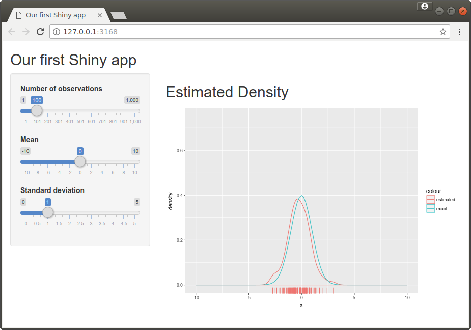

## Overview

RStudio [Shiny](https://shiny.rstudio.com) provides an easy and intuitive way of developing webapps directly from inside R. Shiny will take care of all the technical details, so all we need to do is to specify the layout of the app and implement the data processing that generates the output. Shiny is especially well-suited to efficiently creating small apps. 

###[video,videoid=aoNocuZYv7M]Shiny Apps


###[background] Shiny Demo Apps
The package [shiny](https://cran.r-project.org/web/packages/shiny/) comes with a large number of examples. The 11 built-in examples can be listed using
```r
library(shiny)
runExample()

## Valid examples are "01_hello", "02_text", "03_reactivity", "04_mpg", "05_sliders",
## "06_tabsets", "07_widgets", "08_html", "09_upload", "10_download", "11_timer"
```
The first example can then be run using
```r
runExample("01_hello")
```
More than 100 examples are available on [Github](https://github.com/rstudio/shiny-examples). These can be then run using, for example
```r
# Requires package ggvis
runGitHub("shiny-examples", "rstudio", subdir = "051-movie-explorer")
```
###[/background]

Shiny automatically generates an HTML page ("user interface" or "ui" for short), which will open automatically when we run `runApp(...)`, `runExample(...)` or `runGitHub(...)` locally. Interacting with the controls will send messages to R, which in will turn trigger an update of the calculations and outputs. The entire process is automated, so we only need to describe how the user interface should look like and how to produce plots and other output. 

## Basic architecture

A shiny app is defined by two files which have to be in the same directory:

-  The file `ui.R` specifies the layout ("user interface") of the app.
-  The file `server.R` contains the "backend" performing the calculations and producing the plots and other outputs.

You can also put all the code into a single file `app.R` or provide a suitable R object or script to `runApp`. In this unit we will always use `ui.R` and `server.R`.

###[example, label="shiny_example1"] A simple Shiny app
Our first Shiny app will generate a sample from the $\textsf{N}(\mu,\sigma^2)$ distribution, and plot the estimated probability density function. The user will be able to change sample size $n$, mean $\mu$ and standard deviation $\sigma$.

The focus in this example is on the big picture. We will take a more detailed look at individual functions later on.

The file `ui.R` specifies the user interface:
```r
# This file controls how the shiny app looks like

fluidPage(                              

  # Title of your app (at top, spread across entire page)
  titlePanel("Our first Shiny app"),

  # Typically the controls are arranged in a sidebar on the left
  sidebarLayout(
      sidebarPanel(
          sliderInput("n",                        # Name of the variable
#                     ^^^ This name will be referred to in server.R
                      "Number of observations"  , # Label shown
                      min=1, max=1000, step=1,    # Range and (optional) step size
                      value = 100                 # Initial value
                      ),
          sliderInput("mu",                       # Name of the variable 
#                     ^^^^ This name will be referred to in server.R
                      "Mean",                     # Label shown
                      min=-10, max=10, step=0.1,  # Range and (optional) step size
                      value = 0                   # Initial value
                      ),
          sliderInput("sigma",                    # Name of the variable 
#                     ^^^^^^^ This name will be referred to in server.R
                      "Standard deviation",       # Label shown
                      min=0, max=5, step=0.1,     # Range and (optional) step size
                      value = 1                   # Initial value
                      )
      ),                
  
  # The main panel is typically used for displaying R output
      mainPanel(h2("Estimated Density" ),    
                plotOutput("densityPlot")         # We'll put a plot here
#                          ^^^^^^^^^^^^^ This name will be referred to in server.R            
                )
  )
)
```

The file `server.R` contains the code performing the calculations and producing the output:
```r
library(ggplot2)

# This file contains the code for performing calculations
# and controls how the shiny app looks like

shinyServer(function(input, output) {
    
    output$densityPlot <-  renderPlot( {
#          ^^^^^^^^^^^ Must be the name used in ui.R 
        n <- input$n                # Get n from slider
#                  ^ Must be the name used in ui.R
        mu <- input$mu              # Get mu from slider
#                   ^^ Must be the name used in ui.R
        sigma <- input$sigma        # Get sigma from slider
#                      ^^^^^ Must be the name used in ui.R                      
        x <- rnorm(n, mu, sigma)    # Generate sample   
        ggplot(data.frame(x = x), aes(x, col="estimated")) +
            geom_density() +
            geom_rug() + 
            xlim(-10,10) + 
            ylim(0,0.75) +        # Plot the estimated density of the data ...
            stat_function(fun=function(x) dnorm(x, mu, sigma), aes(colour="exact"))
                                     # ... and add the true density
     })

})
```
The code for the app is available in the folder `Example1` in the [zip file with all apps for this week](http://www.stats.gla.ac.uk/~levers/rp/week10.zip).

We can now run 
```r
# Change working directory to the directory Example1 containing server.R and ui.R           
runApp()
```
which will show the app. You can also run the app in "showcase mode". This will also show the code and highlight the code being currently run in yellow.
```r
runApp(display.mode="showcase")
```
###[/example]



## Deploying Shiny Apps
If you run a Shiny app, it will by default only be accessible from your local computer. You can make your Shiny app available to others in various ways:

- Others can run the app locally on their computer, so you can send the code for your app to other R users (who must have the package `shiny` installed) or make the code for your app available online, for example on [Gist](https://gist.github.com) or in a [Github](https://guthub.com) repository.
- You can upload your app to [shinyapps.io](https://shinyapps.io): there are different pricing schemes, the most basic one being free. Apps can be uploaded to shinyapps.io using `deployApp()` or the "Publish" button in RStudio. Detailed guidance is available at https://shiny.rstudio.com/articles/shinyapps.html.
- You can install your own shiny server (either the open-source version or the commercial "pro" version). This requires access to a Linux server and basic server and web administration skills. See https://www.rstudio.com/products/shiny/download-server/ for details.

###[weblink, target="https://shiny.rstudio.com/gallery/"]Shiny Gallery
The Shiny Gallery has a large number of showcase apps illustrating the wide range of apps that can be developed using Shiny.
###[/weblink]

###[weblink, target="https://shiny.rstudio.com/tutorial/", icon="video"]RStudio Shiny Tutorial
RStudio have produced a detailed Shiny tutorial, which provides additional details. The tutorial is available as [video](https://shiny.rstudio.com/tutorial/#video) and [in written form](https://shiny.rstudio.com/tutorial/#written).
###[/weblink]

###[weblink, target="https://github.com/rstudio/cheatsheets/raw/master/shiny.pdf"]Shiny Cheat Sheet
RStudio have put together a very handy and compact cheat sheet for Shiny. 
###[/weblink]


<!--[if PDF]>
\newpage
<![endif]-->
