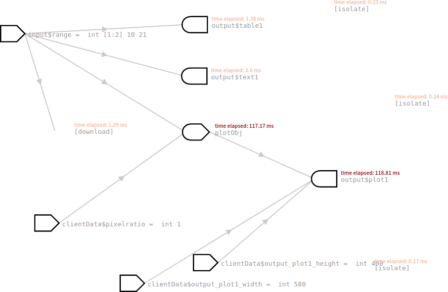
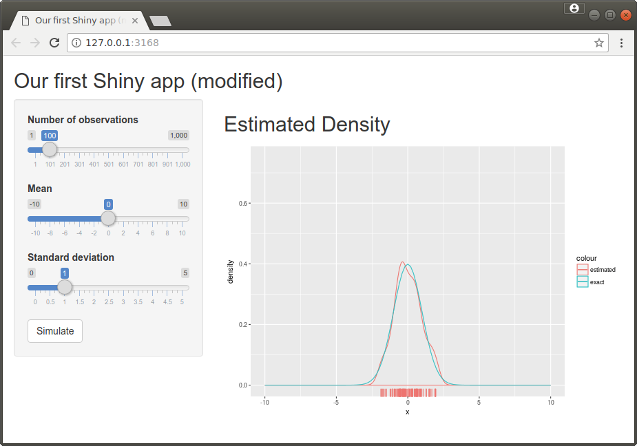
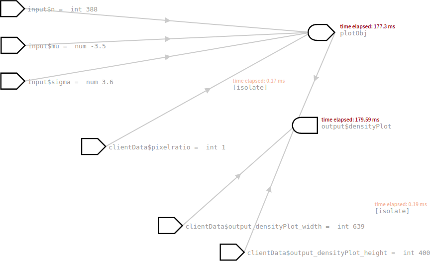
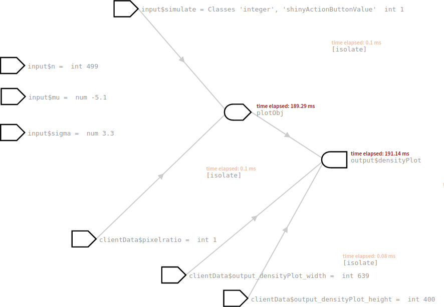

## Under the bonnet

### Reactivity

Shiny automatically figures out whether and when to update output objects. It does so by monitoring which `input$inputid`s you use. 

This is handy, but also means that you need to play by the rules. Otherwise the algorithms used by Shiny to figure out what depends on what will fail. 

- Shiny's logic is based on the idea that a rendered object needs to be updated if and only if any of the `input$inputid`s used in `renderYXZ` change (or any other reactive expression used in `renderXYZ` changes -- more on that later). 
- This also means that you are only meant to access `input$inputid` inside a call to `renderXYZ` (and also inside custom reactive expressions). The video has an example of what goes wrong if you use an input outside. 

(`downloadHandler` counts as a `renderXYZ` function in this context).

You can visualise how inputs and output objects relate to each other by activating the reactivity log. Before you start your app run `options(shiny.reactlog=TRUE)`. Then press `CTRL`/`Command`-`F3` after you have used the app. Shiny then opens a new window showing how the components depend. (There is a slider at the top which lets you move in time, you typically want to drag this to the right).  




### Custom reactive expressions

Often output components are related to each other and there is some commonality between how the outputs are computed: if two outputs perform at least in parts the same calculation, it would make sense to "share" these calculations so that they are not re-run unnecessarily.

If we want to perform a "shared" calculation if an input changes we cannot simply put the code outside `renderXYZ`. Shiny would not know what this code needs to re-run every time an input is updated. 

We can however tell Shiny to do so by using a custom reactive expression. For this you wrap your calculation in `reactive(...)` and place it inside `shinyServer`.
```r
reactive.expression <- reactive( {
   # Perform calculation here
} )    
```
Custom reactive expressions will be monitored and updated by Shiny in the same way as output object created using `renderXYZ`. We can now use the result from that calculation in the `renderXYZ` functions and Shiny will make sure that this calculation will not be repeated unnecessarily.

Note that `reactive` returns a function, so if you want to use the value of `reactive.expression` you have to use `reactive.expression()`.

####[example,label=shiny_example10]
In ref://shiny_example8 was subset the data set `mcycle` independently three times: once in `renderPlot`, once in `renderPrint` and once in `renderDataTable` (as well as in `downloadHandler`, but  download data is only generated when the user clicks the button). So every time a user has moved the slider, we perform the subsetting three times. This isn't a good idea for two reasons: first of all it leads to redundant code, which is a bad thing in itself. It also impacts on the performance and responsiveness of your app (though not that much in our toy case as the data set is tiny, so subsetting is quick). 

If we want to generate `mcycle2` outside the `renderXYZ` functions we need to use a custom reactive expression.

We can use the same `ui.R` as in ref://shiny_example8, however `server.R` changes.

```r
library(ggplot2)
library(MASS)

shinyServer(function(input, output) {

    mcycle2 <- reactive( {   # Define reactive object mcycle2
       subset(mcycle, times>=input$range[1] & times<=input$range[2]) 
#                  Label from ui.R ^^^^^                   ^^^^^
    } )
    
    
    output$plot1 <- renderPlot( {
        qplot(times, accel, data=mcycle2(), xlim=range(mcycle$times),
#                                ^^^^^^^^^ Get the reactive object              
              ylim=range(mcycle$accel)) + geom_smooth(method="lm")
    } )

    output$text1 <- renderPrint( {
        summary(mcycle2())
#               ^^^^^^^^^ Get the reactive object        
    } )

    output$table1 <- renderDataTable( {
        mcycle2()
#       ^^^^^^^^^ Get the reactive object
    } )

    output$download1 <- downloadHandler(
        filename = "mcycle-subset.csv",
        content = function(file) {
            write.csv(mcycle2(), file, row.names=FALSE)
#                     ^^^^^^^^^ Get the reactive object
        }
    )    
   
}) 
```

The Shiny reactivity log will now change. Changes to the inputs now feeds into `mcycle2` which then in turn feeds into the output objects.
####[/example]


### Isolating reactive expressions

Sometimes you want to use an input value, but you do not want to update that component every time a user changes an input. This is typically the case if you need to perform expensive computations: rather than updating the output every time a slider is moved you are probably better off providing the user with a "Run" or "Update" button, which triggers the expensive computations.

This means we need to be able to do two things.

- We need to get the button to trigger the computations. We can do this by simply including `input$buttonname` in `renderXYZ` code that generates the outputs that need to be calculated. (Shiny only checks whether an input is accessed, it doesn't mind if you do nothing more with it).
Alternatively, we could use the function 
```r
observeEvent(input$buttonname, {
   # Actions to perform when input$buttonname fires
} )
```
to explicitly trigger an action.
- We need to stop the outputs from reacting to changes in the other input values. We can achieve this using the function `isolate`. If we use `isolate(input$inputid)` to access the input `inputid` instead of just `input$inputid`, Shiny will not treat this output as depending on `inputid`: it will thus not update the output automatically whenever `input$inputid` changes.


####[example, label=shiny_example11]
In ref://shiny_example1 we simulated from a sample from the normal distribution with the user being able to choose sample size, mean and standard deviation. Suppose we want to add a button to trigger the simulation. Moving the sliders on its own is not meant to trigger a new simulation.

The file `ui.R` is pretty much the same as in ref://shiny_example1, except for the button we have added.

```r
fluidPage(                              
  titlePanel("Our first Shiny app (modified)"),
  sidebarLayout(
      sidebarPanel(
          sliderInput("n",                        
                      "Number of observations"  , 
                      min=1, max=1000, step=1,    
                      value = 100                 
                      ),
          sliderInput("mu",                       
                      "Mean",                     
                      min=-10, max=10, step=0.1,  
                      value = 0                   
                      ),
          sliderInput("sigma",                    
                      "Standard deviation",       
                      min=0, max=5, step=0.1,   
                      value = 1                 
                      ),
          actionButton("simulate",                # Name of new action variable
                       "Simulate")                # Label shown on new button
      ),                
  
  # The main panel is typically used for displaying R output
      mainPanel(h2("Estimated Density" ),    
                plotOutput("densityPlot")         
                )
  )
)
```

In `server.R` we make the `plotOutput` depend on the button by simply putting in `input$simulate`. We wrap `input$n`, `input$mu` and `input$sigma` in `isolate`, so that the `plotOutput` does not get triggered by these controls any more.
```r
library(ggplot2)

shinyServer(function(input, output) {
    
    output$densityPlot <-  renderPlot( {
        input$simulate                # Force dependency on the button
        n <- isolate(input$n)         # Prevent dependency on n 
        mu <- isolate(input$mu)       # Prevent dependency on mu
        sigma <- isolate(input$sigma) # Prevent dependency on sigma
        x <- rnorm(n, mu, sigma)    
        qplot(x, geom="density", col="estimated") +
            geom_rug() + xlim(-10,10) + ylim(0,0.75) +                         
            stat_function(fun=function(x) dnorm(x, mu, sigma), aes(colour="exact"))
     })

})
```

Alternatively, we could have used
```r
library(ggplot2)

shinyServer(function(input, output) {
    
    observeEvent(input$simulate, {    # Run this code if simulate button is pressed
        output$densityPlot <-  renderPlot( {
            n <- isolate(input$n)         # Prevent dependency on n 
            mu <- isolate(input$mu)       # Prevent dependency on mu
            sigma <- isolate(input$sigma) # Prevent dependency on sigma
            x <- rnorm(n, mu, sigma)    
            qplot(x, geom="density", col="estimated") +
                geom_rug() + xlim(-10,10) + ylim(0,0.75) +                         
                stat_function(fun=function(x) dnorm(x, mu, sigma), aes(colour="exact"))
        })
        
    }, ignoreNULL=FALSE)              # ignoreNULL=FALSE triggers the event
                                      # when the app starts (otherwise no
                                      # density would be initially visible)

})
```
####[/example]








### When will which code get run?

Code inside a reactive statement (`reactive` or `renderXYZ`) will get run every time the user changes a inputs used inside that statement. The code snippet below shows in the comments when code placed in other parts of `server.R` gets run.

```r
# Code put here gets run once when the server is being started
# Code put here creates one object shared between sessions

shinyServer(function(input, output) {

    # Code here is run once per client connection ("session")
    # Code here creates one object per client connection ("session")
    
    output$outputid <-  renderTYPE( {        
        # Code here is run every time an input is being changed        
    } )

    # ...
    
})
```

You can exploit this to speed up your app. If, for example, all users use the same big data set, it is probably best if you load it outside `shinyServer`. That way the data set is only loaded once and we also only keep one copy in memory.


\newpage
