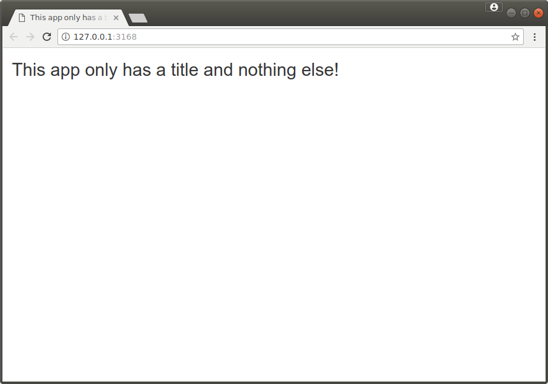
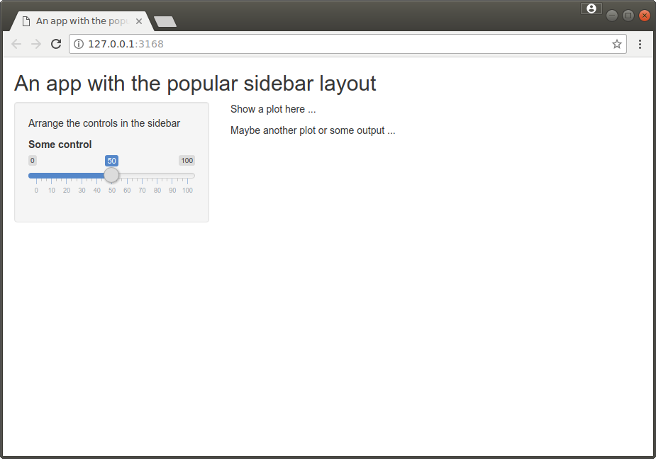
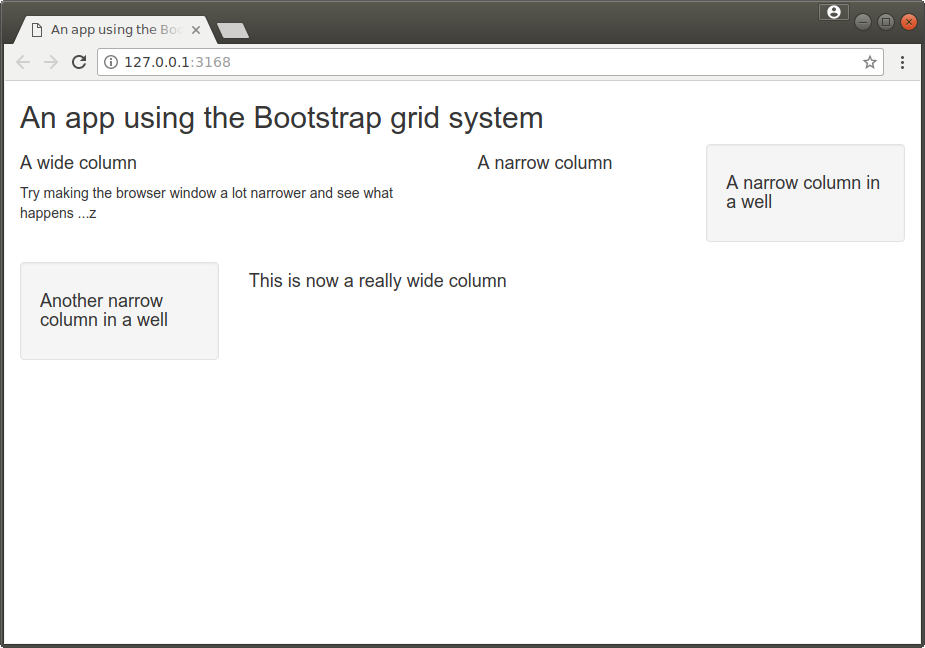
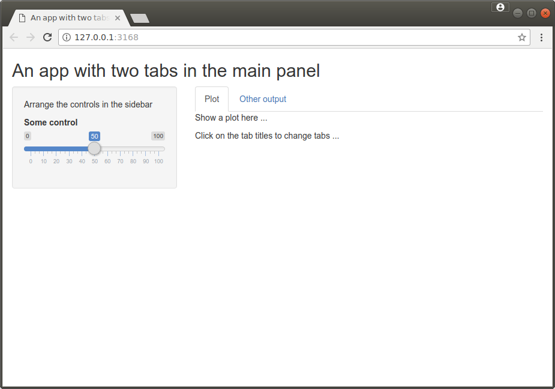
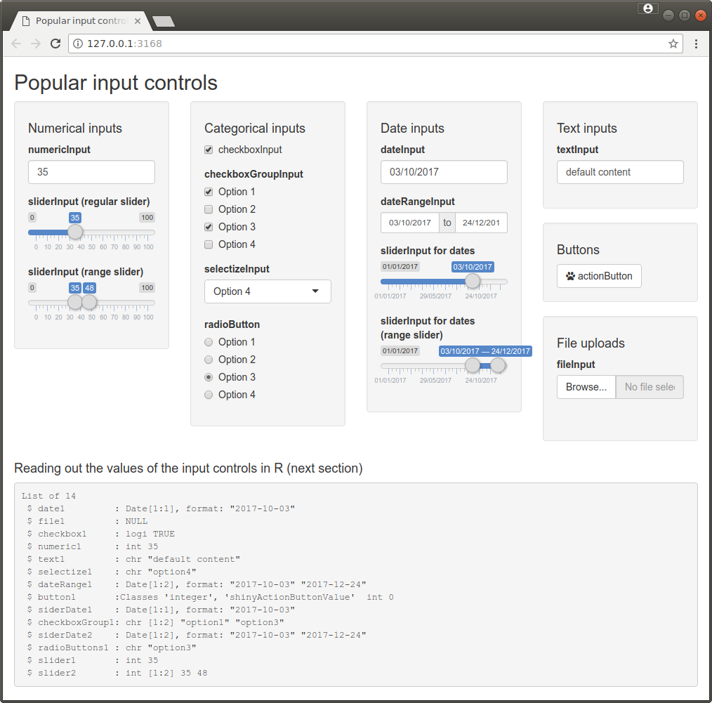
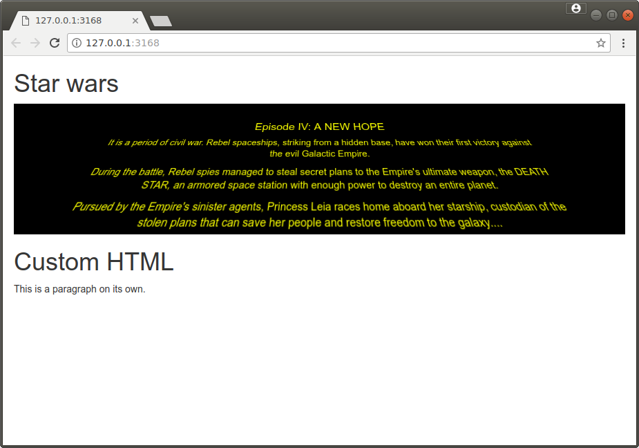

## Building a user interface in Shiny

In this section we will focus on how to construct a user interface in Shiny. We will only work with the file `ui.R`. Our file `server.R` will be an empty skeleton.

In the next section we will then look at how to implement functionality in `server.R`, but we will first look at constructing a user interface.

The file `ui.R` should contain a single call to the function creating the user interface. The function `fluidPage` creates a normal "fluid" web page containing the controls. There are also other functions for creating pages, notably `navbarPage`, which creates a page with a navigation bar at the top.

###[background]Twitter Bootstrap
Shiny uses the front-end framework [Bootstrap](https://getbootstrap.com/) to construct the HTML interface. Bootstrap was developed by Twitter and is by far the most widely used front-end framework for responsive web pages.

Bootstrap is based on a grid system, which splits the screen into up to twelve columns. Bootstrap's grid system is "responsive", i.e. the columns will be re-arranged depending on the window/screen size.

As a Shiny user you do not need to know much about Bootstrap, but knowing a little about the [grid system](https://getbootstrap.com/docs/4.5/layout/grid/) might help with developing Shiny apps with a more complex layout of controls.

###[/background]

### Organising controls
The arguments to `fluidPage` are the (groups of) controls from top to bottom of the Shiny app.

The function `titlePanel("Title goes here")` adds a main title to the app.

#####[example,label=shiny_example2]
The following `ui.R` creates a Shiny app which only has a title bar. 
```r
fluidPage(
    titlePanel("This app only has a title and nothing else!")
)
```
#####[/example]



### Layouts
If we specified the controls by adding them directly as arguments to `fluidPage` they would be simply arranged from top to bottom. Typically we want to arrange controls in a more sophisticated layout.

#### Sidebar layout

The sidebar layout is the most common layout used in Shiny apps. It splits the screen into a narrow column containing the controls and a wide column for the outputs. We have used this layout in ref://shiny_example1. 

The function `sidebarLayout`  takes the content for the sidebar and the content for the main panel as its first two arguments. The sidebar argument is typically created using a call to the function `sidebarPanel` and the main panel using a call to the function `mainPanel`. A typical sidebar layout is thus set up using
```r
sidebarLayout(
    sidebarPanel(
        # Controls and content for sidebar go here
    ),
    mainPanel(
        # Controls and content for main panel go here
    )
)
```
#####[example, label=shiny_example3]
The following `ui.R` creates a Shiny app which uses the sidebar layout. We will look at the functions adding content later on, so don't worry about them just now.
```r
fluidPage(
    titlePanel("An app with the popular sidebar layout"),
    sidebarLayout(
        sidebarPanel(
            p("Arrange the controls in the sidebar"),
            sliderInput("ignored", "Some control", min=0, max=100, value=50)    
        ),
        mainPanel(
            p("Show a plot here ..."),
            p("Maybe another plot or some output ...")
        )
    )
)
```

#####[/example]




#### Manual grid layout

A more flexible layout can be obtained by working with the Bootstrap 12 column layout. The function `fluidRow` create a row of columns. Each column is set up using the function `column`.
```r
fluidRow(
    column(width,
        # Content of first column goes here
    ),
    column(width,
        # Content of second column goes here
    ),
    # More columns go here       
)
```
For each row the widths of the columns have to be integers and should add up to at most 12.

You can use a `wellPanel` element to get an inset border and grey background. 

#####[example,label=shiny_example4]
The following `ui.R` creates a Shiny app using the Bootstrap grid system.
The first row on columns splits the width a 6:3:3 ratio. The second row of columns splits the width in a 3:9 ratio. When the browser window is very narrow, all columns will be automatically stacked on top of each other (Bootstrap will do this for us automatically).
```r
fluidPage(
    titlePanel("An app using the Bootstrap grid system"),
    fluidRow(
        column(6,
           h4("A wide column"),
           p("Try making the browser window a lot narrower ...")               
        ),
        column(3,
            h4("A narrow column")
        ),    
        column(3,
            wellPanel(
                h4("A narrow column in a well")
            )
        )    
    ),
    fluidRow(
        column(3,
            wellPanel(
                h4("Another narrow column in a well")
          )
        ),
        column(9,
           h4("This is now a really wide column")
        )
    )
)
```
#####[/example]




#### Tabs
When an app shows a lot of content it can help to arrange the content in tabs. Tabs can be added using the function `tabsetPanel`, which takes as arguments the panels, created using the function `tabPanel`. 

```r
tabsetPanel(
    tabPanel("Title of first panel",
        # Content of first panel goes here
    ),
    tabPanel("Title of second panel",
        # Content of second panel goes here
    ),
    # More tabs go here
    )
```

Tabs can be used at any point in the Shiny app, you can even nest them.

#####[example,label=shiny_example5]
The following `ui.R` creates a Shiny app using two tabs inside the main panel of a sidebar layout.

```r
fluidPage(
    titlePanel("An app with two tabs in the main panel")
    sidebarLayout(
        sidebarPanel(
            p("Arrange the controls in the sidebar"),
            sliderInput("ignored", "Some control", min=0, max=100, value=50)    
        ),
        mainPanel(
            tabsetPanel(
                tabPanel("Plot",
                         p("Show a plot here ..."),
                         p("Click on the tab titles to change tabs ...")
                         ),
                tabPanel("Other output",
                          p("Another plot or some output ...")
                         )
            )
        )
    )
)
```
#####[/example]



####[weblink, target="https://shiny.rstudio.com/articles/layout-guide.html"]Shiny Layout Guide
The shiny layout guide contains more detailed information about creating layouts for shiny apps
####[/weblink]

### Controls
Shiny has a wide range of input controls. Input controls allow the user to change parameters using the user interface. 

The most common controls are given in the table below. 

| Function | Control widget |
|----------|----------------|
|`actionButton`      | Action Button|
|`checkboxInput` |	Single check box| 
|`checkboxGroupInput`| 	Group of check boxes| 
|`dateInput` |	Calendar to aid date selection|
|`dateRangeInput` |	Pair of calendars for selecting a date range| 
|`fileInput` |	File upload control wizard| 
|`helpText` |	Help text that can be added to an input form| 
|`numericInput` |	Field to enter numbers| 
|`radioButtons` |	set of radio buttons| 
|`selectInput` |	Box with choices to select from| 
|`selectizeInput` |	Fancier box with choices to select from| 
|`sliderInput` |	Slider bar| 
|`textInput` |	Field to enter text| 

All these functions (with the exception of `helpText`) take as first argument the input id of the control. We can set this to any unique name. The name will be not visible to the user, but used by Shiny to refer to the object. The input id is required when we want to read out the value of an input control in `server.R`.

In addition to the input id, the above functions take additional arguments. The key arguments are showcased in the example below.

Because we have (not yet) coded up any application logic in `server.R` interacting with the input controls has no effect.

#####[example,label=shiny_example6]Showcase of popular input controls
In this example we will use all the inputs listed above.

```r
library(shiny)

# We will use this for categorical input. RHS is what is used inside app.
# LHS are the labels shown to the user
choices <- c("Option 1"="option1", "Option 2"="option2",
             "Option 3"="option3", "Option 4"="option4")

fluidPage(
    titlePanel("Popular input controls"),
    fluidRow(
        column(3,
            wellPanel(                      
                h4("Numerical inputs"),
                numericInput("numeric1", "numericInput", value=35,
                    min=0, max=100, step=0.1   # optional
                ),
                sliderInput("slider1","sliderInput (regular slider)",
                    value=35, min=0, max=100,
                    step=1                      # optional
                ),                    
                sliderInput("slider2","sliderInput (range slider)",
                    value=c(35, 48), min=0, max=100,
                    step=1                       # optional
                )
            )   
        ),
        column(3,
            wellPanel(
                h4("Categorical inputs"),
                checkboxInput("checkbox1", "checkboxInput", value=TRUE),
                checkboxGroupInput("checkboxGroup1", "checkboxGroupInput",
                    selected=c("option1", "option3"),
                    choices=choices
                ),
                selectizeInput("selectize1", "selectizeInput", selected="option4",
                    choices=choices,
                    multiple=FALSE            # optional
                ),
                radioButtons("radioButtons1", "radioButton", selected="option3",
                    choices=choices
                )
            )
        ),
        column(3,
            wellPanel(
                h4("Date inputs"),
                dateInput("date1", "dateInput", value="2017-10-03",
                    min="2017-01-01", max="2017-12-31", # optional
                    format="dd/mm/yyyy"       # optional
                ),
                dateRangeInput("dateRange1", "dateRangeInput",
                    start="2017-10-03", end="2017-12-24",
                    min="2017-01-01", max="2017-12-31", # optional
                    format="dd/mm/yyyy"       # optional
                ),
                sliderInput("siderDate1", "sliderInput for dates",
                    value=as.Date("2017-10-03"),
                    min=as.Date("2017-01-01"), max=as.Date("2017-12-31"), #optional
                    timeFormat="%d/%m/%Y"     # optional                
                ),
                sliderInput("siderDate2", "sliderInput for dates (range slider)",
                    value=as.Date(c("2017-10-03","2017-12-24")),
                    min=as.Date("2017-01-01"), max=as.Date("2017-12-31"), #optional
                    timeFormat="%d/%m/%Y"     # optional 
                )
            )
        ),
        column(3,
            wellPanel(
               h4("Text inputs"),
               textInput("text1", "textInput", value="default content")
            ),
            wellPanel(
                h4("Buttons"),
                actionButton("button1", "actionButton",
                    icon=icon("paw")                 # optional
                )
            ),
            wellPanel(
                h4("File uploads"),
                fileInput("file1", "fileInput")
            )
        )
    ),    
    # Ignore the output for the moment, we'll look at it in the next section
    h4("Reading out the values of the input controls in R (next section)"),
    verbatimTextOutput("inputvals")
)
```

#####[/example]



### HTML elements

If you are familiar with using HTML you might want to add some custom HTML content to an app, but keep in mind that the design philosophy of Shiny is that the user would rarely need to do this (other than adding titles). 

We can add regular HTML5 tags to Shiny apps using wrapper functions `tags$<HTMLtagname>(...)`. For example we can add a paragraph of text using
```r
tags$p("This is a paragraph containing text.")
```
Common tags (`p`, `h1` to `h6`, `pre`, ...) are directly available, so we could have used
```r
p("This is a paragraph containing text.")
```
Any named arguments are included in the HTML as attributes of the tag. For example, CSS style attributes can be set using the (optional) argument `style`. Tags can also be nested within each other.

Raw HTML can be included using the function `HTML`.





#####[example,label=shiny_example7] HTML content
This example shows how HTML content can be included into a Shiny app.

```r
fluidPage(
    h1("Star wars"),
    div(
        div(
            h4("Episode IV: A NEW HOPE"),
            p(paste("It is a period of civil war. Rebel spaceships, striking from a",
                    "hidden base, have won their first victory against the evil",
                    "Galactic Empire.")),
            p(paste("During the battle, Rebel spies managed to steal secret plans",
                    "to the Empire's ultimate weapon, the DEATH STAR, an armored",
                    "space station with enough power to destroy an entire planet.")),
            p(paste("Pursued by the Empire's sinister agents, Princess Leia races",
                      "home aboard her starship, custodian of the stolen plans that",
                      "can save her people and restore freedom to the galaxy....")),
            style=paste("transform:rotateX(25deg); text-align: center; color:yellow;",
                        "font-size: 150%; width:75%; display: inline-block;")
        ),
        style=paste("perspective: 250px; perspective-origin: 50% 50%;",
                    "background-color: black; text-align:center;")
    ),
    h1("Custom HTML"),
    HTML("<p>This is a paragraph on its own.</p>")
)
```

I have only used `paste` to avoid having too long lines of code.
#####[/example]


<!--[if PDF]>
\newpage
<![endif]-->
